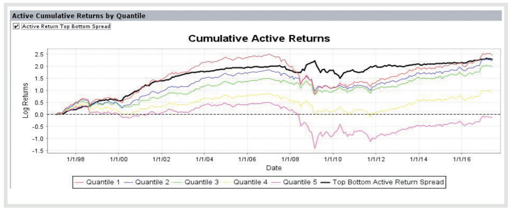
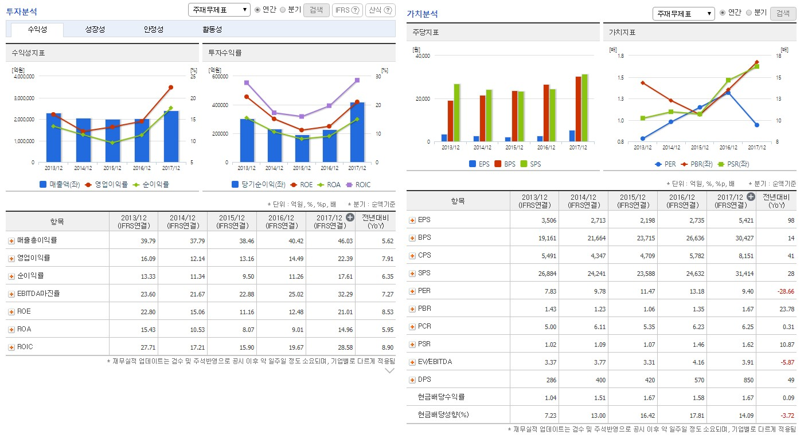
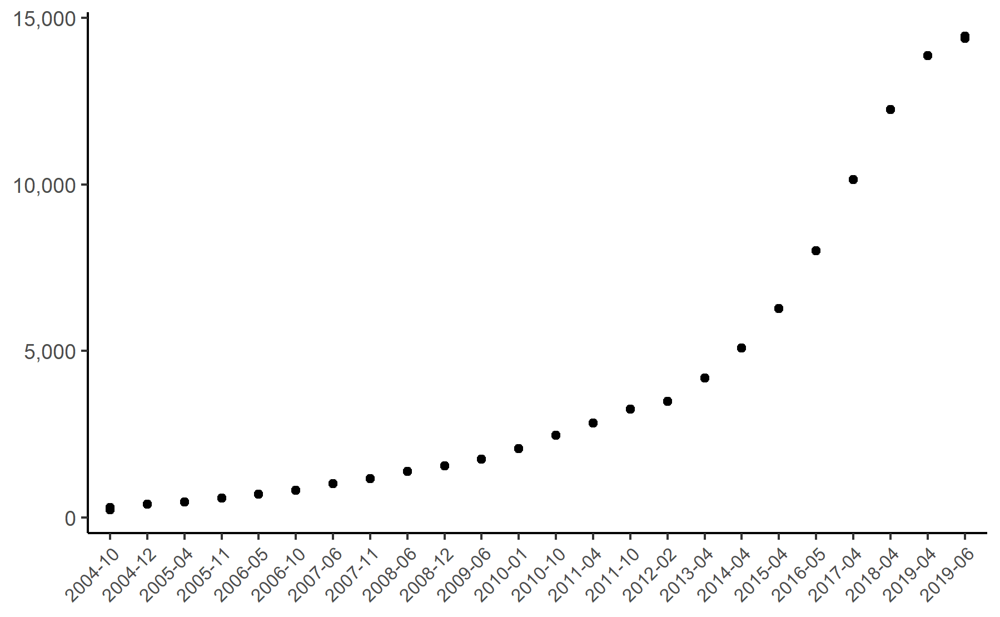

# 퀀트 투자의 심장: 데이터와 프로그래밍

몇 년 전까지만 하더라도 **퀀트 투자**는 일반 투자자들에게 매우 낯선 영역이었지만, 최근에는 각종 커뮤니티와 매체를 통해 많은 사람들에게 익숙한 단어가 되었습니다. 퀀트 투자에서 ‘퀀트’란 모형을 기반으로 금융상품의 가격을 산정하거나, 이를 바탕으로투자를 하는 사람을 말합니다. 퀀트(Quant)라는 단어가 ‘계량적’을 의미하는 퀀티터티브(Quantitative)의 앞 글자를 따왔음을 생각하면 쉽게 이해가 될 것입니다.

일반적으로 투자자들이 산업과 기업을 분석해 가치를 매기는 정성적인 투자법과는 달리, 퀀트 투자는 수학과 통계를 기반으로 전략을 만들고 이를 바탕으로 투자하는 정량적인 투자법을 의미합니다. 이처럼 데이터를 수집·가공한 후 이를 바탕으로 모델을 만들고 실행하는 단계는 데이터 과학의 업무 흐름도와 매우 유사합니다. 해들리 위컴
(Hadley Wickham)[@grolemund2018r]에 따르면 데이터 과학의 업무 과정은 그림 \@ref(fig:ds)과 같습니다.

```{r ds, fig.cap='데이터 과학 업무 과정', echo = FALSE}
knitr::include_graphics('images/ds_flow.png')
```

데이터 과학자들은 프로그래밍을 통해 데이터를 불러온 후 이를 정리하고, 원하는 결과를 찾기 위해 데이터를 변형하거나 시각화하고 모델링합니다. 이러한 결과를 바탕으로 타인과 소통하는 일련의 과정을 거칩니다.

퀀트 투자의 단계 역시 이와 매우 유사합니다. 투자에 필요한 주가, 재무제표 등의 데이터를 수집해 정리한 후 필요한 지표를 얻기 위해 가공합니다. 그 후 각종 모형을 이용해 투자 종목을 선택하거나 백테스트를 수행하며, 이를 바탕으로 실제로 투자하고 성과를 평가합니다. 따라서 퀀트 투자는 데이터 과학이 금융에 응용된 사례라고도 볼수 있으며, 퀀트 투자의 중심에는 데이터와 프로그래밍이 있습니다.

이 책에서도 데이터 과학의 업무 단계와 동일하게 데이터 불러오기, 데이터별로 정리하고 가공하기, 시각화를 통해 데이터의 특징 파악하기, 퀀트 모델을 이용해 종목 선택하기, 백테스트를 실시한 후 성과 및 위험 평가하기에 대해 알아보겠습니다. 이에 앞서 이 CHAPTER에서는 퀀트 투자의 심장이라고 할 수 있는 데이터를 어떻게 얻을 수 있
는지, 왜 프로그래밍을 해야 하는지, 그중에서도 R이 무엇인지에 대해 간략히 살펴보겠습니다.


## 데이터 구하기

퀀트 투자에 필요한 데이터는 여러 데이터 제공업체의 서비스를 이용해서 매우 쉽게 구할 수 있습니다. 해외 데이터 수집에는 블룸버그 혹은 Factset, 국내 데이터 수집에는 DataGuide가 흔히 사용됩니다. 물론 비용을 더 지불한다면 단순 데이터 수집뿐만 아니라 즉석에서 백테스트 및 성과 평가까지 가능합니다. Factset에서 판매하는 Alpha Testing 혹은 S&P Global에서 판매하는 ClariFI(그림 \@ref(fig:clarifi))를 사용한다면, 전 세계 주식을 대상으로 원하는 전략의 백테스트 결과를 마우스 몇 번 클릭해서 얻을 수 있습니다.

```{r clarifi, fig.cap='ClariFI®의 백테스트 기능', echo = FALSE}

```

데이터 제공업체를 이용하는 방법의 최대 단점은 바로 비용입니다. 블룸버그 단말기는 1년 사용료가 대리 한 명의 연봉과 비슷해, 흔히 ‘블대리’라고 부르기도 합니다. 국내 데이터 업체의 사용료는 이보다 저렴하기는 하지만, 역시 1년 사용료가 수백만 원 정도로, 일반 개인 투자자가 감당하기에는 부담이 됩니다.

해외데이터는 Quandl^[https://www.quandl.com/]이나 tiingo^[https://www.tiingo.com/]등의 업체가 제공하는 서비스를 이용하면 상대적으로 저렴한 가격에 데이터를 구할 수 있습니다. 물론 대형 데이터 제공업체에 비해 데
이터의 종류가 적고 기간은 짧은 편이지만, 대부분의 일반 투자자가 사용하기에는 충분한 데이터를 얻을 수 있습니다. tiingo에서는 전 세계 64,386개 주식의 30년 이상 가격 정보, 21,352개 주식의 12년 이상 재무정보를 월 $10에 받을 수 있으며, 한정된 종목과 용량에 대해서는 무료로 데이터를 받을 수도 있습니다. 더군다나 API를 통해 프로그램 내에서 직접 데이터를 받을 수 있어 편리합니다.


그러나 아쉽게도 이러한 데이터에서 한국 시장의 정보는 소외되어 있습니다. 따라서 돈을 들이지 않고 국내 데이터를 얻기 위해서는 직접 발품을 파는 수밖에 없습니다.<a href="https://finance.yahoo.com/" target="blank">야후 파이낸스^[https://finance.yahoo.com/]</a> 혹은 국내 금융 웹사이트에서 제공하는 정보를 크롤링해 데이터를 수집할 수 있습니다.

```{r fig.cap='NAVER 금융 제공 재무정보', echo = FALSE}

```

이러한 정보를 잘만 활용한다면 장기간의 주가 및 재무정보를 무료로 수집할 수 있습니다. 물론 데이터 제공업체가 제공하는 깔끔한 형태의 데이터가 아니므로 클렌징 작업이 필요하고 상장폐지된 기업의 데이터를 구하기 힘들다는 단점이 있습니다. 그러나 비용이 들지 않는 데다 현재 시점에서 투자 종목을 선택할 때는 상장폐지된 기업의 정
보가 필요하지 않는다는 점을 고려하면 이는 큰 문제가 되지 않습니다.

## 퀀트 투자와 프로그래밍

우리가 구한 데이터는 연구나 투자에 바로 사용할 수 있는 형태로 주어지는 경우가 거의 없습니다. 따라서 데이터를 목적에 맞게 처리하는 과정을 거쳐야 하며, 이를 흔히 데이터 클렌징 작업이라고 합니다. 또한 정제된 데이터를 활용한 투자 전략의 백테스트나 종목 선정을 위해서 프로그래밍은 필수입니다. 물론 모든 퀀트 투자에서 프로그래
밍이 필수인 것은 아닙니다. 엑셀을 이용해도 간단한 형태의 백테스트 및 종목 선정은 얼마든지 가능합니다. 그러나 응용성 및 효율성의 측면에서 엑셀은 매우 비효율적입니다.

데이터를 수집하고 클렌징 작업을 할 때 대상이 몇 종목 되지 않는다면 엑셀을 이용해도 충분히 가능합니다. 그러나 종목 수가 수천 종목을 넘어간다면 데이터를 손으로 일일이 처리하기가 사실상 불가능에 가깝습니다. 이러한 단순 반복 작업은 프로그래밍을 이용한다면 훨씬 효율적으로 수행할 수 있습니다.

백테스트에서도 프로그래밍이 훨씬 효율적입니다. 과거 12개월 누적수익률이 높은 종목에 투자하는 모멘텀 전략의 백테스트를 한다고 가정합시다. 처음에는 엑셀로 백테스트를 하는 것이 편하다고 생각할 수 있습니다. 그러나 만일 12개월이 아닌 6개월 누적 수익률로 백테스트를 하고자 한다면 어떨까요? 엑셀에서 다시 6개월 누적수익률을 구하기 위해 명령어를 바꾸고 드래그하는 작업을 반복해야 할 것입니다. 그러나 프로그래밍을 이용한다면 `n = 12`였던 부분을 `n = 6`으로 변경한 후 단지 클릭 한 번만으로 새로운 백테스트가 완료됩니다.

전체 데이터가 100MB 정도라고 가정할 때, 투자 전략이 계속해서 늘어날 경우는 어떨까요? 엑셀에서 A라는 전략을 백테스트하기 위해서는 해당 데이터로 작업한 후 저장할 것입니다. 그 후 B라는 전략을 새롭게 백테스트하려면 해당 데이터를 새로운 엑셀 파일에 복사해 작업한 후 다시 저장해야 합니다. 결과적으로 10개의 전략만 백테스트 하더라도 100MB짜리 엑셀 파일이 10개, 즉 1GB 정도의 엑셀 파일이 쌓이게 됩니다. 만일 데이터가 바뀔 경우 다시 10개 엑셀 시트의 데이터를 일일이 바꿔야 하는 귀찮음도 감수해야 합니다. 물론 하나의 엑셀 파일 내에서 모든 전략을 수행할 수도 있지만, 이러한 경우 속도가 상당히 저하되는 문제가 있습니다.

프로그래밍을 이용한다면 어떨까요? 백테스트를 수행하는 프로그래밍 스크립트는 불과 몇 KB에 불과하므로, 10개의 전략에 대한 스크립트 파일을 합해도 1MB가 되지 않습니다. 데이터가 바뀌더라도 원본 데이터 파일 하나만 수정해주면 됩니다.

물론 대부분의 사람들에게 프로그래밍은 낯선 도구입니다. 그러나 퀀트 투자에 필요한 프로그래밍은 매우 한정적이고 몇 가지 기능을 반복적으로 쓰기 때문에 몇 개의 단어와 구문만 익숙해지면 사용하는 데 큰 어려움이 없습니다. 또한 전문 개발자들의 프로그래밍에 비하면 상당히 쉬운 수준이므로, 비교적 빠른 시간 내에 원하는 전략을 테스트하고 수행하는 정도의 능력을 갖출 수도 있습니다.

## R 프로그램

인간이 사용하는 언어의 종류가 다양하듯이, 프로그래밍 언어의 종류 역시 다양합니다. 대략 700여 개 이상의 프로그래밍 언어 중^[https://en.wikipedia.org/wiki/List_of_programming_languages] 대중적으로 사용하는 언어는 그리 많지 않으므로, 대중성과 효율성을 위해 사용량이 많은 언어를 이용하는 것이 좋습니다.

그림 \@ref(fig:tiobe)는 프로그래밍 언어의 사용 순위^[https://www.tiobe.com/tiobe-index/]입니다. 이 중 R과 Python은 매우 대중적인 언어입니다. 해당 언어가 많이 사용되는 가장 큰 이유는 무료인 데다 일반인들이 사용하기에도 매우 편한 형태로 구성되어 있기 때문입니다.

```{r pkg, fig.cap='2017년 기준 프로그래밍 언어 사용 통계 순위', out.width = '50%', echo = FALSE}
knitr::include_graphics('images/tiobe_index.png')
```

이러한 프로그래밍 언어 중 이 책에서는 R을 이용합니다. R의 장점은 무료라는 점 이외에도 타 언어와 비교할 수 없이 다양한 패키지가 있다는 점입니다. R은 두터운 사용자층을 기반으로 두고 있어 상상할 수 없을 정도로 패키지가 많으며, 특히 통계나 계량분석과 관련된 패키지는 독보적이라고 할 수 있습니다.

```{r echo = FALSE, eval = FALSE}
source('package_trend.R')
```

```{r echo = FALSE, message = FALSE}
library(ggplot2)
library(magrittr)

pkgs = read.csv('data/pkg_trend.csv')
pkgs$date = substr(pkgs$date, 1, 7)

p = pkgs %>%
  dplyr::distinct(date, .keep_all = TRUE) %>%
  ggplot(aes(x = date, y = pkgs, group = 1)) +
  geom_path() +
  geom_point() +
  theme_classic() +
  xlab(NULL) +
  ylab(NULL) +
  scale_y_continuous(label = scales::comma) +
  theme(axis.text.x = element_text(angle = 45, hjust = 1, size = 8)) +
  ggsave('images/cran_pkgs.png')
```

```{r tiobe, fig.cap='CRAN 등록 패키지 수', echo = FALSE}

```

## 퀀트 투자에 유용한 R 패키지

R에는 여러 연구자와 실무자의 헌신적인 노력 덕분에 금융 연구와 퀀트 투자를 위한 다양한 패키지가 만들어져 있으며, 누구나 무료로 이용할 수 있습니다. 이 책에서 사용되는 패키지 중 중요한 것은 다음과 같습니다. 각 패키지에 대한 자세한 설명은 구글에서 패키지명을 검색한 후 PDF 파일을 통해 확인할 수 있습니다.

- **quantmod**: 이름에서 알 수 있듯이 퀀트 투자에 매우 유용한 패키지입니다. API를 이용해 데이터를 다운로드하는 `getSymbols()` 함수는 대단히 많이 사용됩니다. 이 외에도 볼린저밴드, 이동평균선, 상대강도지수(RSI) 등 여러 기술적 지표를 주가 차트에 나타낼 수도 있습니다.

- **PerformanceAnalytics**: 포트폴리오의 성과와 위험을 측정하는 데 매우 유용한 패키지입니다. `Return.portfolio()` 함수는 포트폴리오 백테스트에 필수적인 함수입니다.

- **xts**: 기본적으로 금융 데이터는 시계열 형태이며, xts 패키지는 여러 데이터를 시계열 형태(eXtensible TimeSeries)로 변형해줍니다. 일별 수익률을 월별 수익률 혹은 연도별 수익률로 변환하는 `apply.monthly()`와 `apply.yearly()` 함수, 데이터들의 특정 시점을 찾아주는 `endpoints()` 함수 역시 백테스트에 필수적으로 사용되는 함수입니다. 이 패키지는 PerformanceAnalytics 패키지 설치 시 자동으로 설치됩니다.

- **zoo**: zoo 패키지 역시 시계열 데이터를 다루는 데 유용한 함수가 있습니다. `rollapply()` 함수는 `apply()` 함수를 전체 데이터가 아닌 롤링 윈도우 기법으로 활용할 수 있게 해주며, NA 데이터를 채워주는 `na.locf()` 함수는 시계열 데이터의 결측치를 보정할 때 매우 유용합니다.

- **httr** & **rvest**: 데이터를 웹에서 수집하기 위해서는 크롤링이 필수이며, httr과 rvest는 크롤링에 사용되는 패키지입니다. httr은 http의 표준 요청을 수행하는 패키지로서 단순히 데이터를 받는 `GET()` 함수와 사용자가 필요한 값을 선택해 요청하는 `POST()` 함수가 대표적으로 사용됩니다. rvest는 HTML 문서의 데이터를 가져오는 패키지이며, 웹페이지에서 데이터를 크롤링한 후 원하는 데이터만 뽑는데 필요한 여러 함수가 포함되어 있습니다.

- **dplyr**: 데이터 처리에 특화되어 R을 이용한 데이터 과학 분야에서 많이 사용되는 패키지입니다. C++로 작성되어 매우 빠른 처리 속도를 보이며, API나 크롤링을 통해 수집한 데이터들을 정리할 때도 매우 유용합니다.

- **ggplot2**: 데이터를 시각화할 때 가장 많이 사용되는 패키지입니다. 물론 R에서 기본적으로 내장된 `plot()` 함수를 이용해도 시각화가 가능하지만, 해당 패키지를 이용하면 훨씬 다양하고 깔끔하게 데이터를 그림으로 표현할 수 있습니다.

이 외에도 이 책에서는 다양한 패키지를 사용했으며, 아래의 코드를 실행하면 설치되지 않은 패키지를 설치할 수 있습니다.

```{r eval = FALSE}
pkg = c('magrittr', 'quantmod', 'rvest', 'httr', 'jsonlite',
        'readr', 'readxl', 'stringr', 'lubridate', 'dplyr',
        'tidyr', 'ggplot2', 'corrplot', 'dygraphs',
        'highcharter', 'plotly', 'PerformanceAnalytics',
        'nloptr', 'quadprog', 'RiskPortfolios', 'cccp',
        'timetk', 'broom', 'stargazer', 'timeSeries')

new.pkg = pkg[!(pkg %in% installed.packages()[, "Package"])]
if (length(new.pkg)) {
  install.packages(new.pkg, dependencies = TRUE)}
```
