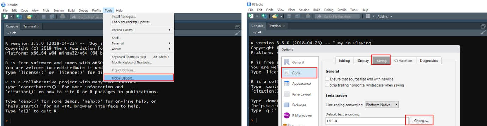
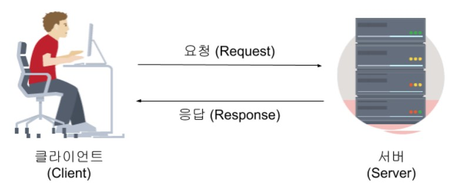
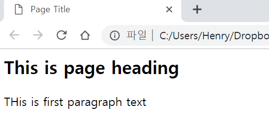
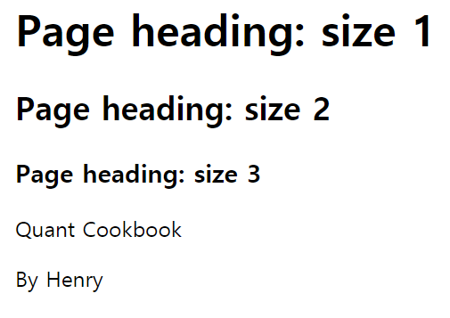
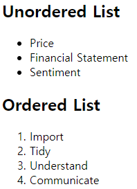
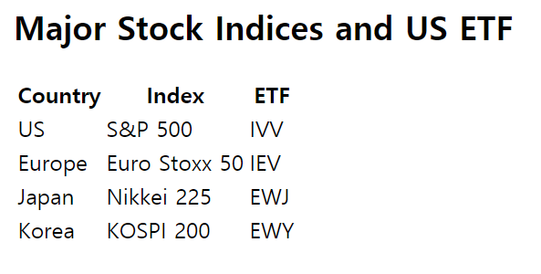
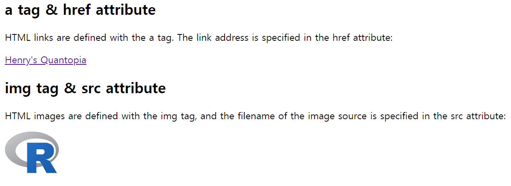
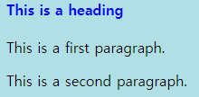
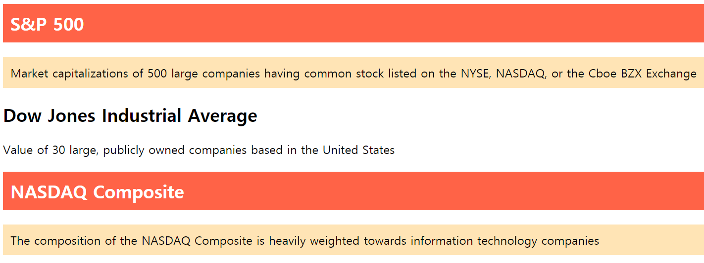

# 크롤링을 위한 기본 지식

기존에 프로그래밍에 익숙한 분들도 크롤링은 생소한 경우가 많습니다. 기본적인 프로그래밍에 관한 책과 강의가 굉장히 많은 것과는 달리, 크롤링에 대한 지식을 접하기 힘들기 때문입니다. 물론 크롤링은 기계적인 단계가 많기 때문에 조금만 연습해도 매우 유용하게 사용할 수 있는 기술입니다. 그러나 복잡한 웹페이지나 데이터 내용을 수집하기 위해서는 인코딩, 통신구조에 대한 지식이 필요할 떄가 있습니다.

본 장에서는 크롤링을 하기 위해 사전에 알고 있으면 도움이 되는 인코딩, 웹의 동작 방식, HTML과 CSS에 대해 알아보도록 하겠습니다. 그리고 실제 크롤링시 유익하게 사용되는 파이프 오퍼레이터와 오류에 대한 예외처리에 대해서도 알아보도록 하겠습니다.

## 인코딩의 이해와 R에서 UTF-8 설정하기

### 인간과 컴퓨터 간 번역의 시작, ASCII

R에서 스크립트를 한글로 작성하여 저장한 후 이를 다시 불러올 때, 혹은 한글로 된 데이터를 크롤링하면 오류가 뜨거나 읽을 수 없는 문자로 나타나는 경우가 종종 있습니다. 이는 한글 인코딩 때문에 발생하는 문제이며, 이러한 현상을 흔히 **인코딩이 깨졌다**고 표현합니다. 인코딩이란 사람이 사용하는 언어를 컴퓨터가 사용하는 0과 1로 변환하는 과정을 말하며, 이와 반대의 과정을 디코딩이라고 합니다.

이러한 사람과 컴퓨터간의 번역을 위해 최초로 사용된 방식이 아스키(ASCII: American Standard Code for Information Interchange)입니다. 0부터 127까지 총 128개 바이트에 알파벳과 숫자, 그리고 자주 사용되는 특수문자 값을 부여하고, 글자가 입력되면 이에 대응되는 바이트가 저장됩니다. 그러나 아스키의 American이라는 이름에서 알 수 있듯이 이는 영어의 알파벳이 아닌 다른 언어를 표현하는데는 한계가 있으며, 이를 보완하기 위한 여러 방법들이 나오게 되었습니다.

```{r fig.cap='아스키 코드 표', echo = FALSE}
knitr::include_graphics('images/ascii_code.jpg')
```

### 한글 인코딩의 종류 

인코딩에 대한 전문적인 내용의 경우 본 책의 범위를 넘어가며, 크롤링을 위해서는 한글을 인코딩하는데 쓰이는 EUC-KR과 CP949, 그리고 UTF-8 정도만 이해해도 충분합니다. 만일 **알**이라는 단어를 인코딩하기 위해서는 어떠한 방법이 있을까요? 먼저 **알**이라는 문자 자체에 해당하는 코드를 부여하여 나타내는 방법이 있습니다. 아니면 이를 구성하는 모음과 자음을 나누어 **ㅇ**, **ㅏ**, **ㄹ** 각각에 해당하는 코드를 부여하고 이를 조합할 수도 있습니다. 전자와 같이 완성된 문자 자체로 나타내는 방법을 완성형, 후자와 같이 각 문자로 나타내는 방법을 조합형이라고 합니다.

먼저 한글 인코딩 중 완성형으로 가장 대표적인 방법은 EUC-KR이며, 이는 현대 한글에서 많이 쓰이는 글자 2,350개에 번호를 붙인 방법입니다. 그러나 2,350개 글자로 모든 한글의 조합을 표현하기가 부족하여, 이를 보완하고자 마이크로소프트사가 도입한 방법이 CP949 입니다. CP949는 11,720개 한글에 번호를 붙인 방법으로 기존 EUC-KR보다 나타낼 수 있는 한글의 갯수가 훨씬 많아졌습니다. 윈도우의 경우 기본 인코딩이 CP949로 되어 있습니다.

조합형의 대표적 방법으로는 UTF-8이 있습니다. 이는 모음과 자음 각각에 코드를 부여한 후 조합하여 한글을 나타냅니다. 조합형의 경우 한글뿐만이 아니라 다양한 언어에 적용할 수 있다는 장점으로 인해 전세계 웹페이지의 대부분이 UTF-8로 만들어 지고 있습니다.

```{r fig.cap='웹페이지에서 사용되는 인코딩 비율', echo = FALSE}
knitr::include_graphics('images/encoding_ratio.jpg')
```

### R에서 UTF-8 설정하기

위에서 언급했듯이 윈도우에서는 기본 인코딩이 CP949로 이루어져 있으며, 일부 국내 홈페이지는 EUC-KR로 인코딩이 된 경우도 있습니다. 반면 R의 여러 함수들은 인코딩이 UTF-8로 이루어져 있어, 이러한 인코딩 방식의 차이로 인해 스크립트 작성 및 크롤링 과정에서 오류가 발생하는 경우가 종종 있습니다. 윈도우 컴퓨터에서는 CP949가 기본으로 설정되어 있습니다.

만일 CP949 인코딩을 그대로 사용할 경우, 미리 저장되었던 한글 스크립트가 깨져 나오는 일이 발생할 수 있습니다. 이를 위해 그림 \@ref(fig:utf1)와 같이 기본 인코딩을 UTF-8로 변경해주는 것이 좋습니다. R Studio의 Tools → Global Options 메뉴에서 Code → Saving 항목 중 Default text encodings 항목을 통해 기본 인코딩을 UTF-8로 변경해주도록 합니다.

```{r utf1, fig.cap='인코딩 변경', fig.align='center', out.width = "100%", echo = FALSE}

```

해당 방법으로도 해결되지 않을 경우 그림 \@ref(fig:utf2)와 같이 File → Reopen with Encoding 메뉴에서 UTF-8 항목을 선택, Set as default encoding for source files 항목을 선택한 후 OK를 누르면 UTF-8로 인코딩이 설정된 후 파일을 다시 열게 됩니다.

```{r utf2, fig.cap='인코딩 변경 후 재시작', fig.align='center', out.width = "100%", echo = FALSE}
knitr::include_graphics('images/utf_encoding_2.jpg')
```

## 웹의 동작 방식

크롤링은 웹사이트의 정보를 수집하는 과정이니 만큼, 웹이 어떻게 동작하는지 이해할 필요가 있습니다. 

```{r fig.cap='웹 환경 구조', fig.align='center', echo = FALSE}

```

먼저 클라이언트는 여러분의 데스크탑이나 휴대폰과 같은 장치, 그리고 이런 장치의 크롬이나 파이어폭스와 같은 소프트웨어를 의미합니다. 반대로 서버는 웹사이트, 앱을 저장하는 컴퓨터를 의미합니다. 클라이언트가 특정 정보를 요구하는 과정을 **요청**이라 하며, 서버가 해당 정보를 제공하는 과정을 **응답** 이라고 합니다. 그러나 클라이언트와 서버가 연결되어 있지 않다면 둘 간에 정보를 주고 받는 것은 불가능하며, 이를 연결해주는 공간이 바로 인터넷입니다. 또한 건물에도 고유의 주소가 있는 것처럼, 각 서버에도 고유의 주소가 있으며, 이것이 인터넷주소 혹은 URL 입니다.

여러분이 네이버에서 경제 기사를 클릭하는 경우를 생각해 봅시다. 클라이언트는 사용자인 여러분, 서버는 네이버이며, URL은 www.naver.com 이 됩니다. 경제 기사를 클릭하는 과정이 요청이며, 클릭 후 해당 페이지를 보여주는 과정이 응답입니다.

### HTTP

클라이언트가 각기 다른 방법으로 데이터를 요청한다면, 서버는 해당 요청을 알아듣지 못할 것입니다. 이를 방지하기 위해 규정된 약속이나 표준에 맞추어 데이터를 요청해야하며, 이러한 약속을 HTTP(HyperText Transfer Protocol)라 합니다.

클라이언트가 서버에게 요청의 목적이나 종류를 알리는 방법을 HTTP 요청 방식(HTTP Request Method)이라고 합니다. 이는 크게 표 \@ref(tab:http)와 같이 GET, POST, PUT, DELETE 4가지로 나눌 수 있지만 크롤링에는 GET과 POST 방식이 대부분 사용되므로 이 두가지만 아는 것도 충분합니다. GET 방식과 POST 방식에 대한 차이 및 크롤링 방법은 데이터 수집 파트에서 자세하게 다루도록 하겠습니다.

```{r http, echo = FALSE}
library(magrittr)

knitr::kable(
  data.frame(
  '요청방식' = c('GET', 'POST', 'PUT', 'DELETE'),
  '주소' = c('특정 정보 조회', '새로운 정보 등록', '기존 특정 정보 갱신', '기존 특정 정보 삭제')
  ),
  booktabs = TRUE,
  align = "c",
  caption = 'HTTP 요청 방식과 설명'
) %>%
  kableExtra::kable_styling(latex_options = c("striped", "hold_position")) %>%
  kableExtra::column_spec(2, width = "5cm")
```

인터넷을 사용하다 보면 한번쯤 **이 페이지를 볼 수 있는 권한이 없습니다.(HTTP 오류 403 - 사용할 수 없음)** 혹은 **페이지를 찾을 수 없음(HTTP 오류 404 - 파일을 찾을 수 없음)** 이라는 오류가 발생한 적이 있을 겁니다. 여기서 403과 404이라는 숫자는 클라이언트의 요청에 대한 서버의 응답 상태를 나타내는 코드이며, 이를 HTTP 상태 코드라 합니다.

HTTP 상태 코드는 100번대 부터 500번대 까지 있으며, 성공적으로 응답을 받을 시 200번 코드를 받게 됩니다. 각 코드에 대한 내용은 HTTP 상태 코드를 검색하면 확인할 수 있으며, 크롤링 과정에서 오류가 발생할 시 해당 코드를 통해 어떤 부분에서 오류가 발생하였는지 확인이 가능합니다.

```{r echo = FALSE}
knitr::kable(
  data.frame(
  '코드' = c('1xx', '2xx', '3xx', '4xx', '5xx'),
  '주소' = c('Informational (조건부 응답)', 'Success (성공)', 'Redirection (리디렉션)',
           'Client Error (클라이언트 오류)', 'Server Error (서버 오류)'),
  '내용' = c('리퀘스트를 받고, 처리 중에 있음', '리퀘스트를 정상적으로 처리함',
           '리퀘스트 완료를 위해 추가 동작이 필요함', '클라이언트 요청을 처리할 수 없어 오류 발생',
           '서버에서 처리를 하지 못하여 오류 발생')
  ),
  booktabs = TRUE,
  align = "c",
  caption = 'HTTP 상태 코드 그룹 별 내용'
) %>%
  kableExtra::kable_styling(latex_options = c("striped", "hold_position")) %>%
  kableExtra::kable_styling(font_size = 8)
```

## HTML과 CSS 이해하기

클라이언트와 서버가 데이터를 주고 받을때는 디자인이라는 개념이 필요하지 않습니다. 그러나 응답 받은 정보를 사람이 확인하기 위해서는 보기 편한 방식으로 바꾸어 줄 필요가 있으며, 웹페이지가 그러한 역할을 합니다. 웹페이지의 제목, 단락, 목록 등 레이아웃을 잡아주는데 쓰이는 대표적인 마크업 언어가 HTML(HyperText Markup Language) 입니다. HTML을 통해 잡혀진 뼈대에 글자의 색상이나 폰트, 배경 색, 배치 등 화면을 꾸며주는 역할을 하는 것이 CSS(Cascading Style Sheets) 입니다.

우리의 목적은 웹페이지를 만드는 것이 아니기에 HTML과 CSS에 대해 지나치게 자세히 알 필요는 없습니다. 그러나 크롤링 하고자 하는 데이터가 페이지의 어떤 태그 내에 위치하고 있는지, 어떻게 크롤링을 하면 될지 파악하기 위해서는 HTML과 CSS에 대한 기본적인 지식은 알아둘 필요가 있습니다.

메모장에서 HTML 코드를 입력한 후 **파일명.html**로 저장할 경우, 해당 코드가 웹페이지에서 어떻게 나타나는지 확인이 가능합니다.

### HTML 기본 구조

HTML은 크게 메타 데이터를 나타내는 \<head\> 부분과 본문을 나타내는 \<body\> 부분으로 나누어집니다. \<head\>에서 \<title\>은 웹페이지에서 나타나는 제목을 나타내며 \<body\> 내에는 본문에 들어갈 각종 내용들이 포함되어 있습니다. 

```{css}
<html>
<head>
<title>Page Title</title>
</head>

<body>
<h2> This is page heading </h2>
<p> THis is first paragraph text </p>
</body>
</html>
```

```{r fig.cap='HTML 기본 구조', fig.align='center', echo = FALSE}

```

### 태그와 속성

HTML 코드는 태그와 속성, 그리고 내용으로 이루어져 있습니다. 크롤링한 데이터에서 특정 태그의 데이터만을 찾는 방법, 특정 속성의 데이터만을 찾는 방법, 뽑힌 자료에서 내용만을 찾는 방법등의 내용을 찾는 방법이 모두 다르기 때문에 이러한 요소에 대해 좀더 자세히 살펴보도록 하겠습니다.

```{r fig.cap='HTML 구성 요소 분석', fig.align='center', echo = FALSE}
knitr::include_graphics('images/html_2.png')
```

꺽쇠(<>)로 감싸져 있는 부분을 태그라 부르며, 여는 태그 <>가 있으면 반드시 이를 닫아주는 태그인 </>가 쌍으로 존재해야 합니다. 속성은 해당 태그에 대한 추가적인 정보를 제공해주는 것으로써, 뒤에 속성값이 따라와야 합니다. 내용은 우리가 눈으로 보는 텍스트 부분을 의미합니다. 위의 HTML 코드는 문단을 나타내는 \<p\> 태그, 정렬을 나타내는 align 속성과 center를 통해 가운데 정렬을, 내용에는 ‘퀀트 투자 Cookbook을, 그리고 태그를 \</p\>를 통해 태그를 마쳤습니다.

### h 태그와 p 태그

h 태그는 폰트의 크기를 나타내는 태그이며, p 태그는 문단을 나타내는 태그입니다. 이를 사용한 간단한 예제는 다음과 같습니다. h 태그의 숫자가 작을수록 텍스트의 크기는 커지는 것이 확인되며, 숫자는 1에서 6까지 지원이 됩니다. p 태그를 사용할 경우 각각의 문단이 만들어지는 것이 확인됩니다.

```{css}
<html>
<body>

<h1>Page heading: size 1</h1>
<h2>Page heading: size 2</h2>
<h3>Page heading: size 3</h3>

<p>Quant Cookbook</p>
<p>By Henry</p>

</body>
</html>
```

```{r fig.cap='h 태그와 p 태그 예제', fig.align='center', echo = FALSE}

```

### 리스트: ul과 ol 태그

ul과 ol태그는 리스트(글머리 기호)를 만들 때 사용되며, ul은 경우 순서가 없는 리스트(unordered list), ol의 경우 순서가 있는 리스트(ordered list)를 만듭니다.

```{css}
<html>
<body>

<h2> Unordered List</h2>
<ul>
  <li>Price</li>
  <li>Financial Statement</li>
  <li>Sentiment</li>
</ul>  

<h2> Ordered List</h2>
<ol>
  <li>Import</li>
  <li>Tidy</li>
  <li>Understand</li>
  <li>Communicate</li>
 </ol> 

</body>
</html>
```

```{r fig.cap='리스트 관련 태그 예제', fig.align='center', echo = FALSE}

```

ul 태그로 감싸진 부분은 글머리 기호가 순서가 없는 **•**으로 표현되었으며, ol 태그로 감싸진 부분은 숫자가 순서대로 표현되었습니다. 각각의 리스트는 li를 통해 생성하게 됩니다.

### table 태그

table 태그는 표를 만드는 태그입니다.  

```{css}
<html>
<body>

<h2>Major Stock Indices and US ETF</h2>

<table>
  <tr>
    <th>Country</th>
    <th>Index</th>
    <th>ETF</th>
  </tr>
  <tr>
    <td>US</td>
    <td>S&P 500</td>
    <td>IVV</td>
  </tr>
  <tr>
    <td>Europe</td>
    <td>Euro Stoxx 50</td>
    <td>IEV</td>
  </tr>
  <tr>
    <td>Japan</td>
    <td>Nikkei 225</td>
    <td>EWJ</td>
  </tr>
  <tr>
    <td>Korea</td>
    <td>KOSPI 200</td>
    <td>EWY</td>
  </tr>
</table>

</body>
</html>
```

```{r fig.cap='table 태그 예제', fig.align='center', echo = FALSE}

```

table 태그 내의 tr 태그는 각 행을 의미합니다. 각 셀의 구분은 th 혹은 td 태그를 통해 구분이 가능하며, th 태그는 진하게 표현되므로 주로 테이블의 제목에, td 태그는 테이블의 내용에 사용됩니다.  

### a, src 태그와 속성

a 태그와 src 태그는 다른 태그와는 다르게, 혼자 쓰이기 보다는 속성과 결합하여 사용됩니다. 먼저 a 태그는 href 속성과 결합하여 다른 페이지의 링크를 걸 수 있습니다. src 태그는 img 속성과 결합하여 이미지를 불러옵니다. 

```{css}
<html>
<body>

<h2>a tag & href attribute</h2>
<p>HTML links are defined with the a tag.
The link address is specified in the href attribute:</p>

<a href="https://henryquant.blogspot.com/">Henry's Quantopia</a>

<h2>img tag & src attribute</h2>
<p>HTML images are defined with the img tag,
and the filename of the image source is
specified in the src attribute:</p>


</body>
</html>
```

```{r fig.cap='a 태그와 src 태그 예제', fig.align='center', echo = FALSE}

```

a 태그 뒤 href 속성에 대한 속성값으로 연결하고자 하는 웹페이지의 주소를 입력한 후, 내용을 입력하면, 해당 텍스트에 웹페이지의 링크가 추가됩니다. img 태그 뒤 src 속성에는 불러오고자 하는 이미지의 주소를 입력하며, width 속성과 height 속성을 통해 가로와 세로 길이를 조절할 수도 있습니다. 페이지 내에서 링크된 주소를 모두 찾거나, 혹은 모든 이미지를 저장하는 작업을 하고자 할 시, 이러한 속성값을 찾으면 손쉽게 원하는 작업을 할 수 있습니다.

### div 태그

div 태그는 화면의 전체적인 틀(레이아웃)을 만들 때 주로 사용하는 태그입니다. 단독으로도 사용될 수 있으며, 꾸밈을 담당하는 style 속성과 결합되어 사용되기도 합니다.

```{css}
<html>
<body>

<div style="background-color:black;color:white">
  <h5>First Div</h5>
  <p>Black backgrond, White Color</p>
</div> 

<div style="background-color:yellow;color:red">
  <h5>Second Div</h5>
  <p>Yellow backgrond, Red Color</p>
</div> 

<div style="background-color:blue;color:grey">
  <h5>Second Div</h5>
  <p>Blue backgrond, Grey Color</p>
</div> 

</body>
</html>
```

```{r fig.cap='div 태그 예제', fig.align='center', echo = FALSE}
knitr::include_graphics('images/html_7.png')
```

div 태그를 통해 총 3개의 레이아웃으로 나누어졌음이 확인됩니다. style 속성 중 background-color는 배경 색상을, color는 글자 색상을 의미하며, 각 레이아웃 마다 다른 스타일이 적용되었습니다.

### CSS

CSS는 앞서 설명했듯이 웹페이지를 꾸며주는 역할을 합니다. head 부분에서 각 태그에 CSS 효과를 입력할 경우, 본문의 해당 태그들은 모두 CSS 효과가 적용됩니다. 이처럼 페이지를 꾸미기 위해 특정 요소에 접근하는 것을 셀렉터^Selector^라 합니다.

```{css}
<html>
<head>
<style>
body {background-color: powderblue;}
h4   {color: blue;}
</style>
</head>
<body>

<h4>This is a heading</h4>
<p>This is a first paragraph.</p>
<p>This is a second paragraph.</p>

</body>
</html>
```

```{r fig.cap='css 예제', fig.align='center', echo = FALSE}

```

head 태그 사이에 여러 태그에 대한 CSS 효과가 정의되었습니다. 먼저 body의 전체 배경색상을 파우더 블루로 설정하였으며, h4 태그의 글씨는 파란색으로 설정하였습니다. body 태그 내에서 style을 태그를 주지 않더라도, CSS 효과가 모두 적용되었음이 확인됩니다. 

### class와 id

CSS를 이용할 경우 본문의 모든 태그에 효과가 적용되므로, 특정한 요소^Element^에만 동일한 효과를 적용할 수 없습니다. 클래스 속성을 이용할 경우 동일한 이름을 가진 클래스에는 동일한 효과가 적용됩니다.

```{css}
<html>
<style>
.index {
  background-color: tomato;
color: white;
padding: 10px;
} 
.desc {
  background-color: moccasin;
  color: black;
  padding: 10px;
} 
</style>

<div>
<h2 class="index">S&P 500</h2>
<p class="desc"> Market capitalizations of 500 large companies
having common stock listed on the NYSE, NASDAQ,
or the Cboe BZX Exchange</p>
</div>

<div>
<h2>Dow Jones Industrial Average</h2>
<p>Value of 30 large, publicly owned companies
based in the United States</p>
</div>

<div>
<h2 class="index">NASDAQ Composite</h2>
<p class="desc">The composition of the NASDAQ Composite is
heavily weighted towards information technology companies</p>
<div>
</html>
```

```{r fig.cap='class 예제', fig.align='center', echo = FALSE}

```

셀렉터를 클래스에 적용할때는 클래스명 앞에 콤마(.)를 붙혀 표현합니다. 위의 예제에서 index 클래스는 배경 색상이 토마토, 글씨는 흰색, 여백은 10px로 정의되었습니다. desc 클래스는 배경 색상이 모카신, 글씨는 검은색, 여백은 10px로 정의되었습니다. 본문의 첫번째(S&P 500)와 세번째(>NASDAQ Composite) 레이아웃의 h2 태그 뒤에는 ‘index’ 클래스를, p 태그 뒤에는 ‘desc’ 클래스를 속성으로 입력하였습니다. 따라서 해당 레이아웃에만 CSS 효과가 적용되며, 클래스 값이 없는 두번째 레이아웃에는 효과가 적용되지 않습니다.

id 또한 이와 비슷한 역할을 하며, HTML 내에서 여러 개의 class가 정의될 수 있는 반면, id는 단 하나만 사용하기를 권장합니다.

```{css}
<html>
<head>
<style>

/* Style the element with the id "myHeader" */
#myHeader {
  background-color: lightblue;
  color: black;
  padding: 15px;
  text-align: center;
}
</style>
</head>
<body>

<!-- A unique element -->
<h1 id="myHeader">My Header</h1>

</body>
</html>
```

```{r fig.cap='id 예제', fig.align='center', echo = FALSE}
knitr::include_graphics('images/html_10.png')
```

셀렉터를 id에 적용할때는 클래스명 앞에 샵(#)를 붙혀 표현하며, 페이지에서 한 번만 사용된다는 점을 제외하면 클래스와 사용방법이 거의 동일합니다. 클래스나 id 값을 통해 원하는 내용을 크롤링 하는 경우도 많으므로, 각각의 이름 앞에 콤마(.)와 샵(#)을 붙여야 한다는 점을 꼭 기억하시기 바랍니다.

HTML와 관련하여 추가적인 정보가 필요하거나 내용이 궁금하신 분들은 아래 사이트를 참고하기 바랍니다.

-  w3schools: <a href="https://www.w3schools.in/html-tutorial/" target="blank">https://www.w3schools.in/html-tutorial/</a>
- 웨버 스터디: <a href="http://webberstudy.com/" target="blank">http://webberstudy.com/</a>

## 파이프 오퍼레이터 (`%>%`)

R 내에서 동일한 데이터를 대상으로 연속적으로 작업하게 해주는 오퍼레이터(연산자)가 바로 파이프 오퍼레이터 입니다. 크롤링에 필수적인 `rvest` 패키지를 설치할 경우 자동으로 `magrittr` 패키지가 설치되어 사용할 수 있습니다. 

흔히 프로그래밍에서 x라는 데이터를 F()라는 함수에 넣어 결과값을 확인하고 싶을 경우, F(x)의 방법을 사용합니다. 예를 들어 3과 5라는 데이터 중 큰 값을 찾고 싶을 때는 `max(3,5)`를 통해 확인합니다. 이를 통해 나온 결과 값을 또 다시 G()라는 함수에 넣어 결과값을 확인하고자 할 경우, 비슷한 과정을 거칩니다. `max(3,5)`를 통해 나온 값의 제곱근을 구하고자 할 경우 `result = max(3,5)`를 통해 첫 번째 결과값을 저장하고, `sqrt(result)`를 통해 두 번째 결과값을 계산합니다. 물론 `sqrt(max(3,5))`와 같은 표현법으로 한번에 표현할 수 있습니다.

이러한 표현의 단점은, 계산하는 함수가 많아질수록 저장하는 변수가 늘어나거나 혹은 괄호가 지나치게 길어집니다. 그러나 파이프 오퍼레이터인 `%>%`를 사용할 경우, 함수 간의 관계를 매우 직관적으로 표현하고 이해할 수 있습니다. 이를 정리하면 아래 표 \@ref(tab:mag)와 같습니다.


```{r mag, echo = FALSE}
knitr::kable(
  data.frame(
  '내용' = c('F(x)', 'G(F(x))'),
  '표현 방법' = c('x %>% F', 'x %>% F %>% G')
  ),
  booktabs = TRUE,
  align = "c",
  caption = '파이프 오퍼레이터의 표현과 내용 비교'
) %>%
  kableExtra::kable_styling(latex_options = c("striped", "hold_position"))
```

파이프 오퍼레이터의 간단한 예제를 통해 사용법을 살펴보도록 하겠습니다. 먼저 다음과 같은 10개의 숫자가 있다고 가정합니다.

```{r}
x = c(0.3078, 0.2577, 0.5523, 0.0564, 0.4685,
      0.4838, 0.8124, 0.3703, 0.5466, 0.1703)
```

우리가 원하는 과정은

1. 각 값들의 로그값을 구할 것
2. 로그값들의 계차를 구할 것
3. 구해진 계차의 지수값을 구할 것
4. 소수 둘째 자리까지 반올림할 것

입니다. 즉 `log()`, `diff()`, `exp()`, `round()`에 대한 값을 순차적으로 구하고자 합니다.

```{r}
x1 = log(x)
x2 = diff(x1)
x3 = exp(x2)
round(x3, 2)
```

첫 번째 방법은, 단계 별 함수의 결과값을 변수에 저장하고, 저장된 변수를 다시 불러와 함수에 넣고 계산하는 방법입니다. 전반적인 계산 과정을 확인하기에는 좋지만, 매번 변수에 저장하고 불러오고 하는 과정은 매우 비효율 적이며, 코드 또한 불필요하게 길어집니다.

```{r}
round(exp(diff(log(x))), 2)
```

두 번째는 괄호를 통해 감싸는 방법입니다. 앞선 방법에 비해 코드는 짧아졌지만, 계산 과정을 알아보기에는 매우 불편한 방법으로 코드가 짜여 있습니다.

```{r}
library(magrittr)
x %>% log() %>% diff() %>% exp() %>% round(., 2)

```

마지막으로 파이프 오퍼레이터를 사용하는 방법입니다. 코드도 짧으며, 계산 과정을 한눈에 파악하기도 좋습니다. 맨 왼쪽에는 원하는 변수를 입력하며, `%>%` 뒤에는 차례대로 계산하고자 하는 함수를 입력합니다. 변수의 입력값을 ()로 비워둘 경우, 오퍼레이터의 좌측에 있는 값이 입력변수가 됩니다. 반면 `round()`와 같이 입력값이 2개 이상 필요할 경우, 콤마(.)가 오퍼레이터의 좌측 값으로 입력됩니다.

파이프 오퍼레이터는 크롤링 뿐만이 아닌, 모든 코드에 사용할 수 있습니다. 이를 통해 훨씬 깔끔하면서도 데이터 처리과정을 직관적으로 이해할 수 있습니다.

## 오류에 대한 예외처리

크롤링을 이용하여 데이터를 수집할 경우, 일반적으로 `for loop` 구문을 통해 수천 종목에 해당하는 웹페이지에 접속하여 해당 데이터를 읽어옵니다. 그러나 특정 종목에 해당하는 페이지가 존재하지 않거나, 혹은 단기적으로 접속이 불안정할 경우 오류가 발생하여 루프를 처음부터 다시 실행해야 하는 번거로움이 있습니다. `tryCatch()` 함수를 이용할 경우 예외처리, 즉 오류가 발생할 경우 이를 무시하고 넘어갈 수 있습니다. 

`tryCatch()` 함수의 구조는 다음과 같습니다.

```{r eval = FALSE}
result = tryCatch({
  expr
}, warning = function(w) {
  warning-handler-code
}, error = function(e) {
  error-handler-code
}, finally = {
  cleanup-code
})
```

먼저 `expr`는 실행하고자 하는 코드를 의미합니다. `warning`은 경고를 나타내며, `warning-handler-code`는 경고 발생시 실행할 구문을 의미합니다. 이와 비슷하게, `error`와 `error-handler-code`는 각각 오류와 오류 발생시 실행할 구문을 의미합니다. `finally`는 오류의 여부와 관계없이 무조건 수행할 구문을 의미하며, 이는 생략이 가능합니다.

```{r}
number = data.frame(1,2,3,"4",5, stringsAsFactors = FALSE)
str(number)
```

먼저 `number` 변수에는 1에서 5까지 값이 입력되어 있으며, 다른 값들은 형태가 숫자인 반면, **4**는 문자 형태입니다. 

```{r error=TRUE}
for (i in number) {
 print(i^2)
}
```

`for loop` 구문을 통해 순서대로 값들의 제곱을 출력하는 명령어를 실행할 경우, 문자 **4**는 제곱을 할 수 없어 오류가 발생하게 됩니다. `tryCatch()` 함수를 사용할 경우, 이처럼 오류가 발생하는 루프를 무시하고 다음 루프로 넘어갈 수 있게 됩니다.

```{r}
for (i in number) {
  tryCatch({
    print(i^2)
  }, error = function(e) {
    print(paste('Error:', i))
    })
}
```

`expr`부분은 `print(i^2)` 이며, `error-handler-code` 부분은 오류가 발생한 `i`를 출력하는 것입니다. 해당 코드를 실행할 경우 문자 **4**에서 오류가 발생함을 알려준 후, 루프가 멈추지 않고 다음으로 진행됩니다.