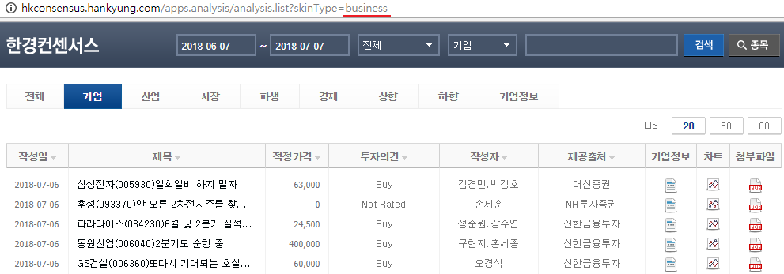
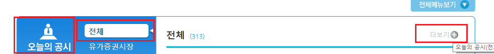
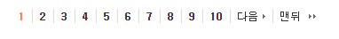
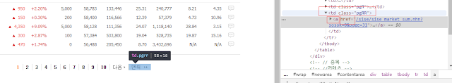

# 크롤링 이해하기

API를 이용하면 데이터를 매우 쉽게 수집할 수 있지만, 국내 주식 데이터를 다운로드 하기에는 한계가 있으며, 원하는 데이터가 API의 형태로 제공된다는 보장도 없습니다. 따라서 우리는 필요한 데이터를 얻기 위해 직접 찾아 나서야 합니다.

각종 금융 웹사이트에는 주가, 재무정보 등 우리가 원하는 대부분의 주식 정보가 제공되고 있으며, API를 활용할 수 없는 경우에도 크롤링을 통해 이러한 데이터를 수집할 수 있습니다. 크롤링 혹은 스크래핑이란 웹사이트에서 원하는 정보를 수집하는 기술입니다. 대부분의 금융 웹사이트는 간단한 형태로 작성되어 있어, 몇 가지 기술만 익히면 어렵지 않게 데이터를 크롤링할 수 있습니다. 이 CHAPTER에서는 크롤링에 대한 간단한 설명과 예제를 살펴보겠습니다.

크롤링을 할 때 주의해야 할 점이 있습니다. 특정 웹사이트의 페이지를 쉬지 않고 크롤링하는 행위를 무한 크롤링이라고 합니다. 무한 크롤링은 해당 웹사이트의 자원을 독점하게 되어 타인의 사용을 막게 되며 웹사이트에 부하를 주게 됩니다. 일부 웹사이트에서는 동일한 IP로 쉬지 않고 크롤링을 할 경우 접속을 막아버리는 경우도 있습니다. **따라서 하나의 페이지를 크롤링한 후 1~2초 가량 정지하고 다시 다음 페이지를 크롤링하는 것이 좋습니다.**

## GET과 POST 방식 이해하기

우리가 인터넷에 접속해 서버에 파일을 요청하면, 서버는 이에 해당하는 파일을 우리에게 보내줍니다. 크롬과 같은 웹 브라우저는 이러한 과정을 사람이 수행하기 편하고 시각적으로 보기 편하도록 만들어진 것이며, 인터넷 주소는 서버의 주소를 기억하기 쉽게 만든 것입니다. 우리가 서버에 데이터를 요청하는 형태는 다양하지만 크롤링에서는 주로 GET과 POST 방식을 사용합니다.

```{r fig.cap='클라이언트와 서버 간의 요청/응답 과정', echo = FALSE}
knitr::include_graphics('images/crawl_flow.png')
```

### GET 방식

GET 방식은 인터넷 주소를 기준으로 이에 해당하는 데이터나 파일을 요청하는 것입니다. 주로 클라이언트가 요청하는 쿼리를 앰퍼샌드(&) 혹은 물음표(?) 형식으로 결합해 서버에 전달합니다.

한경컨센서스^[http://hkconsensus.hankyung.com/]에 접속한 후 상단 탭에서 [기업] 탭을 선택하면, 주소 끝부분에
?skinType=business가 추가되며 이에 해당하는 페이지의 내용을 보여줍니다. 즉, 해당 페이지는 GET 방식을 사용하고 있으며 입력 종류는 skinType, 이에 해당하는 [기업] 탭의 입력값은 business임을 알 수 있습니다.

```{r fig.cap='한경 컨센서스 기업 REPORT 페이지', out.width = '100%', echo = FALSE}

```

이번에는 [파생] 탭을 선택해봅니다. 역시나 웹사이트 주소 끝부분이 ?skinType=derivative로 변경되며, 해당 주소에 맞는 내용이 나타납니다. 여러 다른 탭들을 클릭해보면 ?skinType= 뒷부분의 입력값이 변함에 따라 이에 해당하는 페이지로 내용
이 변경되는 것을 알 수 있습니다.

다시 [기업] 탭을 선택한 후 다음 페이지를 확인하기 위해 하단의 [2]를 클릭합니다. 기존 주소인 ?skinType=business 뒤에 추가로 sdate와 edate, now_page 쿼리가 추가됩니다. sdate는 검색 기간의 시작시점, edate는 검색 기간의 종료시점, now_
page는 현재 페이지를 의미하며, 원하는 데이터를 수기로 입력해도 이에 해당하는 페이지의 데이터를 보여줍니다. 이처럼 GET 방식으로 데이터를 요청하면 웹페이지 주소를 수정해 원하는 종류의 데이터를 받아올 수 있습니다.

```{r fig.cap='쿼리 추가로 인한 url의 변경', out.width = '100%', echo = FALSE}
knitr::include_graphics('images/crawl_hk2.png')
```

### POST 방식

POST 방식은 사용자가 필요한 값을 추가해서 요청하는 방법입니다. GET 방식과 달리 클라이언트가 요청하는 쿼리를 body에 넣어서 전송하므로 요청 내역을 직접 볼 수 없습니다.

한국거래소 상장공시시스템^[http://kind.krx.co.kr/]에 접속해 [전체메뉴보기]를 클릭하고 [상장법인상세정보] 중
[상장종목현황]을 선택합니다. 웹페이지 주소가 바뀌며, 상장종목현황이 나타납니다.

```{r fig.cap='상장공시시스템의 상장종목현황 메뉴', echo = FALSE}
knitr::include_graphics('images/crawl_corp_list.png')
```

이번엔 조회일자를 [2017-12-28]로 선택한 후 [검색]을 클릭합니다. 페이지의 내용은 선택일 기준으로 변경되었지만, 주소는 변경되지 않고 그대로 남아 있습니다. GET 방식에서는 선택 항목에 따라 웹페이지 주소가 변경되었지만, POST 방식을 사용해 서버에 데이터를 요청하는 해당 웹사이트는 그렇지 않은 것을 알 수 있습니다.

POST 방식의 데이터 요청 과정을 살펴보려면 개발자 도구를 이용해야 하며, 크롬에서는 [F12]키를 눌러 개발자 도구 화면을 열 수 있습니다. 개발자 도구 화면에서 다시 한번 [검색]을 클릭해봅니다. [Network] 탭을 클릭하면, [검색]을 클릭함과 동시에 브라우저와 서버 간의 통신 과정을 살펴볼 수 있습니다. 이 중 listedIssueStatus.do라는 항목이 POST 형태임을 알 수 있습니다.

```{r fig.cap='크롬 개발자도구의 Network 화면', out.width = '100%', echo = FALSE}
knitr::include_graphics('images/crawl_corp_list_2.png')
```

해당 메뉴를 클릭하면 통신 과정을 좀 더 자세히 알 수 있습니다. 가장 하단의 Form Data에는 서버에 데이터를 요청하는 내역이 있습니다. method에는 readListIssueStatus, selDate에는 2017-12-28이라는 값이 있습니다.

```{r fig.cap='POST 방식의 서버 요청 내역', echo = FALSE}
knitr::include_graphics('images/crawl_corp_list_3.png')
```

이처럼 POST 방식은 요청하는 데이터에 대한 쿼리가 GET 방식처럼 URL을 통해 전송되는 것이 아닌 body를 통해 전송되므로, 이에 대한 정보는 웹 브라우저를 통해 확인할 수 없습니다.

## 크롤링 예제

일반적인 크롤링은 httr 패키지의 `GET()` 혹은 `POST()` 함수를 이용해 데이터를 다운로드한 후 rvest 패키지의 함수들을 이용해 원하는 데이터를 찾는 과정으로 이루어집니다. 이 CHAPTER에서는 GET 방식으로 금융 실시간 속보의 제목을 추출하는 예제, POST 방식으로 기업공시채널에서 오늘의 공시를 추출하는 예제, 태그와 속성, 페이지 내비게이션 값을 결합해 국내 상장주식의 종목명 및 티커를 추출하는 예제를 학습해 보겠습니다.

### 금융 속보 크롤링

크롤링의 간단한 예제로 금융 속보의 제목을 추출해보겠습니다. 먼저 네이버 금융에
접속한 후 [뉴스 → 실시간 속보]^[https://finance.naver.com/news/news_list.nhn?mode=LSS2D&section_id=101&section_id2=258]를 선택합니다. 이 중 뉴스의 제목에 해당하는 텍스트만 추출하고자 합니다.

뉴스 제목 부분에 마우스 커서를 올려둔 후 마우스 오른쪽 버튼을 클릭하고 [검사]를 선택하면 개발자 도구 화면이 나타납니다. 여기서 해당 글자가 HTML 내에서 어떤 부분에 위치하는지 확인할 수 있습니다. 해당 제목은 dl 태그 → dd 태그의 articleSubject 클래스 → a 태그 중 title 속성에 위치하고 있습니다. 태그와 속성의 차이가 이해되지 않은 분은 CHAPTER 2를 다시 살펴보기 바랍니다.

```{r fig.cap='실시간 속보의 제목 부분 html', out.width = '100%', echo = FALSE}
knitr::include_graphics('images/crawl_naver_news.png')
```

먼저 해당 페이지의 내용을 R로 불러옵니다.

```{r message = FALSE, results="hide"}
library(rvest)
library(httr)

url = 'https://finance.naver.com/news/news_list.nhn?mode=LSS2D&section_id=101&section_id2=258'
data = GET(url)

print(data)
```

먼저 url 변수에 해당 주소를 입력한 후 GET() 함수를 이용해 해당 페이지의 내용을 받아 data 변수에 저장합니다. data 변수를 확인해보면 Status가 200, 즉 데이터가 이상 없이 받아졌으며, 인코딩(charset)은 EUC-KR 타입으로 되어 있습니다.

우리는 개발자 도구 화면을 통해 제목에 해당하는 부분이 dl 태그 → dd 태그의 articleSubject 클래스 → a 태그 중 title 속성에 위치하고 있음을 살펴보았습니다. 이를 활용해 제목 부분만을 추출하는 방법은 다음과 같습니다.

```{r}
data_title = data %>%
  read_html(encoding = 'EUC-KR') %>%
  html_nodes('dl') %>%
  html_nodes('.articleSubject') %>%
  html_nodes('a') %>%
  html_attr('title')
```

1. `read_html()` 함수를 이용해 해당 페이지의 HTML 내용을 읽어오며, 인코딩은 EUC-KR로 설정합니다.
2. `html_nodes()` 함수는 해당 태그를 추출하는 함수이며 dl 태그에 해당하는 부분을 추출합니다.
3. `html_nodes()` 함수를 이용해 articleSubject 클래스에 해당하는 부분을 추출할 수 있으며, 클래스 속성의 경우 이름 앞에 마침표(.)를 붙여주어야 합니다.
4. `html_nodes()` 함수를 이용해 a 태그를 추출합니다.
5. `html_attr()` 함수는 속성을 추출하는 함수이며 title에 해당하는 부분만을 추출합니다.

위 과정을 거쳐 data_title에는 실시간 속보의 제목만이 저장됩니다. 이처럼 개발자 도구 화면을 통해 내가 추출하고자 하는 데이터가 HTML 중 어디에 위치하고 있는지 먼저 확인하면 어렵지 않게 해당 데이터를 읽어올 수 있습니다.

```{r eval= FALSE}
print(data_title)
```

```{r echo = FALSE}
substr(data_title, 1, 20)
```

### 기업공시채널에서 오늘의 공시 불러오기

한국거래소 상장공시시스템에 접속한 후 [오늘의 공시 → 전체 → 더보기]를 선택해 전체 공시내용을 확인할 수 있습니다.

```{r fig.cap='오늘의공시 확인하기', echo = FALSE}

```

해당 페이지에서 날짜를 변경하면 페이지의 내용은 해당일의 공시로 변경되지만 URL은 변경되지 않습니다. 이처럼 POST 방식은 요청하는 데이터에 대한 쿼리가 body의 형태를 통해 전송되므로, 개발자 도구 화면을 통해 해당 쿼리에 대한 내용을 확인해야 합니다.

개발자 도구 화면을 연 상태에서 조회일자를 [2018-12-28]로 선택한 후 [검색]을 클릭하고 [Network] 탭의 todaydisclosure.do 항목을 살펴보면 Form Data를 통해 서버에 데이터를 요청하는 내역을 확인할 수 있습니다. 여러 항목 중 selDate 부분이 우리가 선택한 일자로 설정되어 있습니다.

```{r fig.cap='POST 방식의 데이터 요청', out.width = '100%', echo = FALSE}
knitr::include_graphics('images/crawl_kind_post.png')
```

POST 방식으로 쿼리를 요청하는 방법을 코드로 나타내면 다음과 같습니다.

```{r message = FALSE, results="hide"}
library(httr)
library(rvest)

Sys.setlocale("LC_ALL", "English")

url = 'http://kind.krx.co.kr/disclosure/todaydisclosure.do'
data = POST(url, body = 
              list(
                method = 'searchTodayDisclosureSub',
                currentPageSize = '15',
                pageIndex = '1',
                orderMode = '0',
                orderStat = 'D',
                forward = 'todaydisclosure_sub',
                chose = 'S',
                todayFlag = 'Y',
                selDate = '2018-12-28'
                ))

data = read_html(data) %>%
  html_table(fill = TRUE) %>%
  .[[1]]

Sys.setlocale("LC_ALL", "Korean")
```

1. 한글(korean)로 작성된 페이지를 크롤링하면 오류가 발생하는 경우가 종종 있으므로 `Sys.setlocale()` 함수를 통해 로케일 언어를 영어(English)로 설정합니다.
2. `POST()` 함수를 통해 해당 url에 원하는 쿼리를 요청하며, 쿼리는 body 내에 리스트 형태로 입력해줍니다. 해당 값은 개발자 도구 화면의 Form Data와 동일하게 입력해주며, marketType과 같이 값이 없는 항목은 입력하지 않아도 됩니다.
3. `read_html()` 함수를 이용해 해당 페이지의 HTML 내용을 읽어옵니다.
4. `html_table()` 함수는 테이블 형태의 데이터를 읽어오는 함수입니다. 셀 병합이
된 열이 있으므로 `fill=TRUE`를 추가합니다.
5. .[[1]]를 통해 첫 번째 리스트를 선택합니다.
6. 한글을 읽기 위해 `Sys.setlocale()` 함수를 통해 로케일 언어를 다시 Korean으로 변경합니다.

저장된 데이터를 확인하면 화면과 동일한 내용이 출력됩니다.

```{r}
print(head(data))
```

POST 형식의 경우 body에 들어가는 쿼리 내용을 바꾸어 원하는 데이터를 받을 수 있습니다. 만일 2019년 1월 8일 공시를 확인하고자 한다면 위의 코드에서 selDate만 2019-01-08로 변경해주면 됩니다. 아래 코드의 출력 결과물을 2019년 1월 8일 공시와 비교하면 동일한 결과임을 확인할 수 있습니다.

```{r results="hide"}
Sys.setlocale("LC_ALL", "English")

url = 'http://kind.krx.co.kr/disclosure/todaydisclosure.do'
data = POST(url, body =
              list(
                method = 'searchTodayDisclosureSub',
                currentPageSize = '15',
                pageIndex = '1',
                orderMode = '0',
                orderStat = 'D',
                forward = 'todaydisclosure_sub',
                chose = 'S',
                todayFlag = 'Y',
                selDate = '2019-01-08'
                ))

data = read_html(data) %>%
  html_table(fill = TRUE) %>%
  .[[1]]

Sys.setlocale("LC_ALL", "Korean")
```
```{r}
print(head(data))
```

### 네이버 금융에서 주식티커 크롤링

태그와 속성, 페이지 내비게이션 값을 결합해 국내 상장주식의 종목명 및 티커를 추출하는 방법을 알아보겠습니다. 네이버 금융에서 [국내증시 → 시가총액] 페이지에는 코스피와 코스닥의 시가총액별 정보가 나타나 있습니다.

- 코스피: https://finance.naver.com/sise/sise_market_sum.nhn?sosok=0&page=1
- 코스닥: https://finance.naver.com/sise/sise_market_sum.nhn?sosok=1&page=1

또한 종목명을 클릭해 이동하는 페이지의 URL을 확인해보면, 끝 6자리가 각 종목의 거래소 티커임도 확인이 됩니다.

티커 정리를 위해 HTML에서 확인해야 할 부분은 총 두 가지입니다. 먼저 하단의 페이지 내비게이션을 통해 코스피와 코스닥 시가총액에 해당하는 페이지가 각각 몇 번째 페이지까지 있는지 알아야 합니다. 아래와 같은 항목 중 [맨뒤]에 해당하는 페이지가 가장 마지막 페이지입니다.

```{r fig.cap='페이지 네비게이션', echo = FALSE}

```

[맨뒤]에 마우스 커서를 올려두고 마우스 오른쪽 버튼을 클릭한 후 [검사]를 선택하면 개발자 도구 화면이 열립니다. 여기서 해당 글자가 HTML 내에서 어떤 부분에 위치하는지 확인할 수 있습니다. 해당 링크는 pgRR 클래스 → a 태그 중 href 속성에 위치하며, page= 뒷부분의 숫자에 위치하는 페이지로 링크가 걸려 있습니다.

```{r fig.cap='HTML 내 페이지 네비게이션 부분', fig.align='center', out.width = '100%', echo = FALSE}

```

종목명 링크에 해당하는 주소 중 끝 6자리는 티커에 해당합니다. 따라서 각 링크들의 주소를 알아야 할 필요도 있습니다.

```{r fig.cap='네이버 금융 시가총액 페이지', fig.align='center', out.width = '100%', echo = FALSE}
knitr::include_graphics('images/crawl_naver_corp.png')
```

삼성전자에 마우스 커서를 올려둔 후 마우스 오른쪽 버튼을 클릭하고 [검사]를 선택합니다. 개발자 도구 화면을 살펴보면 해당 링크가 tbody → td → a 태그의 href 속성에 위치하고 있음을 알 수 있습니다.

위 정보들을 이용해 데이터를 다운로드하겠습니다. 아래 코드에서 i = 0일 경우 코스피에 해당하는 URL이 생성되고, i = 1일 경우 코스닥에 해당하는 URL이 생성됩니다. 먼저 코스피에 해당하는 데이터를 다운로드하겠습니다.

```{r message = FALSE}
library(httr)
library(rvest)

i = 0
ticker = list()
url = paste0('https://finance.naver.com/sise/',
             'sise_market_sum.nhn?sosok=',i,'&page=1')
down_table = GET(url)
```

1. 빈 리스트인 ticker 변수를 만들어줍니다.
2. `paste0()` 함수를 이용해 코스피 시가총액 페이지의 url을 만듭니다.
3. `GET()` 함수를 통해 해당 페이지 내용을 받아 down_table 변수에 저장합니다.

가장 먼저 해야 할 작업은 마지막 페이지가 몇 번째 페이지인지 찾아내는 작업입니다. 우리는 이미 개발자 도구 화면을 통해 해당 정보가 pgRR 클래스의 a 태그 중 href 속성에 위치하고 있음을 알고 있습니다.

```{r}
navi.final = read_html(down_table, encoding = 'EUC-KR') %>%
      html_nodes(., '.pgRR') %>%
      html_nodes(., 'a') %>%
      html_attr(., 'href')
```

1. `read_html()` 함수를 이용해 해당 페이지의 HTML 내용을 읽어오며, 인코딩은 EUC-KR로 설정합니다.
2. `html_nodes()` 함수를 이용해 pgRR 클래스 정보만 불러오며, 클래스 속성이므로 앞에 마침표(.)를 붙입니다.
3. `html_nodes()` 함수를 통해 a 태그 정보만 불러옵니다.
4. `html_attr()` 함수를 통해 href 속성을 불러옵니다.

이를 통해 navi.final에는 해당 부분에 해당하는 내용이 저장됩니다.

```{r}
print(navi.final)
```

이 중 우리가 알고 싶은 내용은 page= 뒤에 있는 숫자입니다. 해당 내용을 추출하는 코드는 다음과 같습니다.

```{r}
navi.final = navi.final %>%
  strsplit(., '=') %>%
  unlist() %>%
  tail(., 1) %>%
  as.numeric()
```

1. `strsplit()` 함수는 전체 문장을 특정 글자 기준으로 나눕니다. page= 뒷부분 의 데이터만 필요하므로 =를 기준으로 문장을 나눠줍니다.
2. `unlist()` 함수를 통해 결과를 벡터 형태로 변환합니다.
3. `tail()` 함수를 통해 뒤에서 첫 번째 데이터만 선택합니다.
4. `as.numeric()` 함수를 통해 해당 값을 숫자 형태로 바꾸어줍니다.

```{r}
print(navi.final)
```

코스피 시가총액 페이지는 `r navi.final`번째 페이지까지 있으며, for loop 구문을 이용하면 1페이지부터 navi.final, 즉 `r navi.final` 페이지까지 모든 내용을 읽어올 수 있습니다. 먼저 코스피의 첫 번째 페이지에서 우리가 원하는 데이터를 추출하는 방법을 살펴보겠습니다.

```{r}
i = 0 # 코스피
j = 1 # 첫번째 페이지
url = paste0('https://finance.naver.com/sise/',
             'sise_market_sum.nhn?sosok=',i,"&page=",j)
down_table = GET(url)
```

1. i와 j에 각각 0과 1을 입력해 코스피 첫 번째 페이지에 해당하는 url을 생성합니다.
2. `GET()` 함수를 이용해 해당 페이지의 데이터를 다운로드합니다.

```{r results="hide"}
Sys.setlocale("LC_ALL", "English")

table = read_html(down_table, encoding = "EUC-KR") %>%
  html_table(fill = TRUE)
table = table[[2]]

Sys.setlocale("LC_ALL", "Korean")
```

1. `Sys.setlocale()` 함수를 통해 로케일 언어를 English로 설정합니다.
2. `read_html()` 함수를 통해 HTML 정보를 읽어옵니다.
3. `html_table()` 함수를 통해 테이블 정보를 읽어오며, fill=TRUE를 추가해줍니다.
4. table 변수에는 리스트 형태로 총 세 가지 테이블이 저장되어 있습니다. 첫 번째 리스트에는 거래량, 시가, 고가 등 적용 항목이 저장되어 있고 세 번째 리스트에는 페이지 내비게이션 테이블이 저장되어 있으므로, 우리에게 필요한 두 번째 리스트만을 table 변수에 다시 저장합니다.
5. 한글을 읽기 위해 `Sys.setlocale()` 함수를 통해 로케일 언어를 다시 Korean으로 변경합니다.

저장된 테이블 내용을 확인하면 다음과 같습니다.

```{r}
print(head(table))
```

이 중 마지막 열인 토론실은 필요 없는 열이며, 첫 번째 행과 같이 아무런 정보가 없는 행도 있습니다. 이를 다음과 같이 정리해줍니다.

```{r}
table[, ncol(table)] = NULL
table = na.omit(table)
print(head(table))
```

이제 필요한 정보는 6자리 티커입니다. 티커 역시 개발자 도구 화면을 통해 tbody → td → a 태그의 href 속성에 위치하고 있음을 알고 있습니다. 티커를 추출하는 코드는 다음과 같습니다.

```{r}
symbol = read_html(down_table, encoding = 'EUC-KR') %>%
  html_nodes(., 'tbody') %>%
  html_nodes(., 'td') %>%
  html_nodes(., 'a') %>%
  html_attr(., 'href')

print(head(symbol, 10))
```

1. `read_html()` 함수를 통해 HTML 정보를 읽어오며, 인코딩은 EUC-KR로 설정합니다.
2. `html_nodes()` 함수를 통해 tbody 태그 정보를 불러옵니다.
3. 다시 `html_nodes()` 함수를 통해 td와 a 태그 정보를 불러옵니다.
4. `html_attr()` 함수를 이용해 href 속성을 불러옵니다.

이를 통해 symbol에는 href 속성에 해당하는 링크 주소들이 저장됩니다. 이 중 마지막 6자리 글자만 추출하는 코드는 다음과 같습니다.

```{r}
library(stringr)

symbol = sapply(symbol, function(x) {
        str_sub(x, -6, -1) 
      })

print(head(symbol, 10))
```

`sapply()` 함수를 통해 symbol 변수의 내용들에 `function()`을 적용하며, `stringr` 패키지의 `str_sub()` 함수를 이용해 마지막6자리 글자만 추출합니다.

결과를 살펴보면 티커에 해당하는 마지막 6글자만 추출되지만 동일한 내용이 두 번 연속해 추출됩니다. 이는 main.nhn?code=에 해당하는 부분은 종목명에 설정된 링크, board.nhn?code=에 해당하는 부분은 토론실에 설정된 링크이기 때문입니다.

```{r}
symbol = unique(symbol)
print(head(symbol, 10))
```

`unique()` 함수를 이용해 중복되는 티커를 제거하면 우리가 원하는 티커 부분만 깔끔하게 정리됩니다. 해당 내용을 위에서 구한 테이블에 입력한 후 데이터를 다듬는 과정은 다음과 같습니다.

```{r}
table$N = symbol
colnames(table)[1] = '종목코드'
 
rownames(table) = NULL
ticker[[j]] = table
```

1. 위에서 구한 티커를 N열에 입력합니다.
2. 해당 열 이름을 종목코드로 변경합니다.
3. `na.omit()` 함수를 통해 특정 행을 삭제했으므로, 행 이름을 초기화해줍니다.
4. ticker의 j번째 리스트에 정리된 데이터를 입력합니다.

위의 코드에서 i와 j 값을 for loop 구문에 이용하면 코스피와 코스닥 전 종목의 티커가 정리된 테이블을 만들 수 있습니다. 이를 전체 코드로 나타내면 다음과 같습니다.

```{r eval = FALSE, results="hide"}
data = list()

# i = 0 은 코스피, i = 1 은 코스닥 종목
for (i in 0:1) {

  ticker = list()
  url =
    paste0('https://finance.naver.com/sise/',
             'sise_market_sum.nhn?sosok=',i,'&page=1')
  
  down_table = GET(url)
  
  # 최종 페이지 번호 찾아주기
  navi.final = read_html(down_table, encoding = "EUC-KR") %>%
      html_nodes(., ".pgRR") %>%
      html_nodes(., "a") %>%
      html_attr(.,"href") %>%
      strsplit(., "=") %>%
      unlist() %>%
      tail(., 1) %>%
      as.numeric()
  
  # 첫번째 부터 마지막 페이지까지 for loop를 이용하여 테이블 추출하기
  for (j in 1:navi.final) {
    
    # 각 페이지에 해당하는 url 생성
    url = paste0(
      'https://finance.naver.com/sise/',
      'sise_market_sum.nhn?sosok=',i,"&page=",j)
    down_table = GET(url)
 
    Sys.setlocale("LC_ALL", "English")
    # 한글 오류 방지를 위해 영어로 로케일 언어 변경
 
    table = read_html(down_table, encoding = "EUC-KR") %>%
      html_table(fill = TRUE)
    table = table[[2]] # 원하는 테이블 추출
 
    Sys.setlocale("LC_ALL", "Korean")
    # 한글을 읽기위해 로케일 언어 재변경
 
    table[, ncol(table)] = NULL # 토론식 부분 삭제
    table = na.omit(table) # 빈 행 삭제
    
    # 6자리 티커만 추출
    symbol = read_html(down_table, encoding = "EUC-KR") %>%
      html_nodes(., "tbody") %>%
      html_nodes(., "td") %>%
      html_nodes(., "a") %>%
      html_attr(., "href")
 
    symbol = sapply(symbol, function(x) {
        str_sub(x, -6, -1) 
      })
    
    symbol = unique(symbol)
    
    # 테이블에 티커 넣어준 후, 테이블 정리
    table$N = symbol
    colnames(table)[1] = "종목코드"

    rownames(table) = NULL
    ticker[[j]] = table
 
    Sys.sleep(0.5) # 페이지 당 0.5초의 슬립 적용
  }
  
  # do.call을 통해 리스트를 데이터 프레임으로 묶기
  ticker = do.call(rbind, ticker)
  data[[i + 1]] = ticker
}

# 코스피와 코스닥 테이블 묶기
data = do.call(rbind, data)
```
