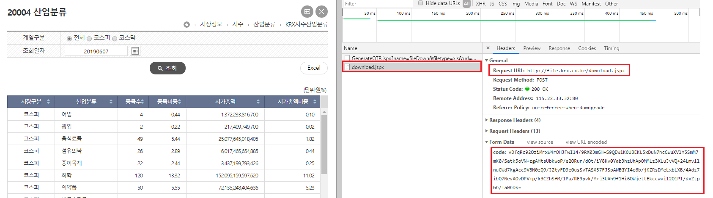
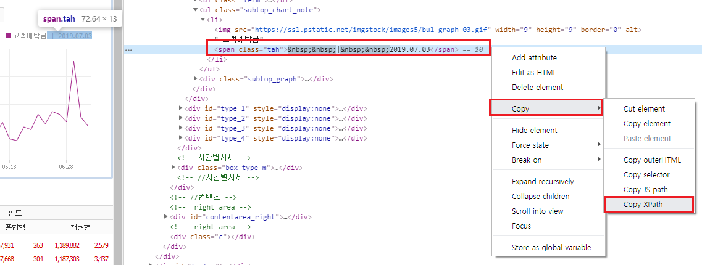

# 금융 데이터 수집하기 (기본)

API와 크롤링을 이용한다면 비용을 지불하지 않고 얼마든지 금융 데이터를 수집할 수있습니다. 이 CHAPTER에서는 금융 데이터를 받기 위해 필요한 주식티커를 구하는 방법과 섹터별 구성종목을 크롤링하는 방법을 알아보겠습니다.

## 한국거래소의 산업별 현황 및 개별지표 크롤링

앞 CHAPTER의 예제를 통해 네이버 금융에서 주식티커를 크롤링하는 방법을 살펴보았습니다. 그러나 이 방법은 지나치게 복잡하고 시간이 오래 걸립니다. 반면 한국거래소에서 제공하는 업종분류 현황과 개별종목 지표 데이터를 이용하면 훨씬 간단하게 주식티커 데이터를 수집할 수 있습니다.

- KRX 정보데이터시스템 http://data.krx.co.kr/ 에서 [기본통계 → 주식 → 세부안내] 부분
- [12025] 업종분류 현황 
- [12021] 개별종목

해당 데이터들을 크롤링이 아닌 [Excel] 버튼을 클릭해 엑셀 파일로 받을 수도 있습니다. 그러나 매번 엑셀 파일을 다운로드하고 이를 R로 불러오는 작업은 상당히 비효율적이며, 크롤링을 이용한다면 해당 데이터를 R로 직접 불러올 수 있습니다.

### 업종분류 현황 크롤링

먼저 업종분류 현황에 해당하는 페이지에 접속한 후 개발자 도구 화면을 열고 [다운로드] 버튼을 클릭한 후 [CSV]를 누릅니다. [Network] 탭에는 generate.cmd와 download.cmd 두 가지 항목이 있습니다. 거래소에서 엑셀 데이터를 받는 과정은 다음과 같습니다.

1. http://data.krx.co.kr/comm/fileDn/download_excel/download.cmd 에 원하는 항목을 쿼리로 발송하면 해당 쿼리에 해당하는 OTP(generate.cmd)를 받게 됩니다.

2. 부여받은 OTP를 **http://data.krx.co.kr/**에 제출하면 이에 해당하는 데이터(download.cmd)를 다운로드하게 됩니다.

먼저 1번 단계를 살펴보겠습니다.

```{r fig.cap='OTP 생성 부분', fig.align='center', out.width = '100%', echo = FALSE}
knitr::include_graphics('images/crawl_practice_krx_sector.png')
```

General 항목의 Request URL의 앞부분이 원하는 항목을 제출할 주소입니다. Form Data에는 우리가 원하는 항목들이 적혀 있습니다. 이를 통해 POST 방식으로 데이터를 요청함을 알 수 있습니다.

다음으로 2번 단계를 살펴보겠습니다.

```{r fig.cap='OTP 제출 부분', fig.align='center', out.width = '100%', echo = FALSE}

```

General 항목의 Request URL은 OTP를 제출할 주소입니다. Form Data의 OTP는 1번 단계에서 부여받은 OTP에 해당합니다. 이 역시 POST 방식으로 데이터를 요청합니다.

위 과정을 코드로 나타내면 다음과 같습니다.

```{r message = FALSE}
library(httr)
library(rvest)
library(readr)

gen_otp_url =
  'http://data.krx.co.kr/comm/fileDn/GenerateOTP/generate.cmd'
gen_otp_data = list(
  mktId = 'STK',
  trdDd = '20210108',
  money = '1',
  csvxls_isNo = 'false',
  name = 'fileDown',
  url = 'dbms/MDC/STAT/standard/MDCSTAT03901'
)
otp = POST(gen_otp_url, query = gen_otp_data) %>%
  read_html() %>%
  html_text()
```

1. gen_otp_url에 원하는 항목을 제출할 URL을 입력합니다.
2. 개발자 도구 화면에 나타는 쿼리 내용들을 리스트 형태로 입력합니다. 이 중 mktId의 STK는 코스피에 해당하는 내용이며, 코스닥 데이터를 받고자 할 경우 KSQ를 입력해야 합니다.
3. `POST()` 함수를 통해 해당 URL에 쿼리를 전송하면 이에 해당하는 데이터를 받게 됩니다.
4. `read_html()`함수를 통해 HTML 내용을 읽어옵니다.
5. `html_text()` 함수는 HTML 내에서 텍스트에 해당하는 부분만을 추출합니다. 이를 통해 OTP 값만 추출하게 됩니다.

위의 과정을 거쳐 생성된 OTP를 제출하면, 우리가 원하는 데이터를 다운로드할 수 있습니다.

```{r}
down_url = 'http://data.krx.co.kr/comm/fileDn/download_csv/download.cmd'
down_sector_KS = POST(down_url, query = list(code = otp),
                   add_headers(referer = gen_otp_url)) %>%
  read_html(encoding = 'EUC-KR') %>%
  html_text() %>%
  read_csv()
```

1. OTP를 제출할 URL을 down_url에 입력합니다.
2. `POST()` 함수를 통해 위에서 부여받은 OTP 코드를 해당 URL에 제출합니다.
3. `add_headers()` 구문을 통해 리퍼러(referer)를 추가해야 합니다. 리퍼러란 링크를 통해서 각각의 웹사이트로 방문할 때 남는 흔적입니다. 거래소 데이터를 다운로드하는 과정을 살펴보면 첫 번째 URL에서 OTP를 부여받고, 이를 다시 두번째 URL에 제출했습니다. 그런데 이러한 과정의 흔적이 없이 OTP를 바로 두번째 URL에 제출하면 서버는 이를 로봇으로 인식해 데이터를 반환하지 않습니다. 따라서 `add_headers()` 함수를 통해 우리가 거쳐온 과정을 흔적으로 남겨
야 데이터를 반환하게 되며 첫 번째 URL을 리퍼러로 지정해줍니다.
4. `read_html()`과 `html_text()` 함수를 통해 텍스트 데이터만 추출합니다. EUC-KR로 인코딩이 되어 있으므로 `read_html()` 내에 이를 입력해줍니다.
5. `read_csv()` 함수는 csv 형태의 데이터를 불러옵니다. 

```{r}
print(down_sector_KS)
```

위 과정을 통해 down_sector 변수에는 산업별 현황 데이터가 저장되었습니다. 코스닥 시장의 데이터도 다운로드 받도록 하겠습니다.

```{r}
gen_otp_data = list(
  mktId = 'KSQ', # 코스닥으로 변경
  trdDd = '20210108',
  money = '1',
  csvxls_isNo = 'false',
  name = 'fileDown',
  url = 'dbms/MDC/STAT/standard/MDCSTAT03901'
)
otp = POST(gen_otp_url, query = gen_otp_data) %>%
  read_html() %>%
  html_text()

down_sector_KQ = POST(down_url, query = list(code = otp),
                   add_headers(referer = gen_otp_url)) %>%
  read_html(encoding = 'EUC-KR') %>%
  html_text() %>%
  read_csv()
```

코스피 데이터와 코스닥 데이터를 하나로 합치도록 합니다.

```{r}
down_sector = rbind(down_sector_KS, down_sector_KQ)
```


이를 csv 파일로 저장하겠습니다.

```{r eval = FALSE}
ifelse(dir.exists('data'), FALSE, dir.create('data'))
write.csv(down_sector, 'data/krx_sector.csv')
```

먼저 `ifelse()` 함수를 통해 data라는 이름의 폴더가 있으면 FALSE를 반환하고, 없으면 해당 이름으로 폴더를 생성해줍니다. 그 후 앞서 다운로드한 데이터를 data 폴더 안에 krx_sector.csv 이름으로 저장합니다. 해당 폴더를 확인해보면 데이터가 csv 형태로 저장되어 있습니다.

### 개별종목 지표 크롤링

개별종목 데이터를 크롤링하는 방법은 위와 매우 유사하며, 요청하는 쿼리 값에만 차이가 있습니다. 개발자 도구 화면을 열고 [CSV] 버튼을 클릭해 어떠한 쿼리를 요청하는지 확인합니다.

```{r fig.cap='개별지표 OTP 생성 부분', fig.align='center', out.width = '100%', echo = FALSE}
knitr::include_graphics('images/crawl_practice_krx_ind.png')
```

이 중 tboxisuCd_finder_stkisu0_6, isu_Cd, isu_Cd2 등의 항목은 조회 구분의 개별추이 탭에 해당하는 부분이므로 우리가 원하는 전체 데이터를 받을 때는 필요하지 않은 요청값입니다. 이를 제외한 요청값을 산업별 현황 예제에 적용하면 해당 데이터 역시 손쉽게 다운로드할 수 있습니다.

```{r message = FALSE}
library(httr)
library(rvest)
library(readr)

gen_otp_url =
  'http://data.krx.co.kr/comm/fileDn/GenerateOTP/generate.cmd'
gen_otp_data = list(
  searchType = '1',
  mktId = 'ALL',
  trdDd = '20210108',
  csvxls_isNo = 'false',
  name = 'fileDown',
  url = 'dbms/MDC/STAT/standard/MDCSTAT03501'
)
otp = POST(gen_otp_url, query = gen_otp_data) %>%
  read_html() %>%
  html_text()

down_url = 'http://data.krx.co.kr/comm/fileDn/download_csv/download.cmd'
down_ind = POST(down_url, query = list(code = otp),
                add_headers(referer = gen_otp_url)) %>%
  read_html(encoding = 'EUC-KR') %>%
  html_text() %>%
  read_csv()
```

```{r}
print(down_ind)
```

위 과정을 통해 down_ind 변수에는 개별종목 지표 데이터가 저장되었습니다. 해당 데이터 역시 csv 파일로 저장하겠습니다.

```{r eval = FALSE}
write.csv(down_ind, 'data/krx_ind.csv')
```

### 최근 영업일 기준 데이터 받기

위 예제의 쿼리 항목 중 date와 schdate 부분을 원하는 일자로 입력하면(예: 20190104) 해당일의 데이터를 다운로드할 수 있으며, 전 영업일 날짜를 입력하면 가장 최근의 데이터를 받을 수 있습니다. 그러나 매번 해당 항목을 입력하기는 번거로우므로 자동으로 반영되게 할 필요가 있습니다.

네이버 금융의 [국내증시 → 증시자금동향]에는 이전 2영업일에 해당하는 날짜가 있으며, 자동으로 날짜가 업데이트되어 편리합니다. 따라서 해당 부분을 크롤링해 쿼리 항목에 사용할 수 있습니다.

```{r fig.cap='최근 영업일 부분', echo = FALSE}
knitr::include_graphics('images/crawl_practice_recentdate.png')
```

크롤링하고자 하는 데이터가 하나거나 소수일때는 HTML 구조를 모두 분해한 후 데이터를 추출하는 것보다 Xpath를 이용하는 것이 훨씬 효율적입니다. Xpath란 XML 중 특정 값의 태그나 속성을 찾기 쉽게 만든 주소라 생각하면 됩니다. 예를 들어 R 프로그램이 저장된 곳을 윈도우 탐색기를 이용해 이용하면 C:\\Program Files\\R\\R-3.4.2 형태의 주소를 보이는데 이것은 윈도우의 path 문법입니다. XML 역시 이와 동일한 개념의 Xpath가 있습니다. 웹페이지에서 Xpath를 찾는 법은 다음과 같습니다.

```{r fig.cap='Xpath 복사하기', echo = FALSE}

```

먼저 크롤링하고자 하는 내용에 마우스 커서를 올린 채 마우스 오른쪽 버튼을 클릭한 후 [검사]를 선택합니다. 그러면 개발자 도구 화면이 열리며 해당 지점의 HTML 부분이 선택됩니다. 그 후 HTML 화면에서 마우스 오른쪽 버튼을 클릭하고 [Copy → Copy Xpath]를 선택하면 해당 지점의 Xpath가 복사됩니다.

```{css}
//*[@id="type_0"]/div/ul[2]/li/span
```

위에서 구한 날짜의 Xpath를 이용해 해당 데이터를 크롤링하겠습니다.

```{r message = FALSE}
library(httr)
library(rvest)
library(stringr)

url = 'https://finance.naver.com/sise/sise_deposit.nhn'

biz_day = GET(url) %>%
  read_html(encoding = 'EUC-KR') %>%
  html_nodes(xpath =
               '//*[@id="type_1"]/div/ul[2]/li/span') %>%
  html_text() %>%
  str_match(('[0-9]+.[0-9]+.[0-9]+') ) %>%
  str_replace_all('\\.', '')

print(biz_day)
```

1. 페이지의 url을 저장합니다.
2. `GET()` 함수를 통해 해당 페이지 내용을 받습니다.
3. `read_html()` 함수를 이용해 해당 페이지의 HTML 내용을 읽어오며, 인코딩은 EUC-KR로 설정합니다.
4. `html_node()` 함수 내에 위에서 구한 Xpath를 입력해서 해당 지점의 데이터를 추출합니다.
5. `html_text()` 함수를 통해 텍스트 데이터만을 추출합니다.
6. `str_match()` 함수 내에서 정규표현식^[특정한 규칙을 가진 문자열의 집합을 표현하는데 사용하는 형식 언어]을 이용해 숫자.숫자.숫자 형식의 데이터를 추출합니다.
7. `str_replace_all()` 함수를 이용해 마침표(.)를 모두 없애줍니다.

이처럼 Xpath를 이용하면 태그나 속성을 분해하지 않고도 원하는 지점의 데이터를 크롤링할 수 있습니다. 위 과정을 통해 yyyymmdd 형태의 날짜만 남게 되었습니다. 이를 위의 date와 schdate에 입력하면 산업별 현황과 개별종목 지표를 최근일자 기준으로 다운로드하게 됩니다. 전체 코드는 다음과 같습니다.

```{r message = FALSE, results = 'hide', eval = FALSE}
library(httr)
library(rvest)
library(stringr)
library(readr)

# 최근 영업일 구하기
url = 'https://finance.naver.com/sise/sise_deposit.nhn'

biz_day = GET(url) %>%
  read_html(encoding = 'EUC-KR') %>%
  html_nodes(xpath =
               '//*[@id="type_1"]/div/ul[2]/li/span') %>%
  html_text() %>%
  str_match(('[0-9]+.[0-9]+.[0-9]+') ) %>%
  str_replace_all('\\.', '')

# 코스피 업종분류 OTP 발급
gen_otp_url =
    'http://data.krx.co.kr/comm/fileDn/GenerateOTP/generate.cmd'
gen_otp_data = list(
  mktId = 'STK',
  trdDd = biz_day, # 최근영업일로 변경
  money = '1',
  csvxls_isNo = 'false',
  name = 'fileDown',
  url = 'dbms/MDC/STAT/standard/MDCSTAT03901'
)
otp = POST(gen_otp_url, query = gen_otp_data) %>%
  read_html() %>%
  html_text()

# 코스피 업종분류 데이터 다운로드
down_url = 'http://data.krx.co.kr/comm/fileDn/download_csv/download.cmd'
down_sector_KS = POST(down_url, query = list(code = otp),
                   add_headers(referer = gen_otp_url)) %>%
  read_html(encoding = 'EUC-KR') %>%
  html_text() %>%
  read_csv()

# 코스닥 업종분류 OTP 발급
gen_otp_data = list(
  mktId = 'KSQ',
  trdDd = biz_day, # 최근영업일로 변경
  money = '1',
  csvxls_isNo = 'false',
  name = 'fileDown',
  url = 'dbms/MDC/STAT/standard/MDCSTAT03901'
)
otp = POST(gen_otp_url, query = gen_otp_data) %>%
  read_html() %>%
  html_text()

# 코스닥 업종분류 데이터 다운로드
down_sector_KQ = POST(down_url, query = list(code = otp),
                   add_headers(referer = gen_otp_url)) %>%
  read_html(encoding = 'EUC-KR') %>%
  html_text() %>%
  read_csv()

down_sector = rbind(down_sector_KS, down_sector_KQ)

ifelse(dir.exists('data'), FALSE, dir.create('data'))
write.csv(down_sector, 'data/krx_sector.csv')

# 개별종목 지표 OTP 발급
gen_otp_url =
  'http://data.krx.co.kr/comm/fileDn/GenerateOTP/generate.cmd'
gen_otp_data = list(
  searchType = '1',
  mktId = 'ALL',
  trdDd = biz_day, # 최근영업일로 변경
  csvxls_isNo = 'false',
  name = 'fileDown',
  url = 'dbms/MDC/STAT/standard/MDCSTAT03501'
)
otp = POST(gen_otp_url, query = gen_otp_data) %>%
  read_html() %>%
  html_text()

# 개별종목 지표 데이터 다운로드
down_url = 'http://data.krx.co.kr/comm/fileDn/download_csv/download.cmd'
down_ind = POST(down_url, query = list(code = otp),
                add_headers(referer = gen_otp_url)) %>%
  read_html(encoding = 'EUC-KR') %>%
  html_text() %>%
  read_csv()

write.csv(down_ind, 'data/krx_ind.csv')
```

### 거래소 데이터 정리하기

위에서 다운로드한 데이터는 중복된 열이 있으며, 불필요한 데이터 역시 있습니다. 따라서 하나의 테이블로 합친 후 정리할 필요가 있습니다. 먼저 다운로드한 csv 파일을 읽어옵니다.

```{r}
down_sector = read.csv('data/krx_sector.csv', row.names = 1,
                       stringsAsFactors = FALSE)
down_ind = read.csv('data/krx_ind.csv',  row.names = 1,
                    stringsAsFactors = FALSE)
```

`read.csv()` 함수를 이용해 csv 파일을 불러옵니다. `row.names = 1`을 통해 첫 번째 열을 행 이름으로 지정하고, `stringsAsFactors = FALSE`를 통해 문자열 데이터가 팩터 형태로 변형되지 않게 합니다.

```{r}
intersect(names(down_sector), names(down_ind))
```

먼저 `intersect()` 함수를 통해 두 데이터 간 중복되는 열 이름을 살펴보면 종목코드와 종목명 등이 동일한 위치에 있습니다.

```{r}
setdiff(down_sector[, '종목명'], down_ind[ ,'종목명'])
```

`setdiff()` 함수를 통해 두 데이터에 공통적으로 없는 종목명, 즉 하나의 데이터에만 있는 종목을 살펴보면 위와 같습니다. 해당 종목들은 선박펀드, 광물펀드, 해외종목 등 일반적이지 않은 종목들이므로 제외하는 것이 좋습니다. 따라서 둘 사이에 공통적으로 존재하는 종목을 기준으로 데이터를 합쳐주겠습니다.

```{r}
KOR_ticker = merge(down_sector, down_ind,
                   by = intersect(names(down_sector),
                                  names(down_ind)),
                   all = FALSE
                   )
```

`merge()` 함수는 by를 기준으로 두 데이터를 하나로 합치며, 공통으로 존재하는 `r intersect(names(down_sector), names(down_ind))`을 기준으로 입력해줍니다. 또한 all 값을 TRUE로 설정하면 합집합을 반환하고, FALSE로 설정하면 교집합을 반환합니다. 공통으로 존재하는 항목을 원하므로 여기서는 FALSE를 입력합니다.

```{r}
KOR_ticker = KOR_ticker[order(-KOR_ticker['시가총액']), ]
print(head(KOR_ticker))
```

데이터를 시가총액 기준으로 내림차순 정렬할 필요도 있습니다. `order()` 함수를 통해 상대적인 순서를 구할 수 있습니다. R은 기본적으로 오름차순으로 순서를 구하므로 앞에 마이너스(-)를 붙여 내림차순 형태로 바꿉니다. 결과적으로 시가총액 기준 내림차
순으로 해당 데이터가 정렬됩니다.

마지막으로 스팩, 우선주 종목 역시 제외해야 합니다.

```{r}
library(stringr)

KOR_ticker[grepl('스팩', KOR_ticker[, '종목명']), '종목명']  
KOR_ticker[str_sub(KOR_ticker[, '종목코드'], -1, -1) != 0, '종목명']
```

`grepl()` 함수를 통해 종목명에 ‘스팩’이 들어가는 종목을 찾고, `stringr` 패키지의 `str_sub()` 함수를 통해 종목코드 끝이 0이 아닌 우선주 종목을 찾을 수 있습니다.

```{r}
KOR_ticker = KOR_ticker[!grepl('스팩', KOR_ticker[, '종목명']), ]  
KOR_ticker = KOR_ticker[str_sub(KOR_ticker[, '종목코드'], -1, -1) == 0, ]
```

마지막으로 행 이름을 초기화한 후 정리된 데이터를 csv 파일로 저장합니다.

```{r eval = FALSE}
rownames(KOR_ticker) = NULL
write.csv(KOR_ticker, 'data/KOR_ticker.csv')
```

## WICS 기준 섹터정보 크롤링

일반적으로 주식의 섹터를 나누는 기준은 MSCI와 S&P가 개발한 GICS^[https://en.wikipedia.org/wiki/Global_Industry_Classification_Standard]를 가장 많이 사용합니다. 국내 종목의 GICS 기준 정보 역시 한국거래소에서 제공하고 있으나, 이는 독점적 지적재산으로 명시했기에 사용하는 데 무리가 있습니다. 그러나 지수제공업체인 와이즈인덱스^[http://www.wiseindex.com/]에서는 GICS와 비슷한 WICS 산업분류를 발표하고 있습니다. WICS를 크롤링해 필요한 정보를 수집해보겠습니다.

먼저 웹페이지에 접속해 [Index → WISE SECTOR INDEX → WICS → 에너지]를 클릭합니다. 그 후 [Components] 탭을 클릭하면 해당 섹터의 구성종목을 확인할 수 있습니다.

```{r fig.cap='WICS 기준 구성종목', fig.align='center', out.width = '100%', echo = FALSE}
knitr::include_graphics('images/crawl_practice_wics.png')
```

개발자도구 화면(그림 \@ref(fig:wicurl))을 통해 해당 페이지의 데이터전송 과정을 살펴보도록 하겠습니다.

```{r wicurl, fig.cap='WICS 페이지 개발자도구 화면', fig.align='center', out.width = '100%', echo = FALSE}
knitr::include_graphics('images/crawl_practice_wics2.png')
```

일자를 선택하면 [Network] 탭의 GetIndexComponets 항목을 통해 데이터 전송 과정이 나타납니다. Request URL의 주소를 살펴보면 다음과 같습니다.

1. http://www.wiseindex.com/Index/GetIndexComponets: 데이터를 요청하는 url 입니다.
2. ceil_yn = 0: 실링 여부를 나타내며, 0은 비실링을 의미합니다.
3. dt=20190607: 조회일자를 나타냅니다.
4. sec_cd=G10: 섹터 코드를 나타냅니다.

이번엔 위 주소의 페이지를 열어보겠습니다.

```{r fig.cap='WICS 데이터 페이지', fig.align='center', out.width = '100%', echo = FALSE}
knitr::include_graphics('images/crawl_practice_wics3.png')
```

글자들은 페이지에 출력된 내용이지만 매우 특이한 형태로 구성되어 있는데 이것은 JSON 형식의 데이터입니다. 기존에 우리가 살펴보았던 대부분의 웹페이지는 XML 형식으로 표현되어 있습니다. XML 형식은 문법이 복잡하고 표현 규칙이 엄격해 데이터의 용량이 커지는 단점이 있습니다. 반면 JSON 형식은 문법이 단순하고 데이터의 용량이 작아 빠른 속도로 데이터를 교환할 수 있습니다. R에서는 jsonlite 패키지의 `fromJSON()` 함수를 사용해 매우 손쉽게 JSON 형식의 데이터를 크롤링할 수 있습니다.

```{r message = FALSE}
library(jsonlite)

url = 'http://www.wiseindex.com/Index/GetIndexComponets?ceil_yn=0&dt=20190607&sec_cd=G10'
data = fromJSON(url)

lapply(data, head)
```

\$list 항목에는 해당 섹터의 구성종목 정보가 있으며, \$sector 항목을 통해 다른 섹터의 코드도 확인할 수 있습니다. for loop 구문을 이용해 URL의 sec_cd=에 해당하는 부분만 변경하면 모든 섹터의 구성종목을 매우 쉽게 얻을 수 있습니다.

````{r eval = FALSE}
sector_code = c('G25', 'G35', 'G50', 'G40', 'G10',
                'G20', 'G55', 'G30', 'G15', 'G45')
data_sector = list()

for (i in sector_code) {
  
  url = paste0(
    'http://www.wiseindex.com/Index/GetIndexComponets',
    '?ceil_yn=0&dt=',biz_day,'&sec_cd=',i)
  data = fromJSON(url)
  data = data$list
  
  data_sector[[i]] = data
  
  Sys.sleep(1)
}

data_sector = do.call(rbind, data_sector)
```

해당 데이터를 csv 파일로 저장해주도록 합니다.

```{r eval = FALSE}
write.csv(data_sector, 'data/KOR_sector.csv')
```
