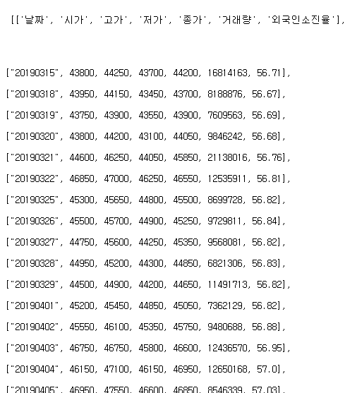
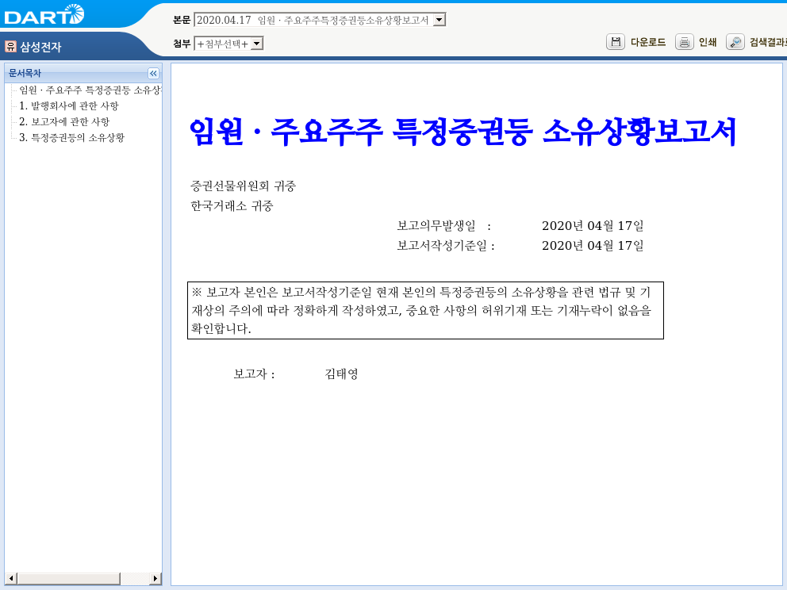

# 금융 데이터 수집하기 (심화)

지난 CHAPTER에서 수집한 주식티커를 바탕으로 이번 CHAPTER에서는 퀀트 투자의 핵심 자료인 수정주가, 재무제표, 가치지표를 크롤링하는 방법을 알아보겠습니다.

## 수정주가 크롤링

주가 데이터는 투자를 함에 있어 반드시 필요한 데이터이며, 인터넷에서 주가를 수집할 수 있는 방법은 매우 많습니다. 먼저 API를 이용한 데이터 수집에서 살펴본 것과 같이, `getSymbols()` 함수를 이용해 데이터를 받을 수 있습니다. 그러나 야후 파이낸스에서 제공하는 데이터 중 미국 주가는 이상 없이 다운로드되지만, 국내 중소형주는 주가가 없는 경우가 있습니다.

또한 단순 주가를 구할 수 있는 방법은 많지만, 투자에 필요한 수정주가를 구할 수 있는 방법은 찾기 힘듭니다. 다행히 네이버 금융에서 제공하는 정보를 통해 모든 종목의 수정주가를 매우 손쉽게 구할 수 있습니다. 

### 개별종목 주가 크롤링

먼저 네이버 금융에서 특정종목(예: 삼성전자)의 [차트] 탭^[https://finance.naver.com/item/fchart.nhn?code=005930]을 선택합니다.^[플래쉬가 차단되어 화면이 나오지 않는 경우, 주소창의 왼쪽 상단에 위치한 자물쇠 버튼을 클릭한 다음, Flash를 허용으로 바꾼 후 새로고침을 누르면 차트가 나오게 됩니다.] 해당 차트는 주가 데이터를 받아 그래프를 그려주는 형태입니다. 따라서 해당 데이터가 어디에서 오는지 알기 위해 개발자 도구 화면을 이용합니다.

```{r fig.cap='네이버금융 차트의 통신기록', echo = FALSE}
knitr::include_graphics('images/crawl_practice_price2.png')
```

화면을 연 상태에서 [일봉] 탭을 선택하면 sise.nhn, schedule.nhn, notice.nhn 총 세 가지 항목이 생성됩니다. 이 중 sise.nhn 항목의 Request URL이 주가 데이터를 요청하는 주소입니다. 해당 URL에 접속해보겠습니다.

```{r fig.cap='주가 데이터 페이지', echo = FALSE}

```

각 날짜별로 시가, 고가, 저가, 종가, 거래량이 있으며, 주가는 모두 수정주가 기준입니다. 또한 해당 데이터가 item 태그 내 data 속성에 위치하고 있습니다.

URL에서 symbol= 뒤에 6자리 티커만 변경하면 해당 종목의 주가 데이터가 있는 페이지로 이동할 수 있으며, 우리가 원하는 모든 종목의 주가 데이터를 크롤링할 수 있습니다.

```{r message = FALSE}
library(stringr)

KOR_ticker = read.csv('data/KOR_ticker.csv', row.names = 1)
print(KOR_ticker$'종목코드'[1])
KOR_ticker$'종목코드' =
  str_pad(KOR_ticker$'종목코드', 6, side = c('left'), pad = '0')
```

먼저 저장해두었던 csv 파일을 불러옵니다. 종목코드를 살펴보면 005930이어야 할 삼성전자의 티커가 5930으로 입력되어 있습니다. 이는 파일을 불러오는 과정에서 0으로 시작하는 숫자들이 지워졌기 때문입니다. stringr 패키지의 `str_pad()` 함수를 사용해 6자리가 되지 않는 문자는 왼쪽에 0을 추가해 강제로 6자리로 만들어주도록 합니다.

다음은 첫 번째 종목인 삼성전자의 주가를 크롤링한 후 가공하는 방법입니다.

```{r message = FALSE}
library(xts)

ifelse(dir.exists('data/KOR_price'), FALSE,
       dir.create('data/KOR_price'))
i = 1
name = KOR_ticker$'종목코드'[i]

price = xts(NA, order.by = Sys.Date())
print(price)
```

1. data 폴더 내에 KOR_price 폴더를 생성합니다.
2. i = 1을 입력합니다. 향후 for loop 구문을 통해 i 값만 변경하면 모든 종목의 주가를 다운로드할 수 있습니다.
3. name에 해당 티커를 입력합니다.
4. `xts()` 함수를 이용해 빈 시계열 데이터를 생성하며, 인덱스는 `Sys.Date()`를 통해 현재 날짜를 입력합니다.

```{r message = FALSE}
library(httr)
library(rvest)

url = paste0(
  'https://fchart.stock.naver.com/sise.nhn?symbol=',
  name,'&timeframe=day&count=500&requestType=0')
data = GET(url)
data_html = read_html(data, encoding = 'EUC-KR') %>%
  html_nodes('item') %>%
  html_attr('data') 

print(head(data_html))
```

1. `paste0()` 함수를 이용해 원하는 종목의 url을 생성합니다. url 중 티커에 해당하는 6자리 부분만 위에서 입력한 name으로 설정해주면 됩니다.
2. `GET()` 함수를 통해 페이지의 데이터를 불러옵니다.
3. `read_html()` 함수를 통해 HTML 정보를 읽어옵니다.
4. `html_nodes()`와 `html_attr()` 함수를 통해 item 태그 및 data 속성의 데이터를 추출합니다.

결과적으로 날짜 및 주가, 거래량 데이터가 추출됩니다. 해당 데이터는 |으로 구분되어 있으며, 이를 테이블 형태로 바꿀 필요가 있습니다.

```{r message = FALSE, warning = FALSE}
library(readr)

price = read_delim(data_html, delim = '|')
print(head(price))
```

readr 패키지의 `read_delim()` 함수를 쓰면 구분자로 이루어진 데이터를 테이블로 쉽게 변경할 수 있습니다. 데이터를 확인해보면 테이블 형태로 변경되었으며 각 열은 날짜, 시가, 고가, 저가, 종가, 거래량을 의미합니다. 이 중 우리가 필요한 날짜와 종가를 선택한 후 데이터 클렌징을 해줍니다.

```{r message = FALSE}
library(lubridate)
library(timetk)

price = price[c(1, 5)] 
price = data.frame(price)
colnames(price) = c('Date', 'Price')
price[, 1] = ymd(price[, 1])
price = tk_xts(price, date_var = Date)
 
print(tail(price))
```

1. 날짜에 해당하는 첫 번째 열과, 종가에 해당하는 다섯 번째 열만 선택해 저장합니다.
2. 티블 형태의 데이터를 데이터 프레임 형태로 변경합니다.
3. 열 이름을 Date와 Price로 변경합니다.
4. lubridate 패키지의 `ymd()` 함수를 이용하면 yyyymmdd 형태가 yyyy-mm-dd로 변경되며 데이터 형태 또한 Date 타입으로 변경됩니다.
5. `timetk` 패키지의 `tk_xts()` 함수를 이용해 시계열 형태로 변경하며, 인덱스는 Date 열을 설정합니다. 형태를 변경한 후 해당 열은 자동으로 삭제됩니다.

데이터를 확인해보면 우리에게 필요한 형태로 정리되었습니다.

```{r eval = FALSE}
write.csv(price, paste0('data/KOR_price/', name,
                        '_price.csv'))
```

마지막으로 해당 데이터를 data 폴더의 KOR_price 폴더 내에 티커_price.csv 이름으로 저장합니다.

### 전 종목 주가 크롤링

위의 코드에서 for loop 구문을 이용해 i 값만 변경해주면 모든 종목의 주가를 다운로드할 수 있습니다. 전 종목 주가를 다운로드하는 전체 코드는 다음과 같습니다.

```{r eval = FALSE, warning = FALSE}
library(httr)
library(rvest)
library(stringr)
library(xts)
library(lubridate)
library(readr)

KOR_ticker = read.csv('data/KOR_ticker.csv', row.names = 1)
print(KOR_ticker$'종목코드'[1])
KOR_ticker$'종목코드' =
  str_pad(KOR_ticker$'종목코드', 6, side = c('left'), pad = '0')

ifelse(dir.exists('data/KOR_price'), FALSE,
       dir.create('data/KOR_price'))

for(i in 1 : nrow(KOR_ticker) ) {
  
  price = xts(NA, order.by = Sys.Date()) # 빈 시계열 데이터 생성
  name = KOR_ticker$'종목코드'[i] # 티커 부분 선택
  
  # 오류 발생 시 이를 무시하고 다음 루프로 진행
  tryCatch({
    # url 생성
    url = paste0(
      'https://fchart.stock.naver.com/sise.nhn?symbol='
      ,name,'&timeframe=day&count=500&requestType=0')
    
    # 이 후 과정은 위와 동일함
    # 데이터 다운로드
    data = GET(url)
    data_html = read_html(data, encoding = 'EUC-KR') %>%
      html_nodes("item") %>%
      html_attr("data") 
    
    # 데이터 나누기
    price = read_delim(data_html, delim = '|')
    
    # 필요한 열만 선택 후 클렌징
    price = price[c(1, 5)] 
    price = data.frame(price)
    colnames(price) = c('Date', 'Price')
    price[, 1] = ymd(price[, 1])
    
    rownames(price) = price[, 1]
    price[, 1] = NULL
    
  }, error = function(e) {
    
    # 오류 발생시 해당 종목명을 출력하고 다음 루프로 이동
    warning(paste0("Error in Ticker: ", name))
  })
  
  # 다운로드 받은 파일을 생성한 폴더 내 csv 파일로 저장
  write.csv(price, paste0('data/KOR_price/', name,
                          '_price.csv'))
  
  # 타임슬립 적용
  Sys.sleep(2)
}
```

위 코드에서 추가된 점은 다음과 같습니다. 페이지 오류, 통신 오류 등 오류가 발생할 경우 for loop 구문은 멈춰버리는데 전체 데이터를 처음부터 다시 받는 일은 매우 귀찮은 작업입니다. 따라서 `tryCatch()` 함수를 이용해 오류가 발생할 때 해당 티커를 출력한 후 다음 루프로 넘어가게 합니다.

또한 오류가 발생하면 `xts()` 함수를 통해 만들어둔 빈 데이터를 저장하게 됩니다. 마지막으로 무한 크롤링을 방지하기 위해 한 번의 루프가 끝날 때마다 2초의 타임슬립을 적용했습니다.

위 코드가 모두 돌아가는 데는 수 시간이 걸립니다. 작업이 끝난 후 data/KOR_price 폴더를 확인해보면 전 종목 주가가 csv 형태로 저장되어 있습니다.

## 재무제표 및 가치지표 크롤링

주가와 더불어 재무제표와 가치지표 역시 투자에 있어 핵심이 되는 데이터입니다. 해당 데이터 역시 여러 웹사이트에서 구할 수 있지만, 국내 데이터 제공업체인 FnGuide에서 운영하는 Company Guide 웹사이트^[http://comp.fnguide.com/]에서 손쉽게 구할 수 있습니다.

### 재무제표 다운로드

먼저 개별종목의 재무제표를 탭을 선택하면 포괄손익계산서, 재무상태표, 현금흐름표 항목이 보이게 되며, 티커에 해당하는 A005930 뒤의 주소는 불필요한 내용이므로, 이를 제거한 주소로 접속합니다. A 뒤의 6자리 티커만 변경한다면 해당 종목의 재무제표 페이지로 이동하게 됩니다.

**http://comp.fnguide.com/SVO2/ASP/SVD_Finance.asp?pGB=1&gicode=A005930**


우리가 원하는 재무제표 항목들은 모두 테이블 형태로 제공되고 있으므로 html_table() 함수를 이용해 추출할 수 있습니다.

```{r message = FALSE, results = 'hide'}
library(httr)
library(rvest)

ifelse(dir.exists('data/KOR_fs'), FALSE,
       dir.create('data/KOR_fs'))

Sys.setlocale("LC_ALL", "English")

url = paste0('http://comp.fnguide.com/SVO2/ASP/SVD_Finance.asp?pGB=1&gicode=A005930')

data = GET(url,
           user_agent('Mozilla/5.0 (Windows NT 10.0; Win64; x64)
                      AppleWebKit/537.36 (KHTML, like Gecko) Chrome/70.0.3538.77 Safari/537.36'))
data = data %>%
  read_html() %>%
  html_table()

Sys.setlocale("LC_ALL", "Korean")
```
```{r}
lapply(data, function(x) {
  head(x, 3)})
```

1. data 폴더 내에 KOR_fs 폴더를 생성합니다.
2. `Sys.setlocale()` 함수를 통해 로케일 언어를 English로 설정합니다.
3. url을 입력한 후 `GET()` 함수를 통해 페이지 내용을 받아오며, `user_agent()` 항목에 웹브라우저 구별을 입력해줍니다. 해당 사이트는 크롤러와 같이 정체가 불분명한 웹브라우저를 통한 접속이 막혀 있어, 마치 모질라 혹은 크롬을 통해 접속한 것 처럼 데이터를 요청합니다. 다양한 웹브라저 리스트는 아래 링크에 나와있습니다.
```
http://www.useragentstring.com/pages/useragentstring.php
```
4. `read_html()` 함수를 통해 HTML 내용을 읽어오며, `html_table()` 함수를 통해 테이블 내용만 추출합니다.
5. 로케일 언어를 다시 Korean으로 설정합니다.

위의 과정을 거치면 data 변수에는 리스트 형태로 총 6개의 테이블이 들어오게 되며, 그 내용은 표 \@ref(tab:fstable)와 같습니다.

```{r fstable, echo = FALSE}
knitr::kable(
  data.frame(
    '순서' = c('1', '2', '3', '4', '5', '6'),
    '내용' = c('포괄손익계산서 (연간)', '포괄손익계산서 (분기)',
             '재무상태표 (연간)', '재무상태표 (분기)',
             '현금흐름표 (연간)', '현금흐름표 (분기)')
    ),
  booktabs = TRUE, linesep = "",
  align = "c",
  caption = '재무제표 테이블 내역'
) %>%
  kableExtra::kable_styling(latex_options = c("striped", "hold_position")) %>%
  kableExtra::column_spec(2, width = "5cm") %>%
  kableExtra::row_spec(c(1,3,5), bold = T, color = "white", background = "black")
```

이 중 연간 기준 재무제표에 해당하는 첫 번째, 세 번째, 다섯 번째 테이블을 선택합니다.

```{r}
data_IS = data[[1]]
data_BS = data[[3]]
data_CF = data[[5]]

print(names(data_IS))
data_IS = data_IS[, 1:(ncol(data_IS)-2)]
```

포괄손익계산서 테이블(data_IS)에는 전년동기, 전년동기(%) 열이 있는데 통일성을 위해 해당 열을 삭제합니다. 이제 테이블을 묶은 후 클렌징하겠습니다.

```{r}
data_fs = rbind(data_IS, data_BS, data_CF)
data_fs[, 1] = gsub('계산에 참여한 계정 펼치기',
                    '', data_fs[, 1])
data_fs = data_fs[!duplicated(data_fs[, 1]), ]

rownames(data_fs) = NULL
rownames(data_fs) = data_fs[, 1]
data_fs[, 1] = NULL

data_fs = data_fs[, substr(colnames(data_fs), 6,7) == '12']
```

1. `rbind()` 함수를 이용해 세 테이블을 행으로 묶은 후 data_fs에 저장합니다.
2. 첫 번째 열인 계정명에는 ‘계산에 참여한 계정 펼치기’라는 글자가 들어간 항목이 있습니다. 이는 페이지 내에서 펼치기 역할을 하는 (+) 항목에 해당하며 `gsub()` 함수를 이용해 해당 글자를 삭제합니다.
3. 중복되는 계정명이 다수 있는데 대부분 불필요한 항목입니다. `!duplicated()` 함수를 사용해 중복되지 않는 계정명만 선택합니다.
4. 행 이름을 초기화한 후 첫 번째 열의 계정명을 행 이름으로 변경합니다. 그 후 첫 번째 열은 삭제합니다.
5. 간혹 12월 결산법인이 아닌 종목이거나 연간 재무제표임에도 불구하고 분기 재무제표가 들어간 경우가 있습니다. 비교의 통일성을 위해 `substr()` 함수를 이용해 끝 글자가 12인 열, 즉 12월 결산 데이터만 선택합니다.

```{r}
print(head(data_fs))
sapply(data_fs, typeof)
```

데이터를 확인해보면 연간 기준 재무제표가 정리되었습니다. 문자형 데이터이므로 숫자형으로 변경합니다.

```{r}
library(stringr)

data_fs = sapply(data_fs, function(x) {
  str_replace_all(x, ',', '') %>%
    as.numeric()
}) %>%
  data.frame(., row.names = rownames(data_fs))

print(head(data_fs))
sapply(data_fs, typeof)
```

1. `sapply()` 함수를 이용해 각 열에 stringr 패키지의 `str_replace_allr()` 함수를 적용해 콤마(,)를 제거한 후 `as.numeric()` 함수를 통해 숫자형 데이터로 변경합니다.
2. `data.frame()` 함수를 이용해 데이터 프레임 형태로 만들어주며, 행 이름은 기존 내용을 그대로 유지합니다.

정리된 데이터를 출력해보면 문자형이던 데이터가 숫자형으로 변경되었습니다.

```{r eval = FALSE}
write.csv(data_fs, 'data/KOR_fs/005930_fs.csv')
```

data 폴더의 KOR_fs 폴더 내에 티커_fs.csv 이름으로 저장합니다.

### 가치지표 계산하기

위에서 구한 재무제표 데이터를 이용해 가치지표를 계산할 수 있습니다. 흔히 사용되는 가치지표는 **PER, PBR, PCR, PSR**이며 분자는 주가, 분모는 재무제표 데이터가 사용됩니다.

```{r echo = FALSE}
knitr::kable(
  data.frame(
    '순서' = c('PER', 'PBR', 'PCR', 'PSR'),
    '분모' = c('Earnings (순이익)', 'Book Value (순자산)',
             'Cashflow (영업활동현금흐름)', 'Sales (매출액)')
  ),
  booktabs = TRUE,
  align = "c",
  caption = '가치지표의 종류'
) %>%
  kableExtra::kable_styling(latex_options = c("striped", "hold_position"))
```

위에서 구한 재무제표 항목에서 분모 부분에 해당하는 데이터만 선택해보겠습니다.

```{r}
ifelse(dir.exists('data/KOR_value'), FALSE,
       dir.create('data/KOR_value'))

value_type = c('지배주주순이익',
               '자본',
               '영업활동으로인한현금흐름',
               '매출액')

value_index = data_fs[match(value_type, rownames(data_fs)),
                      ncol(data_fs)]
print(value_index)
```

1. data 폴더 내에 KOR_value 폴더를 생성합니다.
2. 분모에 해당하는 항목을 저장한 후 `match()` 함수를 이용해 해당 항목이 위치하는 지점을 찾습니다. `ncol()` 함수를 이용해 맨 오른쪽, 즉 최근년도 재무제표 데이터를 선택합니다.

다음으로 분자 부분에 해당하는 현재 주가를 수집해야 합니다. 이 역시 Company Guide 접속 화면에서 구할 수 있습니다. 불필요한 부분을 제거한 URL은 다음과 같습니다.

**http://comp.fnguide.com/SVO2/ASP/SVD_main.asp?pGB=1&gicode=A005930**

위의 주소 역시 A 뒤의 6자리 티커만 변경하면 해당 종목의 스냅샷 페이지로 이동하게 됩니다.

```{r fig.cap='Company Guide 스냅샷 화면', fig.align='center', echo = FALSE}
knitr::include_graphics('images/crawl_practice_comp_price.png')
```

주가추이 부분에 우리가 원하는 현재 주가가 있습니다. 해당 데이터의 Xpath는 다음과 같습니다.

```{css}
//*[@id="svdMainChartTxt11"]
```

위에서 구한 주가의 Xpath를 이용해 해당 데이터를 크롤링하겠습니다.

```{r}
library(readr)

url = 'http://comp.fnguide.com/SVO2/ASP/SVD_main.asp?pGB=1&gicode=A005930'
data = GET(url,
           user_agent('Mozilla/5.0 (Windows NT 10.0; Win64; x64)
                      AppleWebKit/537.36 (KHTML, like Gecko) Chrome/70.0.3538.77 Safari/537.36'))

price = read_html(data) %>%
  html_node(xpath = '//*[@id="svdMainChartTxt11"]') %>%
  html_text() %>%
  parse_number()

print(price)
```

1. url을 입력한 후, `GET()` 함수를 이용해 데이터를 불러오며, 역시나 user_agent를 추가해 줍니다.
2. `read_html()` 함수를 이용해 HTML 데이터를 불러온 후 `html_node()` 함수에 앞서 구한 Xpath를 입력해 해당 지점의 데이터를 추출합니다.
3. `html_text()` 함수를 통해 텍스트 데이터만을 추출하며, readr 패키지의 `parse_number()` 함수를 적용합니다. 해당 함수는 문자형 데이터에서 콤마와 같은 불필요한 문자를 제거한 후 숫자형 데이터로 변경해줍니다.

가치지표를 계산하려면 발행주식수 역시 필요합니다. 예를 들어 PER를 계산하는 방법은 다음과 같습니다.

$$ PER = Price / EPS  = 주가 / 주당순이익$$
  
주당순이익은 순이익을 전체 주식수로 나눈 값이므로, 해당 값의 계산하려면 전체 주식수를 구해야 합니다. 전체 주식수 데이터 역시 웹페이지에 있으므로 앞서 주가를 크롤링한 방법과 동일한 방법으로 구할 수 있습니다. 전체 주식수 데이터의 Xpath는 다음과 같습니다.

```{css}
//*[@id="svdMainGrid1"]/table/tbody/tr[7]/td[1]
```

이를 이용해 발행주식수 중 보통주를 선택하는 방법은 다음과 같습니다.

```{r}
share = read_html(data) %>%
  html_node(
    xpath =
      '//*[@id="svdMainGrid1"]/table/tbody/tr[7]/td[1]') %>%
  html_text()

print(share)
```

`read_html()` 함수와 `html_node()` 함수를 이용해, HTML 내에서 Xpath에 해당하는 데이터를 추출합니다. 그 후 `html_text()` 함수를 통해 텍스트 부분만 추출합니다. 해당 과정을 거치면 보통주/우선주의 형태로 발행주식주가 저장됩니다. 이 중 우리가 원하는 데이터는 / 앞에 있는 보통주 발행주식수입니다.

```{r}
share = share %>%
  strsplit('/') %>%
  unlist() %>%
  .[1] %>%
  parse_number()

print(share)
```

1. `strsplit()` 함수를 통해 /를 기준으로 데이터를 나눕니다. 해당 결과는 리스트 형태로 저장됩니다.
2. `unlist()` 함수를 통해 리스트를 벡터 형태로 변환합니다.
3. `.[1]`.[1]을 통해 보통주 발행주식수인 첫 번째 데이터를 선택합니다.
4. `parse_number()` 함수를 통해 문자형 데이터를 숫자형으로 변환합니다.

재무 데이터, 현재 주가, 발행주식수를 이용해 가치지표를 계산해보겠습니다.

```{r}
data_value = price / (value_index * 100000000 / share)
names(data_value) = c('PER', 'PBR', 'PCR', 'PSR')
data_value[data_value < 0] = NA

print(data_value)
```

분자에는 현재 주가를 입력하며, 분모에는 재무 데이터를 보통주 발행주식수로 나눈 값을 입력합니다. 단, 주가는 원 단위, 재무 데이터는 억 원 단위이므로, 둘 사이에 단위를 동일하게 맞춰주기 위해 분모에 억을 곱합니다. 또한 가치지표가 음수인 경우는 NA로 변경해줍니다.

결과를 확인해보면 4가지 가치지표가 잘 계산되었습니다.^[분모에 사용되는 재무데이터의 구체적인 항목과 발행주식수를 계산하는 방법의 차이로 인해 여러 업체에서 제공하는 가치지표와 다소 차이가 발생할 수 있습니다.]

```{r eval = FALSE}
write.csv(data_value, 'data/KOR_value/005930_value.csv')
```

data 폴더의 KOR_value 폴더 내에 티커_value.csv 이름으로 저장합니다.

### 전 종목 재무제표 및 가치지표 다운로드

위 코드에서 for loop 구문을 이용해 URL 중 6자리 티커에 해당하는 값만 변경해주면 모든 종목의 재무제표를 다운로드하고 이를 바탕으로 가치지표를 계산할 수 있습니다. 해당 코드는 다음과 같습니다.

```{r message = FALSE, eval = FALSE}
library(stringr)
library(httr)
library(rvest)
library(stringr)
library(readr)

KOR_ticker = read.csv('data/KOR_ticker.csv', row.names = 1)
KOR_ticker$'종목코드' =
  str_pad(KOR_ticker$'종목코드', 6,side = c('left'), pad = '0')

ifelse(dir.exists('data/KOR_fs'), FALSE,
       dir.create('data/KOR_fs'))
ifelse(dir.exists('data/KOR_value'), FALSE,
       dir.create('data/KOR_value'))

for(i in 1 : nrow(KOR_ticker) ) {
  
  data_fs = c()
  data_value = c()
  name = KOR_ticker$'종목코드'[i]
  
  # 오류 발생 시 이를 무시하고 다음 루프로 진행
  tryCatch({
    
    Sys.setlocale('LC_ALL', 'English')
    
    # url 생성
    url = paste0(
      'http://comp.fnguide.com/SVO2/ASP/'
      ,'SVD_Finance.asp?pGB=1&gicode=A',
      name)
    
    # 이 후 과정은 위와 동일함
    
    # 데이터 다운로드 후 테이블 추출
    data = GET(url,
               user_agent('Mozilla/5.0 (Windows NT 10.0; Win64; x64)
                          AppleWebKit/537.36 (KHTML, like Gecko) Chrome/70.0.3538.77 Safari/537.36')) %>%
      read_html() %>%
      html_table()
    
    Sys.setlocale('LC_ALL', 'Korean')
    
    # 3개 재무제표를 하나로 합치기
    data_IS = data[[1]]
    data_BS = data[[3]]
    data_CF = data[[5]]
    
    data_IS = data_IS[, 1:(ncol(data_IS)-2)]
    data_fs = rbind(data_IS, data_BS, data_CF)
    
    # 데이터 클랜징
    data_fs[, 1] = gsub('계산에 참여한 계정 펼치기',
                        '', data_fs[, 1])
    data_fs = data_fs[!duplicated(data_fs[, 1]), ]
    
    rownames(data_fs) = NULL
    rownames(data_fs) = data_fs[, 1]
    data_fs[, 1] = NULL
    
    # 12월 재무제표만 선택
    data_fs =
      data_fs[, substr(colnames(data_fs), 6,7) == "12"]
    
    data_fs = sapply(data_fs, function(x) {
      str_replace_all(x, ',', '') %>%
        as.numeric()
    }) %>%
      data.frame(., row.names = rownames(data_fs))
    
    
    # 가치지표 분모부분
    value_type = c('지배주주순이익', 
                   '자본', 
                   '영업활동으로인한현금흐름', 
                   '매출액') 
    
    # 해당 재무데이터만 선택
    value_index = data_fs[match(value_type, rownames(data_fs)),
                          ncol(data_fs)]
    
    # Snapshot 페이지 불러오기
    url =
      paste0(
        'http://comp.fnguide.com/SVO2/ASP/SVD_Main.asp',
        '?pGB=1&gicode=A',name)
    data = GET(url,
               user_agent('Mozilla/5.0 (Windows NT 10.0; Win64; x64)
                      AppleWebKit/537.36 (KHTML, like Gecko) Chrome/70.0.3538.77 Safari/537.36'))
    
    # 현재 주가 크롤링
    price = read_html(data) %>%
      html_node(xpath = '//*[@id="svdMainChartTxt11"]') %>%
      html_text() %>%
      parse_number()
    
    # 보통주 발행주식수 크롤링
    share = read_html(data) %>%
      html_node(
        xpath =
        '//*[@id="svdMainGrid1"]/table/tbody/tr[7]/td[1]') %>%
      html_text() %>%
      strsplit('/') %>%
      unlist() %>%
      .[1] %>%
      parse_number()
    
    # 가치지표 계산
    data_value = price / (value_index * 100000000/ share)
    names(data_value) = c('PER', 'PBR', 'PCR', 'PSR')
    data_value[data_value < 0] = NA
    
  }, error = function(e) {
    
    # 오류 발생시 해당 종목명을 출력하고 다음 루프로 이동
    data_fs <<- NA
    data_value <<- NA
    warning(paste0("Error in Ticker: ", name))
  })
  
  # 다운로드 받은 파일을 생성한 각각의 폴더 내 csv 파일로 저장
  
  # 재무제표 저장
  write.csv(data_fs, paste0('data/KOR_fs/', name, '_fs.csv'))
  
  # 가치지표 저장
  write.csv(data_value, paste0('data/KOR_value/', name,
                               '_value.csv'))
  
  # 2초간 타임슬립 적용
  Sys.sleep(2)
}

```

전 종목 주가 데이터를 받는 과정과 동일하게 KOR_ticker.csv 파일을 불러온 후 for loop를 통해 i 값이 변함에 따라 티커를 변경해가며 모든 종목의 재무제표 및 가치지표를 다운로드합니다. `tryCatch()` 함수를 이용해 오류가 발생하면 NA로 이루어진 빈 데이터를 저장한 후 다음 루프로 넘어가게 됩니다. data/KOR_fs 폴더에는 전 종목의 재무제표 데이터가 저장되고, data/KOR_value 폴더에는 전 종목의 가치지표 데이터가 csv 형태로 저장됩니다.

## DART의 Open API를 이용한 데이터 수집하기

DART(Data Analysis, Retrieval and Transfer System)는 금융감독원 전자공시시스템으로써, 상장법인 등이 공시서류를 인터넷으로 제출하고, 투자자 등 이용자는 제출 즉시 인터넷을 통해 조회할 수 있도록 하는 종합적 기업공시 시스템입니다. 홈페이지에서도 각종 공시내역을 확인할 수 있지만, 해당 사이트에서 제공하는 API를 이용할 경우 더욱 쉽게 공시 내용을 수집할 수 있습니다.

### API Key발급 및 추가하기

먼저 https://opendart.fss.or.kr/에 접속한 후 [인증키 신청/관리] → [인증키 신청]을 통해 API Key를 발급 받습니다.

```{r fig.cap='OpenAPI 인증키 신청', echo = FALSE}
knitr::include_graphics('images/dart_api_key.png')
```

계정을 생성하고 이메일을 통해 이용자 등록을 한 후 로그인을 합니다. 그 후 [오픈API 이용현황]을 살펴보면 **API Key** 부분에 발급받은 Key가 있으며, 금일 몇번의 API를 요청했는지가 일일이용현황에 나옵니다. 하루 총 10,000번까지 데이터를 요청할 수 있습니다.

```{r fig.cap='OpenAPI 이용현황', echo = FALSE}
knitr::include_graphics('images/dart_api_status.png')
```

다음으로 발급받은 API Key를 **.Renviron** 파일에 추가하도록 합니다. 해당 파일에는 여러 패스워드를 추가해 안전하게 관리할 수 있습니다.

```{r eval = FALSE}
file.edit("~/.Renviron")
```

**.Renviron** 파일이 열리면 다음과 같이 입력을 해줍니다.

```
dart_api_key = '발급받은 API'
```

파일을 저장한 후 해당 파일을 적용하기 위해 **R을 Session을 재시작합니다.** 그 후 아래 명령어를 실행하여 API Key를 불러오도록 합니다. (재시작하지 않으면 Key를 불러올 수 없습니다.)

```{r}
dart_api = Sys.getenv("dart_api_key")
```

### 고유번호 다운로드

Open API에서 각 기업의 데이터를 받기 위해서는 종목에 해당하는 고유번호를 알아야 합니다. 이에 대한 개발가이드는 아래 페이지에 나와 있습니다.

https://opendart.fss.or.kr/guide/detail.do?apiGrpCd=DS001&apiId=2019018

위 페이지의 내용을 코드로 나타내보도록 합니다.

```{r}
library(httr)
library(rvest)

codezip_url = paste0(
  'https://opendart.fss.or.kr/api/corpCode.xml?crtfc_key=',dart_api)

codezip_data = GET(codezip_url)
print(codezip_data)
```

1. **https://opendart.fss.or.kr/api/corpCode.xml?crtfc_key=** 뒤에 본인의 API 키를 입력합니다.
2. `GET()` 함수를 통해 해당 페이지 내용을 받습니다.

다운로드 받은 내용을 확인해보면 <BINARY BODY>, 즉 바이너리 형태의 데이터가 첨부되어 있습니다. 이에 대해 좀더 자세히 알아보도록 하겠습니다.

```{r}
codezip_data$headers[["content-disposition"]]
```

headers의 "content-disposition" 부분을 확인해보면 **CORPCODE.zip** 파일이 첨부되어 있습니다. 해당 파일의 압축을 풀어 첨부된 내용을 확인합니다.

```{r}
tf = tempfile(fileext = '.zip')

writeBin(
  content(codezip_data, as = "raw"),
  file.path(tf)
)

nm = unzip(tf, list = TRUE)
print(nm)
```

1. `tempfile()` 함수 통해 빈 .zip 파일을 만듭니다.
2. `writeBin()` 함수는 바이너리 형태의 파일을 저장하는 함수이며,  `content()`를 통해 첨부 파일 내용을 raw 형태로 저장합니다. 파일명은 위에서 만든 tf로 합니다.
3. `unzip()` 함수를 통해 zip 내 파일 리스트를 확인합니다.

zip 파일 내에는 CORPCODE.xml 파일이 있으며, `read_xml()` 함수를 통해 이를 불러오도록 합니다. 

```{r}
code_data = read_xml(unzip(tf, nm$Name))
print(code_data)
```

해당 파일은 HTML 형식으로 되어 있으며 중요부분은 다음과 같습니다.

- corp_code: 고유번호
- corp_name: 종목명
- corp_stock: 거래소 상장 티커

HTML의 태그를 이용해 각 부분을 추출한 후 하나의 데이터로 합치도록 하겠습니다.

```{r}
corp_code = code_data %>% html_nodes('corp_code') %>% html_text()
corp_name = code_data %>% html_nodes('corp_name') %>% html_text()
corp_stock = code_data %>% html_nodes('stock_code') %>% html_text()

corp_list = data.frame(
  'code' = corp_code,
  'name' = corp_name,
  'stock' = corp_stock,
  stringsAsFactors = FALSE
)

```

1. `html_nodes()` 함수를 이용해 고유번호, 종목명, 상장티커를 선택한 후, `html_text()` 함수를 이용해 문자열만 추출하도록 합니다.
2. `data.frame()` 함수를 통해 데이터프레임 형식으로 묶어주도록 합니다.

```{r}
nrow(corp_list)
head(corp_list)
```

종목수를 확인해보면 `r nrow(corp_list)` 개가 확인되며, 이 중 stock 열이 빈 종목은 거래소에 상장되지 않은 종목입니다. 따라서 해당 데이터는 삭제하여 거래소 상장 종목만을 남긴 후, csv 파일로 저장하도록 합니다.

```{r}
corp_list = corp_list[corp_list$stock != " ", ]

write.csv(corp_list, 'data/corp_list.csv')
```

### 공시검색

#### 전체 공시 검색

먼저 공시검색 API에 대한 이해를 위해 전체 종목의 공시를 수집하도록 하며, 해당 개발가이드는 아래 페이지에 나와 있습니다.

https://opendart.fss.or.kr/guide/detail.do?apiGrpCd=DS001&apiId=2019001

각종 요청인자를 통해 url을 생성 후 전송하여, 요청에 맞는 데이터를 받을 수 있습니다. 공시 검색에 해당하는 인자는 다음과 같습니다.

```{r fig.cap='OpenAPI 요청 인자 예시', echo = FALSE}
knitr::include_graphics('images/dart_api_input.png')
```

페이지 하단에서 인자를 입력 후 [검색]을 누르면 각 인자에 맞게 생성된 url과 그 결과를 볼 수 있습니다.

```{r fig.cap='OpenAPI 테스트 예시', echo = FALSE}
knitr::include_graphics('images/dart_api_exam.png')
```

먼저 시작일과 종료일을 토대로 최근 공시 100건에 해당하는 url을 생성하도록 하겠습니다. 

```{r}
library(lubridate)
library(stringr)
library(jsonlite)

bgn_date = (Sys.Date() - days(7)) %>% str_remove_all('-')
end_date = (Sys.Date() ) %>% str_remove_all('-')
notice_url = paste0('https://opendart.fss.or.kr/api/list.json?crtfc_key=',dart_api,'&bgn_de=',
                    bgn_date,'&end_de=',end_date,'&page_no=1&page_count=100')
```

bgn_date에는 현재로부터 일주일 전을, end_date는 오늘 날짜를, 페이지별 건수에 해당하는 page_count에는 100을 입력하도록 합니다. 그 후 홈페이지에 나와있는 예시에 맞게 url을 작성해주도록 합니다. XML 보다는 JSON 형식으로 url을 생성 후 요청하는 것이 데이터 처리 측면에서 훨씬 효율적입니다.

```{r}
notice_data = fromJSON(notice_url) 
notice_data = notice_data[['list']]

head(notice_data)
```

`fromJSON()` 함수를 통해 JSON 데이터를 받은 후 list를 확인해보면 우리가 원하는 공시정보, 즉 일주일 전부터 100건의 공시 정보가 다운로드 되어 있습니다.

#### 특정 기업의 공시 검색

이번에는 고유번호를 추가하여 원하는 기업의 공시만 확인해보록 하겠습니다. 고유번호는 위에서 다운받은 **corp_list.csv** 파일을 통해 확인해볼 수 있으며, 예시로 살펴볼 삼성전자의 고유번호는 00126380 입니다.

```{r}
bgn_date = (Sys.Date() - days(30)) %>% str_remove_all('-')
end_date = (Sys.Date() ) %>% str_remove_all('-')
corp_code = '00126380'

notice_url_ss = paste0(
  'https://opendart.fss.or.kr/api/list.json?crtfc_key=',dart_api,
  '&corp_code=', corp_code, 
  '&bgn_de=', bgn_date,'&end_de=',
  end_date,'&page_no=1&page_count=100')
```

시작일을 과거 30일로 수정하였으며, 기존 url에 **&corp_code=** 부분을 추가하였습니다.

```{r}
notice_data_ss = fromJSON(notice_url_ss) 
notice_data_ss = notice_data_ss[['list']]

head(notice_data_ss)
```

역시나 JSON 형태로 손쉽게 공시정보를 다운로드 받을 수 있습니다. 이 중 rcept_no는 공시번호에 해당하며, 해당 데이터를 이용해 공시에 해당하는 url에 접속을 할 수도 있습니다.
 

```{r}
notice_url_exam = notice_data_ss[1, 'rcept_no']
notice_dart_url = paste0(
  'http://dart.fss.or.kr/dsaf001/main.do?rcpNo=',notice_url_exam)

print(notice_dart_url)
```

dart 홈페이지의 공시에 해당하는 url과 첫번째 공시에 해당하는 공시번호를 합쳐주도록 합니다.

```{r eval = FALSE, echo = FALSE}
webshot::webshot(
  notice_dart_url,
  file = 'images/dart_api_web.png'
)
```

위 url에 접속하여 해당 공시를 좀 더 자세하게 확인할 수 있습니다.

```{r fig.cap='공시 정보의 확인', echo = FALSE}

```

### 사업보고서 주요 정보

API를 이용하여 사업보고서의 주요 정보 역시 다운로드 받을 수 있으며, 제공하는 목록은 다음과 같습니다.

https://opendart.fss.or.kr/guide/main.do?apiGrpCd=DS002

이 중 예시로써 [배당에 관한 사항]을 다운로드 받도록 하며, 개발가이드 페이지는 다음과 같습니다. 

https://opendart.fss.or.kr/guide/detail.do?apiGrpCd=DS002&apiId=2019005 

url 생성에 필요한 요청 인자는 다음과 같습니다.


```{r echo = FALSE}
library(tibble)
library(knitr)
library(kableExtra)
library(dplyr)

info_table = tribble(
  ~ 키, ~ 명칭, ~설명,
  "crtfc_key", "API 인증키", "발급받은 인증키",
  "corp_code", "고유번호", "공시대상회사의 고유번호(8자리)",
  "bsns_year", "사업년도", "사업연도(4자리)",
  "reprt_code", "보고서 코드", "<li>1분기보고서 : 11013</li><li>반기보고서 : 11012</li><li>3분기보고서 : 11014</li><li>사업보고서 : 11011</li>"
) 

info_table %>%
  mutate_all(linebreak) %>%
  kable("html", booktabs = T, escape = F,
        caption = "배당에 관한 사항 주요 인자") %>%
        # col.names = c('키', '명칭', '설명'), align = "c") %>%
  kableExtra::kable_styling(latex_options = c("striped", "hold_position"))
```

이를 바탕으로 삼성전자의 2019년 사업보고서를 통해 배당에 관한 사항을 살펴보도록 하겠습니다.

```{r}
corp_code = '00126380'
bsns_year = '2019'
reprt_code = '11011'

url_div = paste0('https://opendart.fss.or.kr/api/alotMatter.json?crtfc_key=',
       dart_api, 
       '&corp_code=', corp_code,
       '&bsns_year=', bsns_year,
       '&reprt_code=', reprt_code
       )
```

API 인증키, 고유번호, 사업년도, 보고서 코드에 각각 해당하는 데이터를 입력하여 url 생성하도록 합니다.

```{r}
div_data_ss = fromJSON(url_div) 
div_data_ss = div_data_ss[['list']]

head(div_data_ss)
```

JSON 파일을 다운로드 받은 후 데이터를 확인해보면, 사업보고서 중 배당에 관한 사항만이 나타나 있습니다. 위 url의 **alotMatter** 부분을 각 사업보고서에 해당하는 값으로 변경해주면 다른 정보 역시 동일한 방법으로 수집이 가능합니다.

### 상장기업 재무정보

Open API에서는 상장기업의 재무정보 중 주요계정, 전체 재무제표, 원본파일을 제공하고 있습니다. 이 중 주요계정 및 전체 재무제표를 다운로드 받는법에 대해 알아보도록 하겠습니다.

#### 단일회사 및 다중회사 주요계정

API를 통해 단일회사의 주요계정을, 혹은 한번에 여러 회사의 주요계정을 받을수 있습니다. 각각의 개발가이드는 다음과 같습니다.

- 단일회사 주요계정: https://opendart.fss.or.kr/guide/detail.do?apiGrpCd=DS003&apiId=2019016
- 다중회사 주요계정: https://opendart.fss.or.kr/guide/detail.do?apiGrpCd=DS003&apiId=2019017

먼저 단일회사(삼성전자)의 주요계정을 다운로드 받도록 하겠습니다.

```{r}
corp_code = '00126380'
bsns_year = '2019'
reprt_code = '11011'

url_single = paste0(
  'https://opendart.fss.or.kr/api/fnlttSinglAcnt.json?crtfc_key=',
  dart_api, 
  '&corp_code=', corp_code,
  '&bsns_year=', bsns_year,
  '&reprt_code=', reprt_code
  )
```

url을 생성하는 방법이 기존 [사업보고서 주요 정보] 에서 살펴본 바와 매우 비슷하며, **/api** 뒷부분을 [fnlttSinglAcnt.json] 으로 변경하기만 하면 됩니다.

```{r}
fs_data_single = fromJSON(url_single) 
fs_data_single = fs_data_single[['list']]

head(fs_data_single)
```

연결재무제표와 재무상태표에 해당하는 주요 내용이 수집되었으며, 각 열에 해당하는 내용은 페이지의 개발가이드의 [응답 결과]에서 확인할 수 있습니다.

```{r fig.cap='단일회사 주요계정 응답 결과', echo = FALSE}
knitr::include_graphics('images/dart_single_result.png')
```

이번에는 url을 수정하여 여러 회사의 주요계정을 한번에 받도록 하겠으며, 그 예로써 삼성전자, 셀트리온, KT의 데이터를 다운로드 받도록 합니다.

```{r}
corp_code = c('00126380,00413046,00190321')
bsns_year = '2019'
reprt_code = '11011'

url_multiple = paste0(
  'https://opendart.fss.or.kr/api/fnlttMultiAcnt.json?crtfc_key=',
  dart_api, 
  '&corp_code=', corp_code,
  '&bsns_year=', bsns_year,
  '&reprt_code=', reprt_code
  )
```

먼저 corp에 원하는 기업들의 고유번호를 나열해주며, url 중 [fnlttSinglAcnt]을 [fnlttMultiAcnt]로 수정합니다.

```{r}
fs_data_multiple = fromJSON(url_multiple) 
fs_data_multiple = fs_data_multiple[['list']]
```

3개 기업의 주요계정이 하나의 데이터 프레임으로 다운로드 됩니다. 마지막으로 각 회사별로 데이터를 나눠주도록 하겠습니다.

```{r}
fs_data_list = fs_data_multiple %>% split(f = .$corp_code)

lapply(fs_data_list, head, 2)
```

`split()` 함수 내 f 인자를 통해 corp_code, 즉 고유번호 단위로 각각의 리스트에 데이터가 저장됩니다. 

### 단일회사 전체 재무제표

단일회사의 전체 재무제표 데이터 역시 다운로드 받을 수 있으며 개발가이드는 다음과 같습니다.

https://opendart.fss.or.kr/guide/detail.do?apiGrpCd=DS003&apiId=2019020

예제로써 삼성전자의 2019년 사업보고서에 나와있는 전체 재무제표를 다운로드 받도록 하겠습니다.

```{r}
corp_code = '00126380'
bsns_year = 2019
reprt_code = '11011'

url_fs_all = paste0(
  'https://opendart.fss.or.kr/api/fnlttSinglAcntAll.json?crtfc_key=',
   dart_api, 
   '&corp_code=', corp_code,
   '&bsns_year=', bsns_year,
   '&reprt_code=', reprt_code,'&fs_div=CFS'
  )
```

역시나 앞선 예제들과 거의 동일화며, url의 **api/** 뒷 부분을 [fnlttSinglAcntAll.json] 으로 변경해주도록 합니다. 연결재무제표와 일반재무제표를 구분하는 fs_div 인자는 연결재무제표를 의미하는 CFS로 선택해줍니다.

```{r}
fs_data_all = fromJSON(url_fs_all) 
fs_data_all = fs_data_all[['list']]

head(fs_data_all)
```

총 `r nrow(fs_data_all)`개의 재무제표 항목이 다운로드 됩니다. 이 중 thstrm_nm와 thstrm_amount는 당기(금년), frmtrm_nm과 frmtrm_amount는 전기, bfefrmtrm_nm과 bfefrmtrm_amount는 전전기를 의미합니다. 따라서 해당 열을 통해 최근 3년 재무제표 만을 선택할 수도 있습니다.

```{r}
yr_count = str_detect(colnames(fs_data_all), 'trm_amount') %>% sum()
yr_name = seq(bsns_year, (bsns_year - yr_count + 1))

fs_data_all = fs_data_all[, c('corp_code', 'sj_nm', 'account_nm', 'account_detail')] %>%
  cbind(fs_data_all[, str_which(colnames(fs_data_all), 'trm_amount')])

colnames(fs_data_all)[str_which(colnames(fs_data_all), 'amount')] = yr_name

head(fs_data_all)
```

1. `str_detect()` 함수를 이용해 열 이름에 trm_amount 들어간 갯수를 확인합니다. 이는 최근 3개년 데이터가 없는 경우도 고려하기 위함입니다. (일반적으로 3이 반환될 것이며, 재무데이터가 2년치 밖에 없는 경우 2가 반환될 것입니다.)
2. 위에서 계산된 갯수를 이용해 열이름에 들어갈 년도를 생성합니다. 
3. corp_code(고유번호), sj_nm(재무제표명), account_nm(계정명), account_detail(계정상세) 및 연도별 금액에 해당하는 trm_amount가 포함된 열을 선택합니다.
4. 연도별 데이터에 해당하는 열의 이름을 yr_name, 즉 각 연도로 변경합니다.

#### 전 종목 전체 재무제표 데이터 수집하기

for loop 구문을  이용해 고유번호에 해당하는 corp_code 부분만 변경해주면 전 종목의 API를 통해 재무제표 데이터를 손쉽게 수집할 수도 있습니다. 단, 일부 종목(대부분 금융주)의 경우 API로 파일이 제공되지 않습니다.

```{r eval = FALSE, results = 'hide'}
library(stringr)

KOR_ticker = read.csv('data/KOR_ticker.csv', row.names = 1)
corp_list =  read.csv('data/corp_list.csv', row.names = 1)

KOR_ticker$'종목코드' =
  str_pad(KOR_ticker$'종목코드', 6, side = c('left'), pad = '0')

corp_list$'code' =
  str_pad(corp_list$'code', 8, side = c('left'), pad = '0')

corp_list$'stock' =
  str_pad(corp_list$'stock', 6, side = c('left'), pad = '0')

ticker_list = KOR_ticker %>% left_join(corp_list, by = c('종목코드' = 'stock')) %>%
  select('종목코드', '종목명', 'code')

ifelse(dir.exists('data/dart_fs'), FALSE, dir.create('data/dart_fs'))
```

먼저 거래소에서 받은 티커 파일과 API를 통해 받은 고유번호 파일을 불러온 후, `str_pad()` 함수를 통해 0을 채워주며, 고유번호의 경우 8자리로 구성되어 있습니다. 그 후 dart_fs 폴더를 생성해 줍니다.

```{r eval  = FALSE}
bsns_year = 2019
reprt_code = '11011'

for(i in 1 : nrow(ticker_list) ) {
  
  data_fs = c()
  name = ticker_list$code[i]
  
  # 오류 발생 시 이를 무시하고 다음 루프로 진행
  
  tryCatch({
    
    # url 생성
    url = paste0('https://opendart.fss.or.kr/api/fnlttSinglAcntAll.json?crtfc_key=',
       dart_api, 
       '&corp_code=', name,
       '&bsns_year=', bsns_year,
       '&reprt_code=', reprt_code,'&fs_div=CFS'
       )
    
    # JSON 다운로드
    fs_data_all = fromJSON(url) 
    fs_data_all = fs_data_all[['list']]
    
    # 만일 연결재무제표 없어서 NULL 반환시
    # reprt_code를 OFS 즉 재무제표 다운로드
    if (is.null(fs_data_all)) {
      
      url = paste0('https://opendart.fss.or.kr/api/fnlttSinglAcntAll.json?crtfc_key=',
       dart_api, 
       '&corp_code=', name,
       '&bsns_year=', bsns_year,
       '&reprt_code=', reprt_code,'&fs_div=OFS'
       )
      
      fs_data_all = fromJSON(url) 
      fs_data_all = fs_data_all[['list']]
      
    }
    

    # 데이터 선택 후 열이름을 연도로 변경
    yr_count = str_detect(colnames(fs_data_all), 'trm_amount') %>% sum()
    yr_name = seq(bsns_year, (bsns_year - yr_count + 1))
    
    fs_data_all = fs_data_all[, c('corp_code', 'sj_nm', 'account_nm', 'account_detail')] %>%
      cbind(fs_data_all[, str_which(colnames(fs_data_all), 'trm_amount')])
    
    colnames(fs_data_all)[str_which(colnames(fs_data_all), 'amount')] = yr_name
    
  }, error = function(e) {
    
    # 오류 발생시 해당 종목명을 출력하고 다음 루프로 이동
    data_fs <<- NA
    warning(paste0("Error in Ticker: ", name))
  })
  
  # 다운로드 받은 파일을 생성한 각각의 폴더 내 csv 파일로 저장
  
  # 재무제표 저장
  write.csv(fs_data_all, paste0('data/dart_fs/', ticker_list$종목코드[i], '_fs_dart.csv'))
  
  # 2초간 타임슬립 적용
  Sys.sleep(2)
}
```

1. for loop 구문을 이용해 고유번호에 해당하는 값을 변경합니다.
2. 일부 종목의 경우 연결재무제표가 아닌 재무제표를 업로드 하는 경우가 있으며, `if (is.null(fs_data_all))` 부분을 통해 연결재무제표가 없을 경우 fs_div를 OFS로 변경하여 재무제표를 다운로드 받습니다.
3. 이를 제외하고는 앞서 살펴본 예제와 동일합니다.
4. 데이터 수집 및 정리를 해준 후, data 폴더의 dart_fs 폴더 내에 티커_fs_dart.csv 이름으로 저장해 줍니다.

Open API 내에서는 2015년 이후 재무제표 데이터를 API 형태로 제공하고 있으므로 bsns_year 부분에도 for loop 구문을 이용하면 해당 데이터를 모두 수집할 수 있습니다. 그러나 간단한 퀀트 투자를 하기에는 최근 3년의 재무제표 데이터만 있어도 충분하며, 시간이 너무 오래 걸린다는 점, API 요청한도를 초과한다는 단점이 있으므로 본 책에서는 다루지 않도록 하겠습니다.


