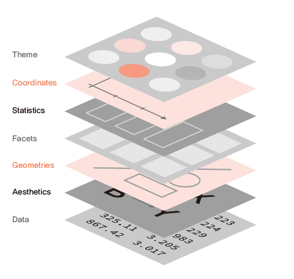

# 데이터 분석 및 시각화하기

데이터 수집 및 정리가 끝났다면, 내가 가지고 있는 데이터가 어떠한 특성을 가지고 있는지에 대한 분석 및 시각화 과정, 즉 **탐색적 데이터 분석(Exploratory Data Analysis)**을 할 필요가 있습니다. 해당 과정을 통해 데이터를 더 잘 이해할 수 있으며, 극단치나 결측치 등 데이터가 가지고 있는 잠재적인 문제를 발견하고 이를 어떻게 처리할지에 대해 고민할 수 있습니다.

해당 장에서는 `dplyr` 패키지를 이용한 데이터 분석과 `ggplot` 패키지를 이용한 데이터 시각화에 대해 알아보도록 하겠습니다.

## 종목정보 데이터 분석 

먼저 거래소를 통해 수집한 산업별 현황과 개별지표를 정리한 파일, WICS 기준 섹터지표를 정리한 파일을 통해 국내 상장종목의 데이터를 분석해보도록 하겠습니다.

```{r}
library(stringr)

KOR_ticker = read.csv('data/KOR_ticker.csv', row.names = 1, stringsAsFactors = FALSE)
KOR_sector = read.csv('data/KOR_sector.csv', row.names = 1, stringsAsFactors = FALSE)

KOR_ticker$'종목코드' = str_pad(KOR_ticker$'종목코드', 6, 'left', 0)
KOR_sector$'CMP_CD' = str_pad(KOR_sector$'CMP_CD', 6, 'left', 0)
```

먼저 각 파일을 불러온 후, 티커에 해당하는 종목코드와 CMP_CD 열을 6자리 숫자로 만들어 주도록 합니다.

이제 `dplyr` 패키지의 여러 함수들을 이용하여 데이터를 분석해보도록 하겠습니다. 해당 패키지는 데이터 처리에 특화된 패키지이며, C++로 작성되어 매우 빠른 처리속도를 자랑합니다. 또한 문법이 SQL과 매우 비슷하여, 함수들의 내용을 직관적으로 이해할 수 있습니다.

### `*_join`: 데이터 합치기

두 테이블을 하나로 합치기 위해 `*_join()` 함수를 이용하도록 합니다. 해당 함수는 기존에 살펴본 `merge()` 함수와 동일하며, 합치는 방법은 그림 \@ref(fig:joinimg)과 표 \@ref(tab:joindesc)과 같이 크게 4가지 종류가 있습니다.

```{r joinimg, fig.cap='join 함수의 종류', fig.align='center', echo = FALSE}
knitr::include_graphics('images/data_analysis_join.png')
```

```{r joindesc, echo = FALSE}
knitr::kable(
  data.frame(
    '함수' = c('inner_join()', 'full_join()', 'left_join()', 'right_join()'),
    '내용' = c('교집합', '합집합', '좌측 기준', '우측 기준')),
  booktabs = TRUE,
  caption = 'join 함수의 종류'
)
```

이 중 데이터의 손실을 없애기 위해 `full_join()`을 사용하여 두 데이터를 합치도록 하겠습니다.

```{r message = FALSE}
library(dplyr)

data_market = full_join(KOR_ticker, KOR_sector,
                         by = c('종목코드' = 'CMP_CD', '종목명' = 'CMP_KOR'))
```

`full_join()` 함수를 이용해 KOR_ticker와 KOR_sector 데이터를 합쳐주도록 합니다. by 인자는 데이터를 합치는 기준점을 의미하며, x 데이터(KOR_ticker)의 종목코드와 y 데이터(KOR_sector)의 CMP_CD는 같음을, x 데이터의 종목명과 y 데이터의 CMP_KOR는 같음을 정의합니다.

### `glimpse()`: 데이터 구조 확인하기

```{r}
glimpse(data_market)
```

`glimpse()` 함수는 데이터 내용, 구조, 형식을 확인하는 함수입니다. 기본 함수인 `str()`과 그 역할은 비슷하지만, tidy 형태로 결과물이 훨씬 깔끔하게 출력됩니다. 총 관측값 및 열의 갯수, 각 열의 이름과 데이터 형식, 앞부분 데이터를 확인할 수 있습니다.

### `rename()`: 열 이름 바꾸기

```{r}
head(names(data_market), 10)

data_market = data_market %>%
  rename(`시가총액` = `시가총액.원.`)

head(names(data_market), 10)
```

`rename()` 함수는 열 이름을 바꾸는 함수로써,`rename(tbl, new_name, old_name)` 형태로 입력합니다. 위의 경우 **시가총액.원.** 열이름이 **시가총액*으로 변경되었습니다.

### distinct(): 고유한 값 확인

```{r}
data_market %>%
  distinct(SEC_NM_KOR) %>% c() 
```

`distinct()` 함수는 고유한 값을 반환하며, 기본함수 중 `unique()`와 동일한 기능을 합니다. 데이터의 섹터 정보를 확인해보면, WICS 기준 10개 섹터 및 섹터 정보가 없는 종목인 NA 값이 있음이 확인됩니다.

### `select()`: 원하는 열만 선택

```{r}
data_market %>%
  select(`종목명`) %>% head()

data_market %>%
  select(`종목명`, `PBR`, `SEC_NM_KOR`) %>% head()
```

`select()` 함수는 원하는 열을 선택해주는 함수이며, 원하는 열 이름을 입력하면 됩니다. 하나의 열 뿐만 아니라 다수의 열을 입력할 경우 해당 열들이 선택됩니다.

```{r}
data_market %>%
  select(starts_with('시')) %>% head()

data_market %>%
  select(ends_with('R')) %>% head()

data_market %>%
  select(contains('가')) %>% head()
```

해당 함수는 다양한 응용기능도 제공합니다. `starts_with()`의 경우 특정 문자로 시작하는 열들을, `ends_with()`의 경우 특정 문자로 끝나는 열들을, `contains()`의 경우 특정 문자가 포함되는 열들을 선택해 줍니다.

### `mutate()`: 열 생성 및 데이터 변경

```{r warning = FALSE}
data_market = data_market %>%
  mutate(`PBR` = as.numeric(PBR),
         `PER` = as.numeric(PER),
         `ROE` = PBR / PER,
         `ROE` = round(ROE, 4),
         `size` = ifelse(`시가총액` >=
                           median(`시가총액`, na.rm = TRUE),
                                        'big', 'small')
  )

data_market %>%
  select(`종목명`, `ROE`, `size`) %>% head()
```

`mutate()` 함수는 원하는 형태로 열을 생성하거나 가공하는 함수입니다. 위의 예제에서는 먼저 PBR과 PER열을 `as.numeric()` 함수를 통해 숫자 형태로 변경한 후, PBR을 PER로 나눈 값을 ROE 열에 생성합니다. 그 후, `round()` 함수를 통해 ROE 값을 반올림 해주며, `ifelse()` 함수를 통해 시가총액의 중앙값 보다 큰 기업의 경우 big, 아닐 경우 small 임을 size 열에 저장해줍니다.

이 외에도 `mutate_*()` 계열 함수에는 `mutate_all()`, `mutate_if()`, `mutate_at()` 처럼 각 상황에 맞게 쓸수있는 다양한 함수들이 존재합니다.

### `filter()`: 조건을 충족하는 행 선택

```{r}
data_market %>%
  select(`종목명`, `PBR`) %>%
  filter(`PBR` < 1) %>% head()

data_market %>%
  select(`종목명`, `PER`, `PBR`, `ROE`) %>%
  filter(PBR < 1 & PER < 20 & ROE > 0.1 ) %>% head()
```

`filter()` 함수는 조건을 충족하는 부분의 데이터를 반환하는 함수입니다. 첫번째 예제와 같이 PBR이 1 미만인 단일 조건을 입력할 수도 있으며, 두번째 예제와 같이 PBR 1 미만, PER 20 미만, ROE 0.1 초과 등 복수 조건을 입력할 수도 있습니다.

### `summarize()`: 요약 통계값 계산

```{r} 
data_market %>%
  summarize(PBR_max = max(PBR, na.rm = TRUE),
            PBR_min = min(PBR, na.rm = TRUE))
```

`summarize()` 혹은 `summarise()` 함수는 원하는 요약 통계값을 계산해 줍니다. PBR_max은 PBR 열에서 최대값을, PBR_min은 최소값을 계산해줍니다.

### `arrange()`: 데이터 정렬

```{r}
data_market %>%
  select(PBR) %>%
  arrange(PBR) %>%
  head(5)

data_market %>%
  select(ROE) %>%
  arrange(desc(ROE)) %>%
  head(5)
```

`arrange()` 함수의 경우 선택한 열을 기준으로 데이터를 정렬해주며, 오름차순을 기준으로 정렬합니다. 내림차순으로 데이터를 정렬하고자 할 경우 `arrange()` 내에 `desc()` 함수를 추가로 입력해주면 됩니다.

### `row_number()`: 순위 계산

```{r}
data_market %>%
  mutate(PBR_rank = row_number(PBR)) %>%
  select(PBR, PBR_rank) %>%
  arrange(PBR) %>%
  head(5)

data_market %>%
  mutate(PBR_rank = row_number(desc(ROE))) %>%
  select(ROE, PBR_rank) %>%
  arrange(desc(ROE)) %>%
  head(5)
```

`row_number()` 함수는 선택한 열의 순위를 구해줍니다. 기본적으로 오름차순 기준으로 순위를 구하며, 내림차순으로 구하고자 할 떄는 `desc()` 함수를 추가해주면 됩니다.

순위를 구하는 함수는 이 외에도 `min_rank()`, `dense_rank()`, `percent_rank()`가 있습니다.

### `ntile()`: 분위수 계산

```{r}
data_market %>%
  mutate(PBR_tile = ntile(PBR, n = 5)) %>%
  select(PBR, PBR_tile) %>%
  head()
```

`ntile()` 함수는 분위수를 계산해주며, n 인자를 통해 몇 분위로 나눌지를 선택할 수 있습니다. 해당 함수 역시 오름차순을 기준으로 분위수를 나눕니다.


### `group_by()`: 그룹별로 데이터를 묶음

```{r}
data_market %>%
  group_by(`SEC_NM_KOR`) %>%
  summarize(n())
```

`group_by()` 함수는 선택한 열 중 동일한 데이터를 기준으로 데이터를 묶어줍니다. 위의 예제에서는 섹터를 나타내는 SEC_NM_KOR 기준으로 데이터를 묶었으며, `n()` 함수를 통해 해당 그룹 내 데이터의 갯수를 구할 수 있습니다.

```{r}
data_market %>%
  group_by(`SEC_NM_KOR`) %>% 
  summarize(PBR_median = median(PBR, na.rm = TRUE)) %>%
  arrange(PBR_median)
```

위 예제는 섹터를 기준으로 데이터를 묶은 후, `summarize()`를 통해 각각의 섹터에 속하는 종목들의 PBR 중앙값을 구한 후, 정렬하였습니다.

```{r}
data_market %>%
  group_by(`시장구분`, `SEC_NM_KOR`) %>%
  summarize(PBR_median = median(PBR, na.rm = TRUE)) %>%
  arrange(PBR_median)
```

위 예제는 시장과 섹터를 기준으로 데이터를 그룹화한 후, 각 그룹별 PBR 중앙값을 구하였습니다. 이처럼 그룹의 경우 하나만이 아닌 원하는 만큼 나눌 수 있습니다.

## 종목정보 시각화

R 내에서 기본적으로 제공하는 `plot()` 함수를 통해서도 시각화가 충분히 가능합니다. 그러나 데이터 과학자들에게 가장 많이 사랑받는 패키지 중 하나인 `ggplot2` 패키지의 `ggplot()` 함수를사용할 경우 훨씬 아름답게 그림이 표현 가능^[R 내에는 `ggplot` 패키지 외에도 `dygraphs`, `highcharter`, `plotly` 패키지를 이용하여 인터랙티브한 시각화가 가능합니다.]하며, 다양한 기능들을 매우 쉽게 사용할 수도 있습니다.

`ggplot()` 함수는 플러스(+) 기호를 사용한다는 점과 문법이 다소 어색하다는 점 때문에 처음에 배우기가 쉽지는 않습니다. 그러나 해당 패키지의 근본이 되는 철학인 **The Grammar of Graphics**를 이해하고 조금만 연습해본다면, 충분히 손쉽게 사용이 가능합니다.

```{r fig.cap='The Grammar of Graphics', fig.align='center', out.width = '50%', echo = FALSE}

```

`ggplot2` 패키지에 대해 더욱 공부하고 싶으신 분은, 해당 패키지의 제작자인 해들리 위컴의 책^[Ggplot2 : R로 분석한 데이터를 멋진 그래픽으로, 해들리 위컴 저/박진수 역]을 추천드립니다.


```{r out.width = '50%', fig.align='center', warning = FALSE}
library(ggplot2)

ggplot(data_market, aes(x = ROE, y = PBR)) +
  geom_point()
```

1. `ggplot()` 함수 내에 사용될 데이터인 data_market을 입력하며, aes 인자 내부에 x축은 ROE, y축은 PBR 열을 사용하도록 정의합니다
2. `geom_point()` 함수를 통해 산점도 그래프를 그려주도록 합니다. 원하는 그림이 그려지기는 하였으나, ROE와 PBR에 극단치 데이터가 존재하여 둘간의 관계가 잘 보이지 않습니다.

```{r out.width = '50%', fig.align='center', warning = FALSE}
ggplot(data_market, aes(x = ROE, y = PBR)) +
  geom_point() +
  coord_cartesian(xlim = c(0, 0.30), ylim = c(0, 3))
```

이번에는 극단치 효과를 제거하기 위해 `coord_cartesian()` 함수 내에 xlim과 ylim, 즉 x축과 y축의 범위를 직접 지정해주도록 합니다. 극단치가 제거되어 데이터를 한 눈에 확인할 수 있습니다.


```{r out.width = '50%', fig.align='center', warning = FALSE}
ggplot(data_market, aes(x = ROE, y = PBR,
                        color = `시장구분`, shape = `시장구분`)) +
  geom_point() +
  geom_smooth(method = 'lm') +
  coord_cartesian(xlim = c(0, 0.30), ylim = c(0, 3))
```

1. `ggplot()` 함수 내부 aes 인자에 color와 shape를 지정해주면, 해당 그룹 별로 모양과 색이 나타납니다. 코스피와 코스닥 종목들에 해당하는 데이터의 색과 점 모양이 다르게 표시할 수 있습니다.
2. `geom_smooth()` 함수를 통해 평활선을 추가해줄 수도 있으며, 방법으로 lm(linear model)을 지정해줄 경우 선형회귀선을 그려주게 됩니다. 이 외에도 glm, gam, loess 등의 다양한 회귀선을 그려줄 수 있습니다.

```{r out.width = '50%', fig.align='center', warning = FALSE}
ggplot(data_market, aes(x = PBR)) +
  geom_histogram(binwidth = 0.1) + 
  coord_cartesian(xlim = c(0, 10))
```

`geom_histogram()` 함수는 히스토그램을 나타내주며, binwidth 인자를 막대의 너비를 선택해줄 수 있습니다. 국내 종목들의 PBR 데이터는 좌측에 쏠려있고 오른쪽으로 꼬리가 긴 분포를 가지고 있습니다.

```{r out.width = '50%', fig.align='center', warning = FALSE}
ggplot(data_market, aes(x = PBR)) +
  geom_histogram(aes(y = ..density..),
                 binwidth = 0.1,
                 color = 'sky blue', fill = 'sky blue') + 
  coord_cartesian(xlim = c(0, 10)) +
  geom_density(color = 'red') +
  geom_vline(aes(xintercept = median(PBR, na.rm = TRUE)), color = 'blue') +
  geom_text(aes(label = median(PBR, na.rm = TRUE), x = median(PBR, na.rm = TRUE)), y = 0.05,
            col = 'black', size = 4, hjust = -0.5)
```

PBR 히스토그램을 좀 더 자세하게 나타내보도록 하겠습니다.

1. `geom_histogram()` 함수 내에 aes(y = ..density..)를 추가해주어 밀도함수로 바꾸어주도록 합니다. 
2. `geom_density()` 함수를 추가해 밀도곡선을 그려줍니다.
3. `geom_vline()` 함수는 세로선을 그려주며, xintercept 즉 x축으로 PBR의 중앙값을 선택해 줍니다.
4. `geom_text()` 함수는 그림 내에 글자를 표현해주며, label 인자에 원하는 글자를 입력해준 후 글자가 표현될 x축, y축, 색상, 사이즈 등을 선택할 수 있습니다.

```{r out.width = '50%', fig.align='center', warning = FALSE}
ggplot(data_market, aes(x = SEC_NM_KOR, y = PBR)) +
  geom_boxplot() +
  coord_flip()
```

박스 플롯 역시 데이터의 분포와 극단치를 확인하기 좋은 그림이며, `geom_boxplot()` 함수를 통해 나타낼 수 있습니다.

1. x축 데이터로는 섹터 정보, y축 데이터로는 PBR을 선택해 줍니다.
2. `geom_boxplot()`를 통해 박스 플롯을 그려줍니다.
3. `coord_flip()` 함수는 x축과 y축을 뒤집어 표현하게 해주며 x축에 PBR, y축에 섹터 정보가 나타나게 되었습니다. 

결과를 살펴보면 유틸리티나 금융 섹터의 경우 PBR이 잘 모여있는 반면, IT나 건강관리 섹터 등은 매우 극단적인 PBR을 가지고 있는 종목이 존재합니다.

```{r out.width = '50%', fig.align='center', warning = FALSE}
data_market %>%
  filter(!is.na(SEC_NM_KOR)) %>%
  group_by(SEC_NM_KOR) %>%
  summarize(ROE_sector = median(ROE, na.rm = TRUE),
            PBR_sector = median(PBR, na.rm = TRUE)) %>%
  ggplot(aes(x = ROE_sector, y = PBR_sector,
             color = SEC_NM_KOR, label = SEC_NM_KOR)) +
  geom_point() +
  geom_text(color = 'black', size = 3, vjust = 1.3) +
  theme(legend.position = 'bottom', legend.title = element_blank())
```

앞에서 배운 데이터 분석과 시각화를 동시에 연결하여 사용할 수도 있습니다.

1. 데이터 분석의 단계로 `filter()`를 통해 섹터가 NA가 아닌 종목을 선택합니다.
2. `group_by()`를 통해 섹터 별 그룹을 묶습니다.
3. `summarize()`를 통해 ROE와 PBR의 중앙값을 계산해줍니다. 해당 과정을 거치면 다음의 결과가 계산됩니다.

```{r echo = FALSE}
data_market %>%
  filter(!is.na(SEC_NM_KOR)) %>%
  group_by(SEC_NM_KOR) %>%
  summarize(ROE_sector = median(ROE, na.rm = TRUE),
            PBR_sector = median(PBR, na.rm = TRUE))
```

해당 결과를 파이프 오퍼레이터(`%>%`)로 이을 경우 그대로 시각화가 가능하며, `ggplot()` 함수 내에 데이터를 입력하지 않아도 됩니다.

4. x축과 y축을 설정해준 뒤, 색상과 라벨을 섹터로 지정해주면 각 섹터 별로 다른 색상의 산점도가 그려지게 됩니다. 5. `geom_text()` 함수를 통해 앞에서 라벨로 지정한 섹터 정보들을 출력해줍니다.
6. `theme()` 함수를 통해 다양한 테마를 지정해주도록 합니다. legend.position 인자를 통해 범례를 하단에 배치하였으며, legend.title 인자를 통해 범례의 제목을 삭제해 주었습니다.

```{r out.width = '50%', fig.align='center', warning = FALSE}
data_market %>%
  group_by(SEC_NM_KOR) %>%
  summarize(n = n()) %>%
  ggplot(aes(x = SEC_NM_KOR, y = n)) +
  geom_bar(stat = 'identity') +
  theme_classic()
```

`geom_bar()`는 막대그래프를 그려주는 함수입니다. 

1. 먼저 `group_by()`를 통해 섹터 별 그룹을 묶어줍니다.
2. `summarize()` 함수 내부에 `n()`을 통해, 각 그룹 별 데이터 갯수를 구합니다. 
3. `ggplot()` 함수에서 x축에는 SEC_NM_KOR, y축에는 n을 지정해줍니다.
4. `geom_bar()`를 통해 막대그래프를 그려주도록 합니다.y축에 해당하는 n 데이터를 그대로 사용하기 위해서는 stat인자를 'identity'로 지정해주어야 합니다. `theme_*()` 함수를 통해 배경 테마를 바꿀수도 있습니다. 

한편 위 그래프는 데이터 갯수에 따라 순서대로 막대가 정렬되지 않아 보기에 좋은 형태는 아닙니다. 이를 반영하여 더욱 보기좋은 그래프로 나타내주도록 하겠습니다.

```{r out.width = '50%', fig.align='center', warning = FALSE}
data_market %>%
  filter(!is.na(SEC_NM_KOR)) %>%
  group_by(SEC_NM_KOR) %>%
  summarize(n = n()) %>%
  ggplot(aes(x = reorder(SEC_NM_KOR, n), y = n, label = n)) +
  geom_bar(stat = 'identity') +
  geom_text(color = 'black', size = 4, hjust = -0.3) +
  xlab(NULL) +
  ylab(NULL) +
  coord_flip() +
  scale_y_continuous(expand = c(0, 0, 0.1, 0)) + 
  theme_classic()
```

1. `filter()` 함수를 통해 NA 종목은 삭제해준 후, 섹터 별 종목 갯수를 구해주도록 합니다.
2. `ggplot()`의 x축에 `reorder()` 함수를 적용하여 SEC_NM_KOR 변수를 n 순서대로 정렬해줍니다.
3. `geom_bar()`를 통해 막대그래프를 그려준 후, `geom_text()`를 통해 라벨에 해당하는 종목 갯수를 출력합니다.
4. `xlab()`과 `ylab()`에 NULL을 입력해 라벨을 삭제해 줍니다.
5. `coord_flip()` 함수를 통해 x축과 y축을 뒤집어 줍니다.
6. `scale_y_continuous()` 함수를 통해 그림의 간격을 약간 넓혀줍니다.
7. `theme_classic()`로 테마를 변경해줍니다.

결과를 보면, 종목수가 많은 섹터부터 순서대로 정렬되어 보기도 쉬우며, 종묵수도 텍스트로 표현되어 한 눈에 확인할 수 있습니다.

이처럼 데이터 시각화를 통해 정보의 분포나 특성을 한눈에 확인할 수 있으며, `ggplot()`을 이용할 경우 복잡한 형태의 그림도 매우 간단하고 아름답게 표현할 수 있습니다.