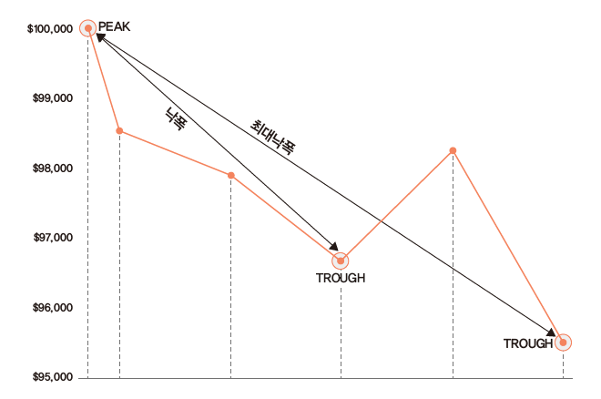

# 성과 및 위험 평가

백테스트를 통해 포트폴리오 수익률을 구했다면, 이를 바탕으로 각종 성과 및 위험을 평가해야 합니다. 아무리 성과가 좋은 전략이라도 위험이 너무 크다면 투자를 하기 부담스럽습니다. 또한 전략의 수익률이 지속적으로 감소하는 추세라면 경쟁이 치열해져 더 이상 작동하지 않는 전략일 가능성도 있습니다.

이 CHAPTER에서는 포트폴리오의 예시로 퀄리티 팩터를 종합적으로 고려한 QMJ(Quality Minus Junk) 팩터[@asness2019quality]의 수익률을 이용하겠습니다. QMJ 팩터란 우량성이 높은 종목들을 매수하고, 우량성이 낮은 종목들을 공매도하는 전략을 지수의 형태로 나타낸 것입니다. 해당 팩터의 수익률을 통해 성과 및 위험을 평가해보고, 회귀분석을 통해 다른 팩터와의 관계도 살펴보겠습니다.

QMJ 팩터의 수익률은 AQR Capital Management의 Datasets^[https://www.aqr.com/Insights/Datasets/Quality-Minus-Junk-Factors-Monthly]에서 엑셀 파일을 다운로
드한 후 가공할 수도 있습니다. 그러나 해당 작업을 매번 하는 것은 지나치게 번거로우므로, R에서 엑셀 파일을 다운로드한 후 가공하겠습니다.

```{r message = FALSE, warning = FALSE}
library(dplyr)
library(readxl)
library(xts)
library(timetk)

url = 'https://images.aqr.com/-/media/AQR/Documents/Insights/Data-Sets/Quality-Minus-Junk-Factors-Monthly.xlsx'

tf = tempfile(fileext = '.xlsx')
download.file(url, tf, mode = 'wb')

excel_sheets(tf)
```

1. 해당 데이터의 엑셀 url을 저장합니다.
2. `tempfile()` 함수 내 .xlsx 인자를 입력함으로써, 임시로 엑셀 파일을 만들도록 합니다.
3. `download.file()` 함수를 통해 url 파일을 tf 파일명에 저장하며, 엑셀 파일은 바이너리 파일이므로 wb 인자를 입력합니다.
4. `readxl` 패키지의 `excel_sheets()` 함수를 통해 해당 엑셀의 시트명들을 확인합니다.

우리가 필요한 데이터는 수익률을 계산할 QMJ Factors, 회귀분석에 필요한 MKT, SMB, HML Devil, UMD, 무위험 이자율인 RF 시트의 데이터입니다.

```{r}
df_QMJ = read_xlsx(tf, sheet = 'QMJ Factors', skip = 18) %>%
  select(DATE, Global)
df_MKT = read_xlsx(tf, sheet = 'MKT', skip = 18) %>%
  select(DATE, Global)
df_SMB = read_xlsx(tf, sheet = 'SMB', skip = 18) %>%
  select(DATE, Global)
df_HML_Devil = read_xlsx(tf, sheet = 'HML Devil',
                         skip = 18) %>%
  select(DATE, Global)
df_UMD = read_xlsx(tf, sheet = 'UMD', skip = 18) %>%
  select(DATE, Global)
df_RF = read_xlsx(tf, sheet = 'RF', skip = 18) 
```

`readxl` 패키지의 `read_xlsx()` 함수를 통해 엑셀 데이터를 읽어올 수 있으며, 시트명을 정해줄 수도 있습니다. 또한 각 시트 내 18행까지는 데이터를 설명하는 텍스트이므로, skip 인자를 통해 해당 부분은 읽어오지 않도록 합니다. 그 후 `select()` 함수를 통해 날짜에 해당하는 DATE와 수익률에 해당하는 Global 열만을 선택합니다.

```{r warning = FALSE}
df = Reduce(function(x, y) inner_join(x, y, by = 'DATE'),
       list(df_QMJ, df_MKT, df_SMB,
            df_HML_Devil,df_UMD, df_RF)) %>%
  setNames(c('DATE','QMJ', 'MKT', 'SMB',
             'HML', 'UMD', 'RF')) %>%
  na.omit() %>%
  mutate(DATE = as.Date(DATE, "%m/%d/%Y"),
         R_excess = QMJ - RF,
         Mkt_excess = MKT - RF) %>%
  tk_xts(date_var = DATE)
```

1. `inner_join()` 함수를 통해 DATE를 기준으로 데이터를 묶어주어야 합니다. 해당 함수는 한 번에 두 개 테이블만을 선택할 수 있으므로, `Reduce()` 함수를 통해 모든 데이터에 `inner_join()` 함수를 적용합니다.
2. `setNames()` 함수를 통해 열 이름을 입력합니다.
3. 각 팩터별 시작시점이 다르므로 `na.omit()` 함수를 통해 NA 데이터를 삭제해줍니다.
4. `mutate()` 함수를 통해 데이터를 변형해줍니다. DATE 열은 mm/dd/yy의 문자열 형식이므로 이를 날짜 형식으로 변경해줍니다. QMJ 팩터 수익률에서 무위험 수익률을 차감해 초과수익률을 구해주며, 시장 수익률에서 무위험 수익률을 차감해 시장위험 프리미엄을 계산해줍니다.
5. `tk_xts()` 함수를 이용해 티블 형태를 시계열 형태로 변경하며, 인덱스는 DATE 열을 설정합니다. 형태를 변경한 후 해당 열은 자동으로 삭제됩니다.

위 과정을 통해 구한 데이터를 바탕으로 성과 및 위험을 평가하겠습니다.

## 결과 측정 지표

포트폴리오의 평가에서 가장 중요한 지표는 수익률과 위험입니다. 수익률은 누적수익률과 연율화 수익률, 연도별 수익률이 주요 지표이며, 위험은 변동성과 낙폭이 주요 지표입니다.

이 외에도 승률, 롤링 윈도우 값 등 다양한 지표를 살펴보기도 합니다. 이러한 지표를 수식을 이용해 직접 계산할 수도 있지만, PerformanceAnalytics 패키지에서 제공하는 다양한 함수들을 이용해 편하게 계산할 수 있습니다.

### 수익률 및 변동성

```{r message = FALSE}
library(PerformanceAnalytics)
chart.CumReturns(df$QMJ)
```

먼저 `chart.CumReturns()` 함수를 이용해 QMJ 팩터의 누적수익률을 그래프로 나타내봅니다. `r index(df$QMJ)[1]`부터 `r last(index(df$QMJ))`까지 장기간동안 우상향하는 모습을 보이고 있습니다.

```{r}
prod((1+df$QMJ)) - 1 # 누적수익률
mean(df$QMJ) * 12 # 연율화 수익률(산술)
(prod((1+df$QMJ)))^(12 / nrow(df$QMJ)) - 1 # 연율화 수익률(기하)
```

수익률 중 가장 많이보는 지표는 누적 수익률, 연율화 수익률(산술), 연율화 수익률(기하)입니다. 각 수익률을 구하는 법은 다음과 같습니다.

1. 누적 수익률: $(1+r_1) \times (1+r_2) \times \dots \ \times (1+r_n) - 1 = \{\prod_{i=1}^n(1+r_i)\}-1$,
2. 연율화 수익률(산술): $\frac{(r_1 + r_2 + \dots + r_i)}{n} \times scale$
3. 연율화 수익률(기하): $\{\prod_{i=1}^n(1+r_i)\}^{scale / Days} - 1$

먼저 누적수익률은 각 수익률에 1을 더한 값을 모두 곱한 후 1을 빼면 됩니다. 연율화 수익률(산술)은 단순히 수익률의 평균을 구한 후 연율화를 위한 조정값($scale$)을 곱해주면 됩니다. 데이터가 일간일 경우 조정값은 252, 주간일 경우 52, 월간일 경우 12입니다. 현재 데이터는 월간 기준이므로 조정값은 12가 됩니다. 마지막으로 연율화 수익률(기하)은 각 수익률에 1을 더한 값의 곱을 구한 후 연율화를 위해 승수를 적용한 후 1을 빼주며, Days는 시계열의 관측 기간입니다. 마지막으로 연율화 수익률(기하)의 경우 각 수익률에 1을 더한 값의 곱을 구한 후, 연율화를 위해 승수를 곱한 후 1을 빼주면 되며, $Days$는 시계열의 관측 기간입니다.

```{r}
Return.cumulative(df$QMJ) # 누적수익률
Return.annualized(df$QMJ, geometric = FALSE) # 연율화 수익률(산술)
Return.annualized(df$QMJ) # 연율화 수익률(기하)
```

수식에 맞게 값을 입력해 계산할 수도 있지만, 함수를 이용하면 더욱 손쉽게 계산이 가능하며 실수할 가능성도 줄어듭니다. 누적수익률은 `Return.cumulative()` 함수를 통해, 연율화 수익률(산술)은 `Return.annualized()` 함수 내 geometric 인자를 FALSE로 선택해줌으로써, 연율화 수익률(기하)는 `Return.annualized()` 함수를 통해 계산이 가능합니다. 수식으로 계산한 값과 함수를 통해 계산한 값을 비교하면 동일함이 확인됩니다.

```{r}
sd(df$QMJ) * sqrt(12) # 연율화 변동성
StdDev.annualized(df$QMJ) # 연율화 변동성

SharpeRatio.annualized(df$QMJ, Rf = df$RF, geometric = TRUE)
```

위험으로 가장 많이 사용되는 지표는 변동성입니다. 연율화 변동성은 `sd()` 함수를 통해 변동성을 계산한 후 조정값을 곱해 계산합니다. 그러나 `StdDev.annualized()` 함수를 사용해 더욱 쉽게 계산할 수도 있습니다.

수익을 위험으로 나누어 위험 조정 수익률을 보는 지표가 샤프 지수(Sharpe Ratio)입니다. 해당 지수는 $\frac {R_i - R_f}{\sigma_i}$로 계산되며, 분자에는 포트폴리오 수익률에서 무위험 수익률을 차감한 값이, 분모에는 포트폴리오의 변동성이 오게 됩니다.

`SharpeRatio.annualized()` 함수를 이용하면 포트폴리오 수익률에서 무위험 수익률을 차감한 값을 연율화로 변경한 후 연율화 변동성으로 나누어 샤프 지수를 계산합니다. geometric을 TRUE로 설정하면 기하평균 기준 연율화 수익률을, FALSE로 설정하면 산술평균 기준 연율화 수익률을 계산합니다.

### 낙폭과 최대낙폭

먼저 낙폭(Drawdown)은 수익률이 하락한 후 반등하기 전까지 얼마나 하락했는지를 나타냅니다. 최대낙폭(Maximum Drawdown)은 이러한 낙폭 중 가장 값이 큰 값으로서, 최고점에서 최저점까지 얼마나 손실을 보는지를 나타냅니다. 투자를 함에 있어 수익률이 하락하는 것은 어쩔 수 없지만, 최대낙폭이 지나치게 큰 전략에 투자하는 것은 매우 위험한 선택이 될 수 있습니다.

```{r fig.cap='낙폭과 최대낙폭', echo = FALSE}

```

```{r}
table.Drawdowns(df$QMJ)
maxDrawdown(df$QMJ)

chart.Drawdown(df$QMJ)
```

이러한 낙폭에 대한 지표들은 손으로 계산하기 번거롭지만, 패키지 내 함수를 사용한 다면 매우 손쉽게 계산할 수 있습니다. 

먼저 `table.Drawdowns()` 함수를 이용하면 역대 낙폭이 가 장 심했던 순서대로 낙폭 정도, 하락 기간과 상승 기간, 원금 회복 기간 등을 테이블로 나타내줍니다. `maxDrawdown()` 함수는 포트폴리오의 최대낙폭을 계산해주며, `chart.Drawdown()` 함수는 낙폭만을 그래프로 그려줍니다.


```{r}
CalmarRatio(df$QMJ)
```

위험 조정 수익률 중 사용되는 지표 중 칼마 지수(Calmar Ratio)도 있습니다. 칼마 지수는 연율화 수익률을 최대낙폭으로 나눈 값으로서, 특히나 안정적인 절대 수익률을 추구하는 헤지펀드에서 많이 참조하는 지표입니다.

### 연도별 수익률

```{r}
apply.yearly(df$QMJ, Return.cumulative) %>% head()
```

`apply.yearly()` 함수 내 계산 함수를 Return.cumulative로 설정한다면 연도별 수익률을 계산할 수 있습니다.

```{r warning = FALSE, message = FALSE}
library(lubridate)
library(tidyr)
library(ggplot2)

R.yr = apply.yearly(df$QMJ, Return.cumulative) %>%
    fortify.zoo() %>%
    mutate(Index = year(Index)) %>%
    gather(key, value, -Index) %>%
    mutate(key = factor(key, levels = unique(key)))

ggplot(R.yr, aes(x = Index, y = value, fill = key)) +
  geom_bar(position = "dodge", stat = "identity") +
  ggtitle('Yearly Return') +
  xlab(NULL) +
  ylab(NULL) +
  theme_bw() +
  scale_y_continuous(expand = c(0.03, 0.03)) +
  scale_x_continuous(breaks = R.yr$Index,
                     expand = c(0.01, 0.01)) +
  theme(plot.title = element_text(hjust = 0.5,
                                  size = 12),
        legend.position = 'bottom',
        legend.title = element_blank(),
        legend.text = element_text(size=7),
        axis.text.x = element_text(angle = 45,
                                   hjust = 1, size = 8),
        panel.grid.minor.x = element_blank() ) +
  guides(fill = guide_legend(byrow = TRUE)) +
      geom_text(aes(label = paste(round(value * 100, 2), "%"),
                    vjust = ifelse(value >= 0, -0.5, 1.5)),
                position = position_dodge(width = 1),
                size = 3)
```

`apply.yearly()` 함수를 통해 계산한 연도별 수익률에 `ggplot()` 함수를 응용하면 막대 그래프로 나타낼 수도 있으며, 시각화를 통해 포트폴리오의 수익률 추이가 더욱 쉽게 확인됩니다.

### 승률 및 롤링 윈도우 값

승률이란 포트폴리오가 벤치마크 대비 높은 성과를 기록한 비율을 의미하며 다음과 같이 계산됩니다.

$$\frac {(포트폴리오\,수익률 > 벤치마크)\,일수}{전체\,기간}$$

벤치마크가 S&P 500 지수, KOSPI 200 지수처럼 구체적으로 존재하는 경우도 있지만, 절대수익을 추구하는 경우에는 이러한 벤치마크가 0 혹은 무위험 수익률이 되기도 합니다.

```{r}
UpsideFrequency(df$QMJ, MAR = 0)
```

`UpsideFrequency()` 함수는 벤치마크 대비 승률을 계산해줍니다. MAR 인자는 0이 기본값으로 설정되어 있으며, 원하는 벤치마크가 있을 시 이를 입력해주면 됩니다. QMJ 팩터는 월간 기준 수익률이 플러스를 기록했던 비율이 `r paste0(round(UpsideFrequency(df$QMJ, MAR = 0), 4) * 100, '%')`입니다.

위에서 구한 각종 지표들은 투자자가 포트폴리오의 시작부터 현재까지 투자를 했다는 전제 하에 계산됩니다. 그러나 투자를 시작하는 시점은 사람마다 다르기에, 무작위 시점에 투자했을 때 향후 n개월 후 승률 혹은 연율화 수익률 등을 계산할 필요도 있습니다. 이러한 기법을 **롤링 윈도우**라고 합니다.

```{r}
roll_12 = df$QMJ %>% apply.monthly(., Return.cumulative) %>%
  rollapply(., 12, Return.annualized) %>% na.omit() %>%
  UpsideFrequency()

roll_24 = df$QMJ %>% apply.monthly(., Return.cumulative) %>%
  rollapply(., 24, Return.annualized) %>% na.omit() %>%
  UpsideFrequency()

roll_36 = df$QMJ %>% apply.monthly(., Return.cumulative) %>%
  rollapply(., 36, Return.annualized) %>% na.omit() %>%
  UpsideFrequency()

roll_win = cbind(roll_12, roll_24, roll_36)
print(roll_win)
```

롤링 윈도우 승률은 무작위 시점에 투자했을 시 미래 n개월 동안의 연율화 수익률을 구하고, 해당 값이 벤치마크 대비 수익이 높았던 비율을 계산합니다. 만일 12개월 롤링 윈도우 승률이 100%라면, 어떠한 시점에 투자해도 12개월 후에는 언제나 벤치마크를 이겼음을 의미합니다. 반면 아무리 연율화 수익률이 높은 전략도 이러한 롤링 윈도우 승률이 지나치게 낮다면, 단순히 한 번의 운으로 인해 수익률이 높은 것처럼 보일수 있습니다.

함수를 이용해 해당 값을 구하는 과정은 다음과 같습니다.

1. `apply.*()` 함수를 이용해 원하는 기간의 수익률로 변경하며, 위 예제에서는 월간 수익률로 변경했습니다.
2. `rollapply()` 함수를 통해 원하는 기간의 롤링 윈도우 통곗값을 구해줍니다. 각각 12개월, 24개월, 36개월 기간에 대해 연율화 수익률을 계산해줍니다.
3. 계산에 필요한 n개월 동안은 수익률이 없으므로 `na.omit()`을 통해 삭제해줍니다.
4. `UpsideFrequency()` 함수를 통해 승률을 계산합니다.

해당 과정을 통해 계산된 12개월, 24개월, 36개월 롤링 승률은 각각 `r paste0(round(roll_win[1]*100,2),'%')`, `r paste0(round(roll_win[2]*100,2),'%')`, `r paste0(round(roll_win[3]*100,2),'%')`이며, 투자 기간이 길어질수록 승률이 높아집니다.

```{r}
df$QMJ %>% apply.monthly(., Return.cumulative) %>%
  rollapply(., 12, Return.annualized) %>% na.omit() %>%
  fortify.zoo() %>%
  ggplot(aes(x = Index, y = QMJ)) +
  geom_line() +
  geom_hline(aes(yintercept = 0), color = 'red') +
  xlab(NULL) + ylab(NULL)
```

롤링 윈도우 연율화 수익률 역시 매우 중요한 지표입니다. 해당 값이 지속적으로 하락할 경우 전략이 더 이상 동작하지 않는 것인지 혹은 가장 험난한 시기를 지났기에 인내심을 갖고 기다려야 할지 판단해야 합니다.

## 팩터 회귀분석 및 테이블로 나타내기

포트폴리오 수익률에 대한 성과 평가만큼 중요한 것이, 수익률이 어디에서 발생했는가에 대한 요인을 분석하는 것입니다. 베타를 통한 개별 주식과 주식시장과의 관계를 시작으로, 수익률을 설명하기 위한 여러 모형들이 개발되고 발표되었습니다. 그중 일반적으로 많이 사용되는 모형은 기존의 CAPM에 사이즈 팩터(SMB), 밸류 팩터(HML)를 추가한 파마-프렌치의 3팩터 모형[@fama1993common], 그리고 3팩터 모형에 모멘텀 팩터(UMD)를 추가한 카하트의 4팩터 모형[@carhart1997persistence]입니다.

QMJ 팩터를 위 4개 팩터에 회귀분석한 결과를 토대로, 퀄리티 팩터의 수익률에 대한 요인 분석을 해보겠습니다.


```{r}
reg = lm(R_excess ~ Mkt_excess + SMB + HML + UMD, data = df)
# summary(reg)
summary(reg)$coefficient
```

먼저 우리가 구한 데이터를 통해 다음과 같은 회귀분석을 실시합니다. 즉 QMJ 팩터의 초과수익률을 시장위험 프리미엄, 사이즈 팩터, 밸류 팩터, 모멘텀 팩터에 회귀분석을 수행합니다.

$$QMJ - R_f= \beta_m \times \ [R_m - R_f] + \beta_{SMB} \times R_{SMB} + \beta_{HML} \times R_{HML} + \beta_{UMD} \times R_{UMD}$$

`lm()` 함수 내에서 R_excess는 $QMJ - R_f$와 동일하며, Mkt_excess는 $R_m - R_f$와 동일합니다. 베타의 절댓값이 크다는 의미는 QMJ 팩터의 수익률이 해당 팩터와의 관계가 높다는 의미이며, 양수일 경우에는 양의 관계가, 음수일 경우에는 음의 관계가 높다는 의미입니다. 또한 t값 혹은 P값을 통해 관계가 얼마나 유의한지도 확인할 수 있습니다.

1. 시장 베타에 해당하는 $\beta_m$은 `r round(summary(reg)$coef[2,1], 3)`로 음숫값을 보이며, 퀄리티 팩터의 경우 시장과 역의 관계에 있다고 볼 수 있습니다. 또한 t값이 `r round(summary(reg)$coef[2,3], 3)`로 충분히 유의합니다.
2. 사이즈 베타에 해당하는 $\beta_{SMB}$는 `r round(summary(reg)$coef[3,1], 3)`이며 역시나 음숫값을 보입니다. 즉 퀄리티 팩터는 소형주보다는 대형주 수익률과 관계가 있으며, t값 역시 `r round(summary(reg)$coef[3,3], 3)`로 충분히 유의합니다.
3. 밸류 베타에 해당하는 $\beta_{HML}$은 `r round(summary(reg)$coef[4,1], 3)`이며 이 역시 음숫값을 보입니다. 즉 퀄리티와 밸류 간의 관계에서 살펴본 것처럼, 두 팩터는 서로 역의 관계가 있습니다. t값 역시 `r round(summary(reg)$coef[4,3], 3)`로 유의합니다.
4. 모멘텀 베타에 해당하는 $\beta_{UMD}$는 `r round(summary(reg)$coef[5,1], 3)`로 양의 관계가 있으며, 모멘텀 팩터가 좋은 시기에 퀄리티 팩터도 좋을 수 있습니다. t값은 `r round(summary(reg)$coef[5,3], 3)`로 유의하다고 볼 수 있습니다.
5. 이러한 설명변수를 제외하고도 월간 초과수익률에 해당하는 계숫값이 `r round(summary(reg)$coef[1,1], 3)`이며, t값은 `r round(summary(reg)$coef[1,3], 3)`로 유의합니다. 즉, 퀄리티 팩터는 기존의 여러 팩터들로 설명되지 않는 새로운 팩터라고도 볼 수 있습니다.

```{r}
library(broom)
tidy(reg)
```

broom 패키지의 `tidy()` 함수를 사용하면 분석 결과 중 계수에 해당하는 값만을 요약해서 볼 수 있습니다.


```{r message = FALSE}
library(stargazer)
stargazer(reg, type = 'text', out = 'data/reg_table.html')
```

stargazer 패키지를 사용하면, 회귀분석 결과를 논문에서 많이 사용되는 테이블 형식으로 손쉽게 출력과 저장을 할 수 있습니다.테이블이 출력과 함께 data 폴더 내에 reg_table.html 이름으로 HTML 파일도 저장됩니다.
