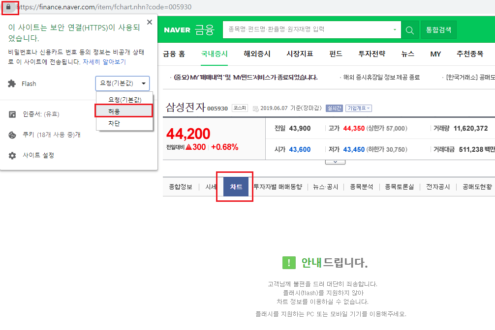
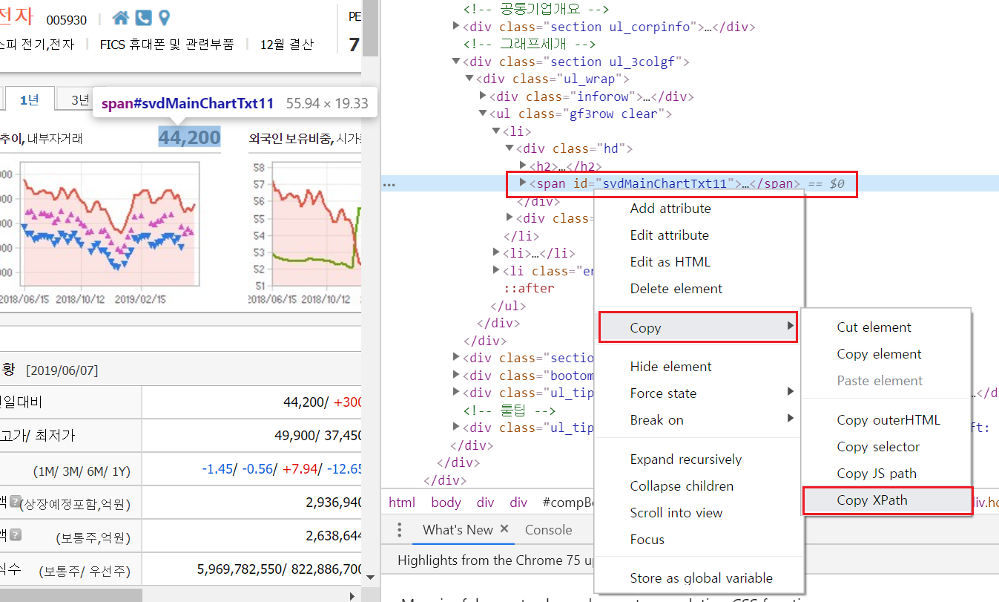
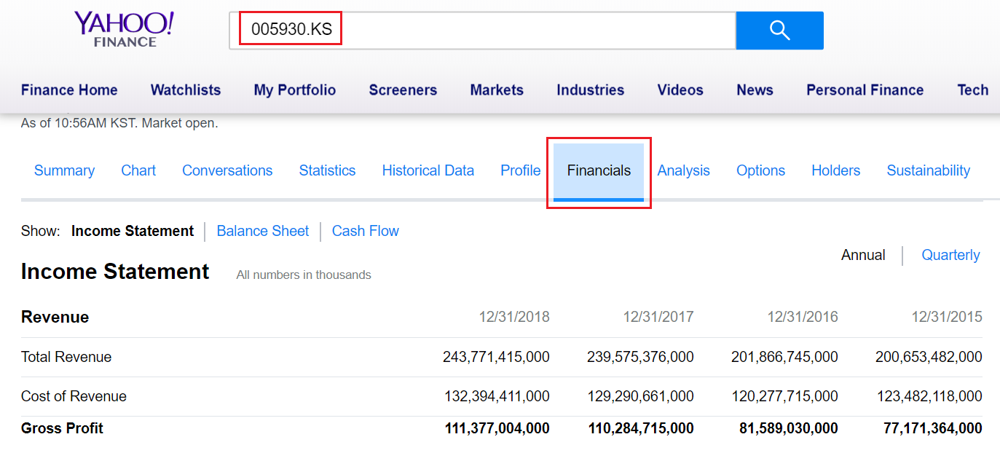

# 금융 데이터 수집하기 (심화)

지난 장에서는 주식티커를 구하였습니다. 이를 바탕으로 이번 장에서는 퀀트 투자의 핵심 자료인 수정주가, 재무제표 및 가치지표를 크롤링 하는법에 대해 알아보도록 하겠습니다.

## 수정주가 크롤링

주가 데이터는 투자를 함에 있어 반드시 필요한 데이터이며, 인터넷에서 주가를 수집할 수 있는 방법은 매우 많습니다. 먼저, [API를 이용한 데이터 수집]에서 살펴본 것과 같이,  ``getSymbols()`` 함수를 이용하여 데이터를 받을 수 있습니다. 그러나 야후 파이낸스에서 제공하는 데이터의 경우 미국 주가는 이상없이 다운로드가 되지만, 국내 중소형주의 경우 주가가 없는 경우가 있습니다.

또한 단순 주가를 구할수 있는 방법은 많지만, 투자에 필요한 수정주가를 구할 수 있는 방법은 찾기 힘듭니다. 다행히 네이버 금융에서 제공하는 정보를 통해 모든 종목의 수정주가를 매우 손쉽게 구할 수 있습니다. 

### 개별 종목 주가 크롤링

먼저 네이버 금융에서 특정종목(예: 삼성전자)의 차트 탭^[https://finance.naver.com/item/fchart.nhn?code=005930]을 선택합니다. 

<div class="figure" style="text-align: center">

<p class="caption">(\#fig:unnamed-chunk-1)네이버금융 개별종목 차트탭</p>
</div>

위와 같이 플래쉬가 차단되어 화면이 나오지 않는 경우, 주소창의 왼쪽 상단에 위치한 자물쇠 버튼을 클릭한 다음, Flash를 허용으로 바꾼 후 새로고침을 누르면 차트가 나오게 됩니다.

해당 차트는 주가 데이터를 받아 그림을 그려주는 형태입니다. 따라서 해당 데이터가 어디에서 오는지 알기 위해 개발자도구 화면을 이용하도록 합니다. 

<div class="figure" style="text-align: center">

<p class="caption">(\#fig:unnamed-chunk-2)네이버금융 차트의 통신기록</p>
</div>

화면을 연 상태에서 일봉 탭을 선택하면 **sise.nhn**, **schedule.nhn**, **notice.nhn** 총 3가지 항목이 생성됩니다. 이 중 sise.nhn 항목의 Request URL이 주가 데이터를 요청하는 주소입니다. 해당 url에 접속해 보도록 하겠습니다.

<div class="figure" style="text-align: center">

<p class="caption">(\#fig:unnamed-chunk-3)주가 데이터 페이지</p>
</div>

각 날짜별로 시가, 고가, 저가, 종가, 거래량이 있으며, 주가의 경우 모두 수정주가 기준입니다. 또한 해당 데이터가 item 태그 내 data 속성에 위치하고 있습니다.

위 주소에서 symbol= 뒤에 위치하는 6자리 티커만 변경하면 해당 종목의 주가 데이터가 위치한 페이지로 이동할 수 있으며, 우리가 원하는 모든 종목들의 주가 데이터를 크롤링 할 수 있습니다. 이러한 티커의 경우 우리는 이미 거래소에서 받은 데이터를 통해 가지고 있습니다.


```r
library(stringr)

KOR_ticker = read.csv('data/KOR_ticker.csv', row.names = 1)
print(KOR_ticker$'종목코드'[1])
```

```
## [1] 5930
```

```r
KOR_ticker$'종목코드' = str_pad(KOR_ticker$'종목코드', 6, side = c('left'), pad = '0')
```

먼저 저장해두었던 csv 파일을 불러오도록 합니다. 종목코드를 살펴보면 005930 이어야 할 삼성전자의 티커가 5930으로 입력되어 있습니다. 이는 파일을 불러오는 과정에서 0으로 시작하는 숫자들이 지워져버렸기 때문입니다. 이를 6자리로 다시 맞춰주기 위해, `stringr` 패키지의 `str_pad()` 함수를 사용해 줍니다. 6자리가 되지 않는 문자는, 왼쪽에 0을 추가하여 강제로 6자리로 만들어 주도록 합니다.

다음은 첫번째 종목인 삼성전자의 주가를 크롤링한 후 가공하는 방법입니다.


```r
library(xts)

ifelse(dir.exists('data/KOR_price'), FALSE, dir.create('data/KOR_price'))
```

```
## [1] FALSE
```

```r
i = 1
name = KOR_ticker$'종목코드'[i]

price = xts(NA, order.by = Sys.Date())
print(price)
```

```
##            [,1]
## 2019-06-17   NA
```

1. 먼저 data 폴더 내에 KOR_price 폴더를 생성해줍니다.
2. i = 1 을 입력해 줍니다. 향후 for loop 구문을 통해 i 값만 변경하면 모든 종목의 주가를 다운로드 받을 수 있습니다.
3. name에 해당 티커를 입력해줍니다.
4. `xts()` 함수를 이용해 빈 시계열 데이터를 생성해주며, 인덱스는 `Sys.Date()`를 통해 현재 날짜를 입력합니다.


```r
library(httr)
library(rvest)

url = paste0('https://fchart.stock.naver.com/sise.nhn?symbol=',
             name,'&timeframe=day&count=500&requestType=0')
data = GET(url)
data_html = read_html(data, encoding = 'EUC-KR') %>%
  html_nodes('item') %>%
  html_attr('data') 

print(head(data_html))
```

```
## [1] "20170530|45520|45660|44480|44640|248672"
## [2] "20170531|44580|45020|44400|44700|373382"
## [3] "20170601|44860|44900|44400|44680|195070"
## [4] "20170602|45060|45960|45000|45960|249775"
## [5] "20170605|46040|46360|45720|45940|151988"
## [6] "20170607|46500|46500|45240|45300|274588"
```
1. `paste0()` 함수를 이용해 원하는 종목의 url을 생성해 줍니다. url중 티커에 해당하는 6자리 부분만 위에서 입력한 name으로 설정해주면 됩니다.
2. `GET()` 함수를 통해 페이지의 데이터를 불러옵니다.
3. `read_html()` 함수를 통해 html 정보를 읽어옵니다.
4. `html_nodes()`와 `html_attr()` 함수를 통해 item 태그 및 data 속성의 데이터를 추출합니다.

결과적으로 날짜 및 주가, 거래량 데이터만 추출되어 집니다. 해당 데이터는 '|'으로 구분되어 있으며, 이를 테이블 형태로 바꿀 필요가 있습니다.


```r
library(readr)

price = read_delim(data_html, delim = '|')
print(head(price))
```

```
## # A tibble: 6 x 6
##   `20170530` `45520` `45660` `44480` `44640` `248672`
##        <dbl>   <dbl>   <dbl>   <dbl>   <dbl>    <dbl>
## 1   20170531   44580   45020   44400   44700   373382
## 2   20170601   44860   44900   44400   44680   195070
## 3   20170602   45060   45960   45000   45960   249775
## 4   20170605   46040   46360   45720   45940   151988
## 5   20170607   46500   46500   45240   45300   274588
## 6   20170608   45000   45580   45000   45160   279575
```

`readr` 패키지의 `read_delim()` 함수를 쓸 경우 구분자로 이루어진 데이터를 테이블로 쉽게 변경할 수 있습니다. 데이터를 확인해보면 테이블 형태로 변경되었으며 각 열은 날짜, 시가, 고가, 저가, 종가, 거래량을 의미합니다. 이 중 우리가 필요한 날짜와 종가를 선택한 후, 데이터 클랜징을 해주도록 합니다.


```r
library(lubridate)

price = price[c(1, 5)] 
price = data.frame(price)
colnames(price) = c('Date', 'Price')
price[, 1] = ymd(price[, 1])

rownames(price) = price[, 1]
price[, 1] = NULL

print(tail(price))
```

```
##            Price
## 2019-06-10 44800
## 2019-06-11 44850
## 2019-06-12 44600
## 2019-06-13 43750
## 2019-06-14 44000
## 2019-06-17 43900
```

1. 날짜에 해당하는 첫번째 열과, 종가에 해당하는 다섯번째 열만을 선택해 저장해 줍니다.
2. 티블 형태의 데이터를 데이터프레임 형태로 변경해 줍니다.
3. 열이름을 Date와 Price로 변경해 줍니다.
4. `lubridate` 패키지의 `ymd()` 함수를 이용하여 yyyymmdd 형태를 yyyy-mm-dd로 변경해주며, 데이터 형태 또한 Date 타입으로 변경됩니다.
5. 행이름을 첫번째 열인 날짜로 변경해준 후, 해당 열은 NULL을 통해 삭제해 줍니다.

데이터를 확인해보면 우리에게 필요한 형태로 정리가 되었습니다. 마지막으로 해당 데이터를 csv 파일로 저장해주도록 합니다.


```r
write.csv(price, paste0('data/KOR_price/', name, '_price.csv'))
```

data 폴더의 KOR_price 폴더 내에 티커_price.csv 이름으로 저장해주도록 합니다. 

### 전 종목 주가 크롤링

위의 코드에서 for loop 구문을 이용하여 i 값만 변경해주면 모든 종목의 주가를 다운로드 받을 수 있습니다. 전 종목 주가를 다운로드 받는 전체 코드는 다음과 같습니다.


```r
library(httr)
library(rvest)
library(stringr)
library(xts)
library(lubridate)
library(readr)

KOR_ticker = read.csv('data/KOR_ticker.csv', row.names = 1)
print(KOR_ticker$'종목코드'[1])
KOR_ticker$'종목코드' = str_pad(KOR_ticker$'종목코드', 6, side = c('left'), pad = '0')

ifelse(dir.exists('data/KOR_price'), FALSE, dir.create('data/KOR_price'))

for(i in 1 : nrow(KOR_ticker) ) {
  
  price = xts(NA, order.by = Sys.Date()) # 빈 시계열 데이터 생성
  name = KOR_ticker$'종목코드'[i] # 티커 부분 선택
  
  # 오류 발생 시 이를 무시하고 다음 루프로 진행
  tryCatch({
    # url 생성
    url = paste0('https://fchart.stock.naver.com/sise.nhn?symbol='
                 ,name,'&timeframe=day&count=500&requestType=0')
    
    # 이 후 과정은 위와 동일함
    # 데이터 다운로드
    data = GET(url)
    data_html = read_html(data, encoding = 'EUC-KR') %>%
      html_nodes("item") %>%
      html_attr("data") 
    
    # 데이터 나누기
    price = read_delim(data_html, delim = '|')
    
    # 필요한 열만 선택 후 클렌징
    price = price[c(1, 5)] 
    price = data.frame(price)
    colnames(price) = c('Date', 'Price')
    price[, 1] = ymd(price[, 1])
    
    rownames(price) = price[, 1]
    price[, 1] = NULL
    
  }, error = function(e) {
    
    # 오류 발생시 해당 종목명을 출력하고 다음 루프로 이동
    warning(paste0("Error in Ticker: ", name))
  })
  
  # 다운로드 받은 파일을 생성한 폴더 내 csv 파일로 저장
  write.csv(price, paste0('data/KOR_price/', name, '_price.csv'))
  
  # 타임슬립 적용
  Sys.sleep(2)
}
```

위의 코드에서 추가된 점은 다음과 같습니다. 페이지 오류, 통신 오류 등 오류가 발생할 경우 for loop 구문은 멈추어 버리며, 전체 데이터를 처음부터 다시 받는 일은 매우 귀찮은 작업입니다. 따라서 `tryCatch()` 함수를 이용해 [오류가 발생 시 해당 티커를 출력한 후 다음 loop로 넘어가게 합니다.][오류에 대한 예외처리]

또한 오류가 발생했을 시에는 `xts()` 함수를 통해 만들어 둔 빈 데이터를 저장하게 됩니다.

위의 코드가 모두 돌아가는데는 수시간이 걸리며, 작업이 끝난 후 data/KOR_price 폴더를 확인해보면, 전 종목 주가가 csv 형태로 저장되어 있게 됩니다.

## 재무제표 및 가치지표 크롤링

주가와 더불어 재무제표와 가치지표 역시 투자에 있어 핵심이 되는 데이터입니다. 해당 데이터 역시 구할 수 잇는 여러 사이트가 있지만, 국내의 데이터 제공업체인 FnGuide에서 운영하는 Company Guide 홈페이지^[http://comp.fnguide.com/]에서 손쉽게 구할 수 있습니다. 

### 재무제표 다운로드

먼저 개별종목의 재무제표를 탭을 선택하면 **포괄손익계산서, 재무상태표, 현금흐름표** 항목이 보이게 되며, 티커에 해당하는 A005930 뒤의 주소는 불필요한 내용이므로, 이를 제거한 주소로 접속하도록 합니다. A 뒤의 6자리 티커만 변경할 경우, 해당 종목의 재무제표 페이지로 이동하게 됩니다.

```
http://comp.fnguide.com/SVO2/ASP/SVD_Finance.asp?pGB=1&gicode=A005930
```

우리가 원하는 재무제표 항목들은 모두 테이블 형태로 제공되고 있으므로, `html_table()` 함수를 이용하여 손쉽게 추출할 수 있습니다.


```r
library(httr)
library(rvest)

ifelse(dir.exists('data/KOR_fs'), FALSE,
       dir.create('data/KOR_fs'))

Sys.setlocale("LC_ALL", "English")

url = 'http://comp.fnguide.com/SVO2/ASP/SVD_Finance.asp?pGB=1&gicode=A005930'
data = GET(url)
data = data %>%
  read_html() %>%
  html_table()

Sys.setlocale("LC_ALL", "Korean")

lapply(data, function(x) {head(x, 3)})
```

1. 먼저 data 폴더 내에 KOR_fs 폴더를 생성해줍니다.
2. `Sys.setlocale()` 함수를 통해 로케일 언어를 영어로 설정 해줍니다.
3. url을 입력한 후, `GET()` 함수를 통해 페이지 내용을 받아옵니다.
4. `read_html()` 함수를 통해 html 내용을 읽어오며, `html_table()` 함수를 통해 테이블 내용만을 추출합니다.
5. 로케일 언어를 다시 한글로 설정 해줍니다.

위의 과정을 거치면 data 변수에는 총 리스트 형태로 총 6개의 테이블이 들어오게 되며, 그 내용은 다음과 같습니다.


Table: (\#tab:unnamed-chunk-12)재무제표 테이블 내역

순서   내용                  
-----  ----------------------
1      포괄손익계산서 (연간) 
2      포괄손익계산서 (분기) 
3      재무상태표 (연간)     
4      재무상태표 (분기)     
5      현금흐름표 (연간)     
6      현금흐름표 (분기)     

이 중 연간 기준 재무제표에 해당하는 첫번째, 세번째, 다섯번째 테이블을 선택한 후, 클랜징 작업을 해주도록 하겠습니다.


```r
data_IS = data[[1]]
data_BS = data[[3]]
data_CF = data[[5]]

print(names(data_IS))
```

```
## [1] "IFRS(연결)"  "2016/12"     "2017/12"     "2018/12"     "2019/03"    
## [6] "전년동기"    "전년동기(%)"
```

```r
data_IS = data_IS[, 1:(ncol(data_IS)-2)]
```

포괄손익계산서 테이블(data_IS)에는 전년동기, 전년동기(%) 열이 존재하며, 통일성을 위해 이를 삭제해주었습니다. 이제 테이블을 묶은 후 클랜징을 해주도록 하겠습니다.


```r
data_fs = rbind(data_IS, data_BS, data_CF)
data_fs[, 1] = gsub('계산에 참여한 계정 펼치기',
                    '', data_fs[, 1])
data_fs = data_fs[!duplicated(data_fs[, 1]), ]

rownames(data_fs) = NULL
rownames(data_fs) = data_fs[, 1]
data_fs[, 1] = NULL

data_fs = data_fs[, substr(colnames(data_fs), 6,7) == "12"]
```

1. 먼저 `rbind()` 함수를 이용하여 세 테이블을 행으로 묶은 뒤 저장합니다.
2. 첫번째 열인 계정명에는 '계산에 참여한 계정 펼치기' 라는 글자가 들어간 항목이 존재합니다. 이는 페이지 내에서 펼치기 역할을 하는 (+) 항목에 해당하며, `gsub()` 함수를 이용해 해당 글자를 삭제해 줍니다.
3. 중복되는 계정명이 다수 존재하며, 이는 대부분 불필요한 항목입니다. `!duplicated()` 함수를 사용해 중복되지 않는 계정명만을 선택해 줍니다.
4. 행이름을 초기화 한 후, 첫번째 열의 계정명을 행이름으로 변경합니다. 그 후 첫번째 열은 삭제해주도록 합니다.
5. 간혹 12월 결산법인이 아닌 종목, 혹은 연간 재무제표임에도 불구하고 분기 재무제표가 들어와 있는 경우가 있습니다. 비교의 통일성을 위해 `substr()` 함수를 이용하여 끝 글자가 12인 열, 즉 12월 결산 데이터만을 선택해 줍니다. 


```r
print(head(data_fs))
```

```
##                    2016/12   2017/12   2018/12
## 매출액           2,018,667 2,395,754 2,437,714
## 매출원가         1,202,777 1,292,907 1,323,944
## 매출총이익         815,890 1,102,847 1,113,770
## 판매비와관리비     523,484   566,397   524,903
## 인건비              59,763    67,972    64,514
## 유무형자산상각비    10,018    13,366    14,477
```

```r
str(data_fs)
```

```
## 'data.frame':	236 obs. of  3 variables:
##  $ 2016/12: chr  "2,018,667" "1,202,777" "815,890" "523,484" ...
##  $ 2017/12: chr  "2,395,754" "1,292,907" "1,102,847" "566,397" ...
##  $ 2018/12: chr  "2,437,714" "1,323,944" "1,113,770" "524,903" ...
```

데이터를 확인해보면 연간 기준 재무제표가 정리되었습니다. 그러나 데이터에 콤마가 문자형이므로, 이를 숫자형으로 변경해주어야 합니다.


```r
library(readr)
library(stringr)

data_fs = sapply(data_fs, function(x) {
  str_replace_all(x, ',', '') %>%
    as.numeric()
}) %>%
  data.frame(., row.names = rownames(data_fs))

print(head(data_fs))
```

```
##                  X2016.12 X2017.12 X2018.12
## 매출액            2018667  2395754  2437714
## 매출원가          1202777  1292907  1323944
## 매출총이익         815890  1102847  1113770
## 판매비와관리비     523484   566397   524903
## 인건비              59763    67972    64514
## 유무형자산상각비    10018    13366    14477
```

```r
str(data_fs)
```

```
## 'data.frame':	236 obs. of  3 variables:
##  $ X2016.12: num  2018667 1202777 815890 523484 59763 ...
##  $ X2017.12: num  2395754 1292907 1102847 566397 67972 ...
##  $ X2018.12: num  2437714 1323944 1113770 524903 64514 ...
```

1. `sapply()` 함수를 이용해 각 열에 `stringr` 패키지의 `str_replace_allr()` 함수를 적용하여 콤마(,)를 제거한 후, `as.numeric()` 함수를 통해 숫자형 데이터로 변경합니다.
2. `data.frame()` 함수를 이용해 데이터프레임 형태로 만들어주며, 행이름은 기존 내용을 그대로 유지해줍니다.

정리된 데이터를 출력해보면 문자형이던 데이터가 숫자형으로 변경되었습니다.


```r
write.csv(data_fs, 'data/KOR_fs/005930_fs.csv')
```

data 폴더의 KOR_fs 폴더 내에 티커_fs.csv 이름으로 저장해주도록 합니다.

### 가치지표 계산하기

위에서 구한 재무제표 데이터를 이용해 가치지표를 계산할 수 있습니다. 흔히 사용되는 가치지표는 **PER, PBR, PCR, PSR** 이며 분자는 주가, 분모는 재무제표 데이터가 사용됩니다.


Table: (\#tab:unnamed-chunk-18)가치지표의 종류

순서   분모                        
-----  ----------------------------
PER    Earnings (순이익)           
PBR    Book Value (순자산)         
PCR    Cashflow (영업활동현금흐름) 
PSR    Sales (매출액)              

위에서 구한 재무제표 항목에서 분모 부분에 해당하는 데이터만 선택하도록 하겠습니다.


```r
ifelse(dir.exists('data/KOR_value'), FALSE,
       dir.create('data/KOR_value'))
```

```
## [1] FALSE
```

```r
value_type = c('지배주주순이익',
               '자본',
               '영업활동으로인한현금흐름',
               '매출액')

value_index = data_fs[match(value_type, rownames(data_fs)),
                      ncol(data_fs)]
print(value_index)
```

```
## [1]  438909 2477532  670319 2437714
```

1. 먼저 data 폴더 내에 KOR_value 폴더를 생성해줍니다.
2. 분모에 해당하는 항목을 저장한 후, `match()` 함수를 이용하여 해당 항목이 위치하는 지점을 찾아 데이터를 선택해줍니다.`ncol()` 함수를 이용하여 가장 우측, 즉 최근년도 재무제표 데이터를 선택해줍니다.

다음으로 분자 부분에 해당하는 현재 주가를 수집해야 합니다. 이 역시 Company Guide 접속화면에서 구할 수 있으며, 불필요한 부분을 제거한 url은 다음과 같습니다.

```
http://comp.fnguide.com/SVO2/ASP/SVD_main.asp?pGB=1&gicode=A005930
```
위의 주소 역시 A 뒤의 6자리 티커만 변경할 경우, 해당 종목의 스냅샷 페이지로 이동하게 됩니다.

<div class="figure" style="text-align: center">

<p class="caption">(\#fig:unnamed-chunk-20)Company Guide 스냅샷 화면</p>
</div>

주가추이 부분에 우리가 원하는 현재 주가가 있으므로, 해당 데이터를 크롤링 하면 됩니다. 이처럼 크롤링하고자 하는 데이터가 하나 혹은 소수 일때는 html 구조를 모두 분해한 후 데이터를 추출하는 것 보다 Xpath를 이용하는 것이 훨씬 효율적입니다.

Xpath란 XML 중 특정 값의 태그나 속성을 찾기 쉽게 만든 주소라 생각하면 됩니다. 예를 들어 R 프로그램이 저장된 곳을 윈도우 탐색기를 이용하여 이용할 경우 C:\\Program Files\\R\\R-3.4.1 형태의 주소를 보이며, 이는 윈도우의 path 문법입니다. XML 역시 이와 동일한 개념의 XPath가 존재합니다. 웹페이지에서 Xpath를 찾는 법은 다음과 같습니다.

<div class="figure" style="text-align: center">

<p class="caption">(\#fig:unnamed-chunk-21)Company Guide 스냅샷 화면</p>
</div>

먼저 크롤링하고자 하는 내용에 마우스를 올린 채 우클릭 → 검사를 누르면, 개발자도구 화면이 열리며 해당 지점의 html 부분이 선택됩니다.그 후 html 화면에서 우클릭 → Copy → Copy Xpath를 선택하면, 해당 지점의 xpath가 복사됩니다. 


```html
//*[@id="svdMainChartTxt11"]
```

위에서 구한 xpath를 이용하여 주가 데이터를 크롤링하도록 하겠습니다.


```r
url = 'http://comp.fnguide.com/SVO2/ASP/SVD_main.asp?pGB=1&gicode=A005930'
data = GET(url)

price = read_html(data) %>%
  html_node(xpath = '//*[@id="svdMainChartTxt11"]') %>%
  html_text() %>%
  parse_number()

print(price)
```

```
## [1] 44000
```

1. 먼저 url을 입력한 후, `GET()` 함수를 이용하여 데이터를 불러옵니다.
2. `read_html()` 함수를 이용해 html 데이터를 불러온 후, `html_node()` 함수 내에 위에서 구한 xpath를 입력하여, 해당 지점의 데이터를 추출합니다. 
3. `html_text()` 함수를 통해 텍스트 데이터만을 추출하며, `parse_number()` 함수를 적용합니다. 해당 함수는 문자형 데이터에서 콤마와 같은 불필요한 문자를 제거한 후, 숫자형 데이터로 변경해줍니다.

이처럼 xpath를 이용할 경우 태그나 속성을 분해하지 않고도 원하는 지점의 데이터를 크롤링할 수 있습니다. 가치지표를 계산하기 위해서는 발행주식수 역시 필요합니다. 예를 들어 PER를 계산하는 방법은 다음과 같습니다.

$$ PER = Price / EPS  = 주가 / 주당순이익$$
  
주당순이익의 경우 순이익을 전체 주식수로 나눈값이므로, 해당 값의 계산을 위해 전체 주식수 역시 크롤링해야 합니다. 해당 데이터 역시 웹페이지에 존재하므로 위에서 주가를 크롤링한 방법과 동일하게 구할 수 있으며, xpath는 다음과 같습니다.


```html
//*[@id="svdMainGrid1"]/table/tbody/tr[7]/td[1]
```

이를 이용해 발행주식수 중 보통주를 선택하는 방법은 다음과 같습니다.


```r
share = read_html(data) %>%
  html_node(xpath = '//*[@id="svdMainGrid1"]/table/tbody/tr[7]/td[1]') %>%
  html_text()

print(share)
```

```
## [1] "5,969,782,550/ 822,886,700"
```

`read_html()` 함수와 `html_node()` 함수를 이용해, html 내에서 xpath에 해당하는 데이터를 추출합니다. 그 후, `html_text()` 함수를 통해 텍스트 부분만 추출하도록 합니다. 해당 과정을 거치면 보통주/우선주의 형태로 발행주식주가 저장되어 있습니다. 이 중 우리가 원하는 데이터는 '/' 앞에 위치한 보통주 발행주식수 입니다.


```r
share = share %>%
  strsplit('/') %>%
  unlist() %>%
  .[1] %>%
  parse_number()

print(share)
```

```
## [1] 5969782550
```

1. `strsplit()` 함수를 통해 '/'를 기준으로 데이터를 나누어주며, 해당 결과는 리스트 형태로 저장이 됩니다.
2. `unlist()` 함수를 통해 리스트를 벡터 형태로 변환합니다.
3. `.[1]`을 통해 보통주 발행주식수인 첫번째 데이터를 선택합니다.
4. `parse_number()` 함수를 통해 문자형 데이터를 숫자형으로 변환해 줍니다.

재무데이터, 현재 주가, 발행주식수를 이용하여 가치지표를 계산해보도록 하겠습니다.


```r
data_value = price / (value_index * 100000000/ share)
names(data_value) = c('PER', 'PBR', 'PCR', 'PSR')
data_value[data_value < 0] = NA

print(data_value)
```

```
##      PER      PBR      PCR      PSR 
## 5.984622 1.060210 3.918588 1.077528
```

분자에는 현재 주가를 입력하며, 분모에는 재무 데이터를 보통주 발행주식수로 나눈 값을 입력합니다. 단, 주가는 원 단위, 재무 데이터는 억 단위이므로, 둘 간의 단위를 동일하게 맞춰주기 위해 분모에 억을 곱해 줍니다. 또한 가치지표가 음수인 경우는`NA`로 변경해주도록 합니다.

결과를 확인해보면 4가지 가치지표가 잘 계산되었습니다.^[분모에 사용되는 재무데이터의 구체적인 항목과 발행주식수를 계산하는 방법의 차이로 인해 여러 업체에서 제공하는 가치지표와 다소 차이가 발생할 수 있습니다.]


```r
write.csv(data_value, 'data/KOR_value/005930_value.csv')
```

data 폴더의 KOR_value 폴더 내에 티커_value.csv 이름으로 저장해주도록 합니다.

### 전 종목 재무제표 및 가치지표 다운로드

위의 코드에서 for loop 구문을 이용하여 url 중 6자리 티커에 해당하는 값만 변경해주면 모든 종목의 재무제표를 다운로드 받고, 이를 바탕으로 가치지표를 계산할 수 있습니다. 해당 코드는 다음과 같습니다.


```r
library(stringr)
library(httr)
library(rvest)
library(stringr)
library(readr)

KOR_ticker = read.csv('data/KOR_ticker.csv', row.names = 1)
KOR_ticker$'종목코드' = str_pad(KOR_ticker$'종목코드', 6, side = c('left'), pad = '0')

ifelse(dir.exists('data/KOR_fs'), FALSE, dir.create('data/KOR_fs'))
ifelse(dir.exists('data/KOR_value'), FALSE, dir.create('data/KOR_value'))

for(i in 1 : nrow(KOR_ticker) ) {
  
  data_fs = c()
  data_value = c()
  name = KOR_ticker$'종목코드'[i]
  
  # 오류 발생 시 이를 무시하고 다음 루프로 진행
  tryCatch({
    
    # url 생성
    url = paste0("http://comp.fnguide.com/SVO2/ASP/SVD_Finance.asp?pGB=1&gicode=A",
                 name)
    
    # 이 후 과정은 위와 동일함
    # 데이터 다운로드
    Sys.setlocale("LC_ALL", "English")
    
    # 테이블 추출
    data = GET(url) %>%
      read_html() %>%
      html_table()
    
    Sys.setlocale("LC_ALL", "Korean")
    
    # 3개 재무제표를 하나로 합치기
    data_IS = data[[1]]
    data_BS = data[[3]]
    data_CF = data[[5]]
    
    data_IS = data_IS[, 1:(ncol(data_IS)-2)]
    data_fs = rbind(data_IS, data_BS, data_CF)
    
    # 데이터 클랜징
    data_fs[, 1] = gsub('계산에 참여한 계정 펼치기',
                        '', data_fs[, 1])
    data_fs = data_fs[!duplicated(data_fs[, 1]), ]
    
    rownames(data_fs) = NULL
    rownames(data_fs) = data_fs[, 1]
    data_fs[, 1] = NULL
    
    # 12월 재무제표만 선택
    data_fs = data_fs[, substr(colnames(data_fs), 6,7) == "12"]
    
    data_fs = sapply(data_fs, function(x) {
      str_replace_all(x, ',', '') %>%
        as.numeric()
    }) %>%
      data.frame(., row.names = rownames(data_fs))
    
    
    # 가치지표 분모부분
    value_type = c('지배주주순이익', 
                   '자본', 
                   '영업활동으로인한현금흐름', 
                   '매출액') 
    
    # 해당 재무데이터만 선택
    value_index = data_fs[match(value_type, rownames(data_fs)),
                          ncol(data_fs)]
    
    # Snapshot 페이지 불러오기
    url = paste0("http://comp.fnguide.com/SVO2/ASP/SVD_Main.asp?pGB=1&gicode=A",
                 name)
    data = GET(url)
    
    # 현재 주가 크롤링
    price = read_html(data) %>%
      html_node(xpath = '//*[@id="svdMainChartTxt11"]') %>%
      html_text() %>%
      parse_number()
    
    # 보통주 발행장주식수 크롤링
    share = read_html(data) %>%
      html_node(xpath = '//*[@id="svdMainGrid1"]/table/tbody/tr[7]/td[1]') %>%
      html_text() %>%
      strsplit('/') %>%
      unlist() %>%
      .[1] %>%
      parse_number()
    
    # 가치지표 계산
    data_value = price / (value_index * 100000000/ share)
    names(data_value) = c('PER', 'PBR', 'PCR', 'PSR')
    data_value[data_value < 0] = NA
    
  }, error = function(e) {
    
    # 오류 발생시 해당 종목명을 출력하고 다음 루프로 이동
    data_fs <<- NA
    data_value <<- NA
    warning(paste0("Error in Ticker: ", name))
  })
  
  # 다운로드 받은 파일을 생성한 각각의 폴더 내 csv 파일로 저장
  
  # 재무제표 저장
  write.csv(data_fs, paste0('data/KOR_fs/', name, '_fs.csv'))
  
  # 가치지표 저장
  write.csv(data_value, paste0('data/KOR_value/', name, '_value.csv'))
  
  # 2초간 타임슬립 적용
  Sys.sleep(2)
}
```

전종목 주가 데이터를 받는 과정과 동일하게, KOR_ticker.csv 파일을 불러온 후 for loop을 통해 i값이 변함에 따라 티커를 변경해가며 모든 종목의 재무제표 및 가치지표를 다운로드 받습니다. `tryCatch()` 함수를 이용해 오류가 발생 시 `NA`로 이루어진 빈 데이터를 저장한 후, 다음 루프로 넘어가게 됩니다.

data/KOR_fs 폴더에는 전 종목의 재무제표 데이터가, data/KOR_value 폴더에는 전 종목의 가치지표 데이터가 csv 형태로 저장되어 있게 됩니다.

## 야후 파이낸스 데이터 구하기

크롤링을 이용하여 데이터를 수집할 경우 주의해야 할 점은, 웹페이지 구조가 변경되는 경우입니다. 웹페이지의 형태가 변경될 경우 이에 맞춰 코드를 다시 짜야합니다. 그러나 최악의 경우는 웹사이트가 폐쇄되는 경우입니다. 실제로 투자자들이 많이 사용하던 구글 파이낸스가 2018년 서비스를 중단함에 따라 이를 이용하던 사이트 및 패키지에서 오류가 발생하기도 했습니다.

이러한 상황에 대비하여 데이터를 구할수 있는 예비 사이트를 알아두어 테스트 코드를 작성해둘 필요가 있으며, 이를 위해 야후 파이낸스에서 데이터 구하는 법을 살펴보도록 하겠습니다. 주가 데이터의 경우 `getSymbols()` 함수를 통해  야후 파이낸스에서 제공하는 [API를 사용하여 주가를 다운로드 받는 방법][주가 다운로드]을 이미 살펴보았으며, 웹페이지에서 재무제표를 크롤링하는법 및 가치지표를 계산하는 법에 대해 알아보도록 하겠습니다.

### 재무제표 다운로드

<div class="figure" style="text-align: center">

<p class="caption">(\#fig:unnamed-chunk-30)야후 파이낸스 재무제표</p>
</div>

먼저 야후 파이낸스에 접속하여 삼성전자 티커에 해당하는 `005930.KS`를 입력합니다. 그 후, 재무제표 데이터에 해당하는 Financials 항목을 선택합니다. 손익계산서(Income Statement), 재무상태표(Balance Sheet), 현금흐름표(Cash Flow) 총 3개 지표가 있으며, 각각의 url은 다음과 같습니다.

- Income Statement: https://finance.yahoo.com/quote/005930.KS/financials?p=005930.KS
- Balance Sheet: https://finance.yahoo.com/quote/005930.KS/balance-sheet?p=005930.KS
- Cash Flow: https://finance.yahoo.com/quote/005930.KS/cash-flow?p=005930.KS

각 페이지에서 Xpath를 이용하여 재무제표에 해당하는 테이블 부분만을 선택하여 추출할 수 있으며, 3개 페이지의 해당 Xpath는 모두 아래와 같이 동일합니다.


```html
//*[@id="Col1-1-Financials-Proxy"]/section/div[3]/table
```

위의 정보를 이용하여 재무제표를 다운로드 받는 과정은 다음과 같습니다.


```r
library(httr)
library(rvest)

url_IS = 'https://finance.yahoo.com/quote/005930.KS/financials?p=005930.KS'
url_BS = 'https://finance.yahoo.com/quote/005930.KS/balance-sheet?p=005930.KS'
url_CF = 'https://finance.yahoo.com/quote/005930.KS/cash-flow?p=005930.KS'

yahoo_finance_xpath = '//*[@id="Col1-1-Financials-Proxy"]/section/div[3]/table'

data_IS = GET(url_IS) %>%
  read_html() %>%
  html_node(xpath = yahoo_finance_xpath) %>%
  html_table()

data_BS = GET(url_BS) %>%
  read_html() %>%
  html_node(xpath = yahoo_finance_xpath) %>%
  html_table()

data_CF = GET(url_CF) %>%
  read_html() %>%
  html_node(xpath = yahoo_finance_xpath) %>%
  html_table()

data_fs = rbind(data_IS, data_BS, data_CF)

print(head(data_fs))
```

```
##                     X1                 X2                 X3
## 1              Revenue         12/31/2018         12/31/2017
## 2        Total Revenue    243,771,415,000    239,575,376,000
## 3      Cost of Revenue    132,394,411,000    129,290,661,000
## 4         Gross Profit    111,377,004,000    110,284,715,000
## 5   Operating Expenses Operating Expenses Operating Expenses
## 6 Research Development     18,354,080,000     16,355,612,000
##                   X4                 X5
## 1         12/31/2016         12/31/2015
## 2    201,866,745,000    200,653,482,000
## 3    120,277,715,000    123,482,118,000
## 4     81,589,030,000     77,171,364,000
## 5 Operating Expenses Operating Expenses
## 6     14,111,381,000     13,705,695,000
```

1. 위에서 구한 url을 저장해줍니다.
2. `GET()` 함수를 통해 페이지 정보를 받아온 후, `read_html()` 함수를 통해 html 정보를 받아옵니다.
3. `html_node()` 함수 내에서 위에서 구한 xpath를 이용해 테이블 부분의 html을 선택한 후, `html_table()`을 통해 테이블 형태만 추출합니다.
4. 3개 페이지에 위의 내용을 동일하게 적용한 후, `rbind()`를 이용해 행으로 묶어줍니다.

다운로드 받은 데이터를 클랜징 작업을 해주도록 하며, 그 과정은 앞선 예시와 거의 비슷합니다.


```r
library(stringr)

data_fs = data_fs[!duplicated(data_fs[, 1]), ]
rownames(data_fs) = NULL
rownames(data_fs) = data_fs[, 1]

colnames(data_fs) = data_fs[1, ]
data_fs = data_fs[-1, ]

data_fs = data_fs[, substr(colnames(data_fs), 1,2) == "12"]

data_fs = sapply(data_fs, function(x) {
  str_replace_all(x, ',', '') %>%
    as.numeric()
  }) %>%
  data.frame(., row.names = rownames(data_fs))

print(head(data_fs))
```

```
##                                     X12.31.2018  X12.31.2017  X12.31.2016
## Total Revenue                      243771415000 239575376000 201866745000
## Cost of Revenue                    132394411000 129290661000 120277715000
## Gross Profit                       111377004000 110284715000  81589030000
## Operating Expenses                           NA           NA           NA
## Research Development                18354080000  16355612000  14111381000
## Selling General and Administrative  32688565000  38947445000  37235161000
##                                     X12.31.2015
## Total Revenue                      200653482000
## Cost of Revenue                    123482118000
## Gross Profit                        77171364000
## Operating Expenses                           NA
## Research Development                13705695000
## Selling General and Administrative  36081636000
```

1.`!duplicated()` 함수를 사용해 중복되지 않는 계정명만을 선택해 줍니다.
4. 행이름을 초기화 한 후, 첫번째 열의 계정명을 행이름으로 변경합니다. 그 후 첫번째 열은 삭제해주도록 합니다.
3. 열이름으로 첫번째 행으로 변경한 후, 해당 행은 삭제해주도록 합니다.
4. `substr()` 함수를 이용하여 처음 두 글자가 '12'인 열, 즉 12월 결산 데이터만을 선택해 줍니다. 
5. `sapply()` 함수를 이용해 각 열에 `stringr` 패키지의 `str_replace_allr()` 함수를 적용하여 콤마(,)를 제거한 후, `as.numeric()` 함수를 통해 숫자형 데이터로 변경합니다.
6. `data.frame()` 함수를 이용해 데이터프레임 형태로 만들어주며, 행이름은 기존 내용을 그대로 유지해줍니다.


### 가치지표 계산하기

가치지표를 계산하는 과정도 앞선 예시와 거의 비슷합니다.


```r
value_type =
  c('Net Income Applicable To Common Shares', # Earnings
    'Total Stockholder Equity', # Book Value
    'Total Cash Flow From Operating Activities', # Cash Flow
    'Total Revenue') # Sales

value_index = data_fs[match(value_type, rownames(data_fs)), 1]

print(value_index)
```

```
## [1]  43890877000 240068993000  67031863000 243771415000
```

먼저 분모에 해당하는 항목을 저장한 후, `match()` 함수를 이용하여 해당 항목이 위치하는 지점을 찾아 데이터를 선택해줍니다.기존 예제와 다른점은, 야후 파이낸스의 경우 최근년도 데이터가 가장 좌측에 위치하므로, 첫번째 열을 선택해 줍니다.

다음으로 현재 주가 및 상장주식수를 구해야 합니다. 해당 데이터는 Statistics 항목에서 구할 수 있습니다. 먼저 현재 주가를 크롤링 하는 방법입니다.


```r
url = 'https://finance.yahoo.com/quote/005930.KS/key-statistics?p=005930.KS'
data = GET(url)

price = read_html(data) %>%
  html_node(xpath = '//*[@id="quote-header-info"]/div[3]/div/div/span[1]') %>%
  html_text() %>%
  str_replace_all(',', '') %>%
  as.numeric()

print(price)
```

```
## [1] 43900
```

1. 해당 페이지 url을 저장 후, `GET()` 함수를 통해 페이지 정보를 받습니다.
2. `read_html()` 함수를 이용해 데이터를 받고, `html_node()` 함수와 Xpath를 이용해 현재 주가에 해당하는 html을 구합니다. 주가의 경우 페이지 상단에서 확인할 수 있습니다.
3. `html_text()` 함수를 이용해 텍스트 데이터만을 추출한 후, `str_replace_all()` 함수를 통해 콤마 부분을 삭제해 줍니다. 그리고 `as.numeric()`을 통해 숫자형 데이터로 변경해 줍니다.

이처럼 주가의 경우 상대적으로 쉽게 데이터를 구할 수 있습니다. 다음은 상장주식수 데이터를 크롤링하는 방법입니다.


```r
share_yahoo = read_html(data) %>% 
  html_node(xpath = '//*[@id="Col1-0-KeyStatistics-Proxy"]/section/div[2]/div[2]/div/div[2]/table/tbody/tr[3]/td[2]') %>%
  html_text() 

print(share_yahoo)
```

```
## [1] "5.97B"
```

상장주식수의 경우 **Shares Outstanding** 부분에서 찾을 수 있습니다. 해당 지점의 Xpath를 이용해 데이터를 찾으면 5.97B가 추출됩니다. 이 중 숫자 뒤 알파벳 부분은 단위에 해당하는 부분이며, 각 문자 별 단위는 다음과 같습니다.


Table: (\#tab:unnamed-chunk-37)발행주식수 단위

알파벳   단위              숫자              
-------  ----------------  ------------------
M        백만 (Million)    1,000,000         
B        십억 (Billion)    1,000,000,000     
T        일조 (Triliion)   1,000,000,000,000 

따라서 알파벳을 해당하는 숫자로 변경한 뒤, 이를 앞의 숫자에 곱해주어야 제대로된 상장주식수가 계산됩니다.


```r
library(stringr)

share_unit = str_match(share_yahoo, '[a-zA-Z]')
print(share_unit)
```

```
##      [,1]
## [1,] "B"
```

```r
share_multiplier = switch(share_unit, 
       'M' = { 1000000 },
       'B' = { 1000000000 },
       'T' = { 1000000000000 }
)
print(share_multiplier)
```

```
## [1] 1e+09
```

먼저 `str_match()` 함수 내에서 정규표현식^[특정한 규칙을 가진 문자열의 집합을 표현하는데 사용하는 형식 언어이며, 이는 본 책의 범위를 넘어가므로 설명은 생략하도록 합니다.]을 사용하여 알파벳을 추출한 후, 이를 share_unit에 저장합니다. 그 후, `switch` 구문을 이용하여 해당 알파벳에 해당하는 숫자를 share_multiplier에 저장해줍니다. 


```r
share_yahoo = share_yahoo %>% 
  str_match('[0-9.0-9]*') %>% as.numeric()
share_yahoo = share_yahoo * share_multiplier

print(share_yahoo)
```

```
## [1] 5.97e+09
```

숫자 부분과 위에서 구한 단위 부분을 곱하여 최종 발행주식수를 구하도록 하겠습니다. 먼저 `str_match()` 함수 내에 정규표현식을 이용하여 숫자에 해당하는 부분만 추출한 후, `as.numeric()`을 통해 숫자 형태로 변경합니다. 그 후 단위에 해당하는 숫자를 곱해 최종값을 구하도록 합니다.

위에서 구한 재무데이터, 현재주가, 발행주식수를 이용하여 가치지표를 계산하도록 하겠습니다.


```r
data_value_yahoo = price / (value_index * 1000/ share_yahoo)
names(data_value_yahoo) = c('PER', 'PBR', 'PCR', 'PSR')

data_value_yahoo[data_value_yahoo < 0] = NA
print(data_value_yahoo)
```

```
##      PER      PBR      PCR      PSR 
## 5.971241 1.091699 3.909827 1.075118
```

분자에는 주가를, 분모에는 재무 데이터를 보통주 발행주식수로 나눈 값을 입력합니다. 야후 파이낸스의 재무 데이터는 천원 단위이므로, 둘 간의 단위를 동일하게 맞춰주기 위해 분모에 천을 곱해 줍니다. 또한 가치지표가 음수인 경우는`NA`로 변경해주도록 합니다.

결과를 확인해보면 4가지 가치지표가 잘 계산되었습니다. Company Guide에서 구한 값과는 재무데이터의 차이로 인해 미세한 차이가 있지만, 이는 무시해도 될 정도입니다.


Table: (\#tab:unnamed-chunk-41)두 사이트의 가치지표 비교

                  PER    PBR    PCR    PSR
--------------  -----  -----  -----  -----
Company Guide    5.98   1.06   3.92   1.08
야후 파이낸스    5.97   1.09   3.91   1.08

해당 방법 또한 url의 티커 부분만 변경하면 전 종목의 재무제표와 가치지표 데이터를 다운로드 받을 수 있습니다. 그러나 주의해야 할점은 코스피 종목은 끝이 .KS, 코스닥 종목은 끝이 .KQ가 되어야 합니다. 자세한 코드는 생략하도록 하겠습니다.
