# 퀀트 전략을 이용한 종목선정 (심화)

지난 장에서는 팩터를 이용한 투자 전략의 기본이 되는 로우볼, 모멘텀, 밸류, 퀄리티 전략에 대해 알아보았습니다. 물론 이러한 단일 팩터를 이용한 투자도 장기적으로 우수한 성과를 보이지만, 여러 팩터를 결합하거나 좀더 정밀하게 전략을 만든다면 더욱 우수한 성과를 거둘 수 있습니다.

이번 장에서는 섹터별 효과를 없앤 후 포트폴리오를 구성하는 방법, 이상치 데이터 제거 및 팩터 결합 방법, 그리고 멀티팩터 구성방법에 대해 알아보겠습니다.

## 섹터 중립 포트폴리오

팩터 전략의 단점 중 하나는 선택된 종목들이 특정 섹터로 쏠리는 경우가 있다는 점입니다. 특히 과거 수익률을 토대로 종목을 선정하는 모멘텀 전략의 경우, 특정 섹터가 좋을때 동일한 섹터의 모든 종목이 함께 움직이는 경향이 있어 이러한 쏠림이 심할 수 있습니다.

먼저 지난 장에서 배운 12개월 모멘텀을 이용한 포트폴리오 구성 방법을 다시 살펴보도록 하겠습니다.


```r
library(stringr)
library(xts)
library(PerformanceAnalytics)
library(dplyr)
library(ggplot2)

KOR_price = read.csv('data/KOR_price.csv', row.names = 1, stringsAsFactors = FALSE) %>% as.xts()
KOR_ticker = read.csv('data/KOR_ticker.csv', row.names = 1, stringsAsFactors = FALSE) 
KOR_ticker$'종목코드' = str_pad(KOR_ticker$'종목코드', 6, 'left', 0)

ret = Return.calculate(KOR_price) %>% xts::last(252) 
ret_12m = ret %>% sapply(., function(x) {
  prod(1+x) - 1
  })

invest_mom = rank(-ret_12m) <= 30
```

기존의 코드와 동일하게, 주식 가격 및 티커 데이터를 불러온 후, 최근 12개월 수익률을 구해 상위 30 종목을 선택합니다.


```r
KOR_sector = read.csv('data/KOR_sector.csv', row.names = 1, stringsAsFactors = FALSE)
KOR_sector$'CMP_CD' = str_pad(KOR_sector$'CMP_CD', 6, 'left', 0)
data_market = left_join(KOR_ticker, KOR_sector,
                         by = c('종목코드' = 'CMP_CD', '종목명' = 'CMP_KOR'))
```

해당 종목들의 섹터 정보를 추가로 살펴보기 위해, 섹터 데이터를 불러온 후, `left_join()` 함수를 이용해 티커와 결합하여 data_market에 저장해줍니다.


```r
data_market[invest_mom, ] %>%
  select(`SEC_NM_KOR`) %>%
  group_by(`SEC_NM_KOR`) %>%
  summarize(n = n()) %>%
  ggplot(aes(x = reorder(`SEC_NM_KOR`, `n`), y = `n`, label = n)) +
  geom_col() +
  geom_text(color = 'black', size = 4, hjust = -0.3) +
  xlab(NULL) +
  ylab(NULL) +
  coord_flip() +
  scale_y_continuous(expand = c(0, 0, 0.1, 0)) + 
  theme_classic()
```

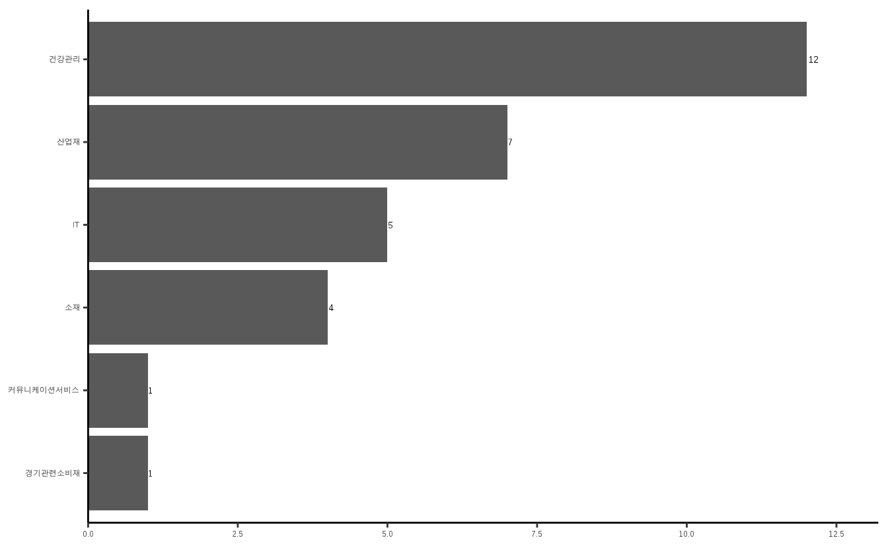

`group_by()` 함수를 이용하여 12개월 기준 모멘텀 포트폴리오 종목들의 섹터 별 종목수를 계산해준 후, `ggplot()` 함수를 이용하여 이를 그림으로 나타내줍니다. 그림에서 알 수 있듯이, 특정 섹터에 대부분의 종목이 몰려있습니다.

따라서 여러 종목으로 포트폴리오를 구성하였지만, 분해해보면 특정 섹터에 쏠림이 심하다는 것을 알 수 있습니다. 이러한 섹터 쏠림 현상을 제거한 **섹터 중립 포트폴리오**를 구성해 보도록 하겠습니다.


```r
sector_neutral = data_market %>%
  select(`종목코드`, `SEC_NM_KOR`) %>%
  mutate(`ret` = ret_12m) %>%
  group_by(`SEC_NM_KOR`) %>%
  mutate(scale_per_sector = scale(`ret`),
         scale_per_sector = ifelse(is.na(`SEC_NM_KOR`), NA, scale_per_sector))
```

1. 먼저 종목코드와 섹터정보, 그리고 12개월 수익률 정보를 불러옵니다.
2. `group_by()` 함수를 통해 섹터별 그룹을 만들어 줍니다.
3. `scale()` 함수를 이용해 정규화를 해줍니다. 정규화의 경우 $\frac{x- \mu}{\sigma}$로 계산됩니다. 
4. 섹터 정보가 없는 정보는 삭제해주도록 합니다.

위의 정규화 과정을 살펴보면, 전체 종목에서 12개월 수익률을 비교하는 것이 아닌 각 섹터별로 수익률의 강도를 비교하게 됩니다. 따라서 특정 종목의 과거 수익률이 전체 종목과 비교해서 높았어도 해당 섹터 내에서의 순위가 낮다면, 정규화된 값은 낮게됩니다. 

따라서 섹터 별 정규화 과정을 거친 값으로 비교 분석을 한다면, 섹터 효과가 어느정도 제거된 포트폴리오를 구성할 수 있습니다.


```r
invest_mom_neutral = rank(-sector_neutral$scale_per_sector) <= 30

data_market[invest_mom_neutral, ] %>%
  select(`SEC_NM_KOR`) %>%
  group_by(`SEC_NM_KOR`) %>%
  summarize(n = n()) %>%
  ggplot(aes(x = reorder(`SEC_NM_KOR`, `n`), y = `n`, label = n)) +
  geom_col() +
  geom_text(color = 'black', size = 4, hjust = -0.3) +
  xlab(NULL) +
  ylab(NULL) +
  coord_flip() +
  scale_y_continuous(expand = c(0, 0, 0.1, 0)) + 
  theme_classic()
```

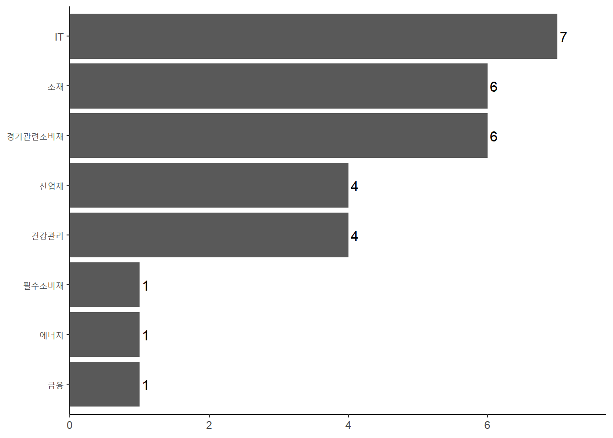

정규화된 값의 랭킹이 높은 상위 30 종목을 선택하며, 내림차순을 위해 마이너스를 붙여줍니다. 해당 포트폴리오의 섹터 별 구성종목을 확인해보면, 단순하게 포트폴리오를 구성한 것 대비, 여러 섹터에 종목이 분산되어 있음이 확인됩니다.

이처럼 `group_by()` 함수를 통해 손쉽게 그룹별 중립화를 할 수 있으며, 글로벌 투자를 하는 경우에는 지역, 국가, 섹터 별로도 중립화된 포트폴리오를 구성하기도 합니다.

## 마법공식

하나의 팩터만을 보고 투자하는 것 보다, 둘 혹은 그 이상의 팩터를 결합하여 투자하는 것이 훨씬 좋은 포트폴리오를 구성할 수 있으며, 이러한 방법을 멀티 팩터라 합니다. 그중에서도 밸류와 퀄리티의 조합은 전통적으로 많이 사용되어진 방법이며, 그 중 대표적인 예가 조엘 그린블라트의 마법공식입니다.

이번 장에서는 퀄리티와 밸류 간의 관계, 그리고 마법공식의 정의와 구성방법에 대해 알아보도록 하겠습니다.

### 퀄리티와 밸류 간의 관계

투자의 정석 중 하나는 **좋은 기업을 싸게 사는 것**입니다. 이를 팩터의 관점에서 이해하면 퀄리티 팩터와 밸류 팩터로 이해할 수도 있습니다. 

여러 논문에 따르면 흔히 밸류와 퀄리티 팩터는 반대의 관계에 있습니다. 먼저 가치주들은 위험이 크기 때문에 시장에서 소외를 받아 저평가가 이루어지는 것이며, 이러한 위험에 대한 댓가로 밸류 팩터의 수익률이 높게됩니다. 반대로 사람들은 우량주에 기꺼이 프리미엄을 지불하려 하기 때문에 퀄리티 팩터의 수익률이 높기도 합니다. 이는 마치 동전의 양면과 같지만, 장기적으로 가치주와 우량주 모두 우수한 성과를 기록합니다. 

먼저 퀄리티의 지표인 매출총이익과 밸류 지표인 PBR을 통해 둘간의 관계를 확인해보도록 하겠습니다.


```r
library(stringr)
library(dplyr)

KOR_value = read.csv('data/KOR_value.csv', row.names = 1, stringsAsFactors = FALSE)
KOR_fs = readRDS('data/KOR_fs.Rds')
KOR_ticker = read.csv('data/KOR_ticker.csv', row.names = 1, stringsAsFactors = FALSE) 

data_pbr = KOR_value['PBR']
data_gpa = (KOR_fs$'매출총이익' / KOR_fs$'자산')[ncol(KOR_fs$'매출총이익')] %>%
  setNames('GPA')

cbind(data_pbr, -data_gpa) %>%
  cor(method = 'spearman', use = 'complete.obs') %>% round(4)
```

```
##         PBR     GPA
## PBR  1.0000 -0.2096
## GPA -0.2096  1.0000
```

데이터를 불러온 후, PBR과 GPA(매출총이익 / 자산)를 구해주도록 합니다. 그 후 랭킹의 상관관계인 스피어만 상관관계를 구해보면, 서로 간 반대 관계가 있음이 확인됩니다. PBR의 경우 오름차순, GPA의 경우 내림차순 이므로 GPA 앞에 마이너스를 붙여주었습니다.


```r
cbind(data_pbr, data_gpa) %>%
  mutate(quantile_pbr = ntile(data_pbr, 5)) %>%
  filter(!is.na(quantile_pbr)) %>%
  group_by(quantile_pbr) %>%
  summarise(mean_gpa = mean(GPA, na.rm = TRUE)) %>%
  ggplot(aes(x = quantile_pbr, y = mean_gpa)) +
  geom_col() +
  xlab('PBR') + ylab('GPA')
```

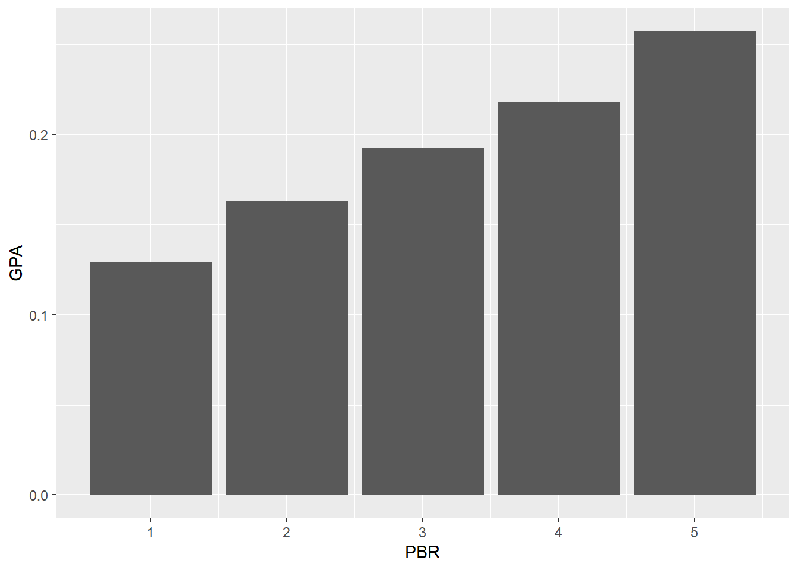

이번에는 PBR의 분위수 별 GPA 평균값을 구하도록 하겠습니다.

1. `ntile()` 함수를 이용해 PBR을 5분위수로 나누어 줍니다.
2. PBR이 없는 종목은 제외합니다.
3. `group_by()`를 통해 PBR의 분위수별 그룹을 묶어 줍니다.
4. 각 PBR 그룹 별 GPA의 평균값을 구해줍니다.
5. `ggplot()`을 이용해 시각화를 해줍니다.

그림에서 알수 있듯이 PBR이 낮을수록 GPA도 낮으며, 즉 가치주일수록 우량성은 떨어집니다. 반면에 PBR이 높을수록 GPA도 늪으며, 이는 주식의 가격이 비쌀수록 우량성도 높다는 것을 의미합니다.

이를 이용해 밸류 팩터와 퀄리티 팩터간의 관계를 나타내면 다음과 같습니다.


<div class="figure" style="text-align: center">

<p class="caption">(\#fig:unnamed-chunk-8)밸류 팩터와 퀄리티 팩터간의 관계</p>
</div>

주가가 쌀수록 기업의 우량성은 떨어지며(①번), 반대로 기업의 우량성이 좋으면 주식은 비싼 경향(③번)이 있습니다. 물론 우량성도 떨어지고 비싸기만한 주식(②번)을 사려는 사람들 아마 없을 겁니다. 결과적으로 우리가 원하는 최고의 주식은 우량성이 있으면서도 가격은 싼 주식(④번)일 것입니다. 

### 마법공식 이해하기

마법공식이란 고담 캐피탈의 설립자이자 전설적인 투자자 조엘 그린블라트에 의해 알려진 투자방법입니다. 그는 본인의 책 **주식 시장을 이기는 작은 책**에서 투자를 하는데 있어 중요한 두가지 지표와, 이를 혼합할 경우 뛰어난 성과를 기록할 수 있다고 하였습니다.

첫번째 지표는 이율(Earnings Yield)로써 기업의 수익을 기업의 가치로 나는 값입니다. 이는 PER의 역수와 비슷하며, 밸류 지표 중 하나입니다.

두번째 지표는 투자 자본 수익률(Return on Capital)로써 기업의 수익을 투자한 자본으로 나눈 값입니다. 이는 ROE와도 비슷하며, 퀄리티 지표 중 하나입니다.

마법공식은 이 두가지 지표의 랭킹을 각각 구한 후, 랭킹의 합 기준 상위 30 개 종목을 1년간 보유한 후 매도하는 전략입니다.

해당 전략은 국내 투자자들에게도 많이 사랑받는 전략입니다. 그러나 두 지표를 계산하기 위한 데이터를 수집하는데 어려움이 있어 많은 투자자들이 이율 대신 PER를, 투하 자본 수익률 대신 ROE를 사용합니다. 그러나 우리가 수집한 데이터를 통해 충분히 원래의 마법공식을 구현할 수 있습니다.


Table: (\#tab:unnamed-chunk-9)마법공식의 구성 요소

팩터   Value                                               Quality                                         
-----  --------------------------------------------------  ------------------------------------------------
지표   이율 (Earnings Yield)                               투하 자본 수익률 (Return On Capital)            
계산   $\frac{이자\,및\,법인세\,차감전이익}{기업\,가치}$   $\frac{이자\,및\,법인세\,차감전이익}{투하자본}$ 

### 마법공식 구성하기

재무제표 항목을 통해 이율과 투하 자본 수익률을 계산하고, 이를 통해 마법공식 포트폴리오를 구성하도록 하겠습니다.

먼저, 밸류지표에 해당하는 이익수익률을 계산해보도록 하겟습니다. 이익수익률은 이자 및 법인세 차감전이익(EBIT)를 기업 가치(시가총액 + 순차입금)으로 나눈 값입니다. 이를 분해하면 다음과 같습니다.

\begin{equation} 
\begin{split}
이익수익률 & = \frac{이자\,및\,법인세\,차감전이익}{기업\,가치} \\
& = \frac{이자\,및\,법인세\,차감전이익}{시가총액 + 순차입금} \\
& = \frac{당기순이익 + 법인세 + 이자비용}{시가총액 + 총부채 - 여유자금} \\
& = \frac{당기순이익 + 법인세 + 이자비용}{시가총액 + 총부채 - (현금 - max(0, 유동부채 - 유동자산 + 현금))}
\end{split}
\end{equation} 


```r
library(stringr)
library(dplyr)

KOR_value = read.csv('data/KOR_value.csv', row.names = 1, stringsAsFactors = FALSE)
KOR_fs = readRDS('data/KOR_fs.Rds')
KOR_ticker = read.csv('data/KOR_ticker.csv', row.names = 1, stringsAsFactors = FALSE) 
KOR_ticker$'종목코드' = str_pad(KOR_ticker$'종목코드', 6, 'left', 0)

num_col = ncol(KOR_fs[[1]])

# 분자
magic_ebit = (KOR_fs$'지배주주순이익' + KOR_fs$'법인세비용' + KOR_fs$'이자비용')[num_col]

# 분모
magic_cap = KOR_value$PER * KOR_fs$'지배주주순이익'[num_col]
magic_debt = KOR_fs$'부채'[num_col]
magic_excess_cash_1 = KOR_fs$'유동부채' - KOR_fs$'유동자산' + KOR_fs$'현금및현금성자산'
magic_excess_cash_1[magic_excess_cash_1 < 0] = 0
magic_excess_cash_2 = (KOR_fs$'현금및현금성자산' - magic_excess_cash_1)[num_col]

magic_ev = magic_cap + magic_debt - magic_excess_cash_2

# 이익수익률
magic_ey = magic_ebit / magic_ev
```

먼저 가치지표, 재무제표, 티커 데이터를 불러온 후, 재무제표 열 갯수를 구해주도록 합니다. 그 후 분자와 분모 항목에 해당하는 부분을 하나씩 계산해 줍니다.

먼저 분자 부분인 **이자 및 법인세 차감전이익**은 **지배주주 순이익**에 **법인세비용**과 **이자비용**을 더해줍니다. 그 후, 최근년도 데이터를 선택해 줍니다.

분모 부분은 시가총액, 총부채, 여유자금 총 세가지로 구성되어 있습니다.

1. 우리가 가지고 있는 밸류 데이터와 재무제표 데이터를 통해 시가총액을 역산할 수 있습니다. PER 값에 Earnings를 곱해주면 시가총액이 계산되게 됩니다. 이를 통해 계산된 시가총액을 HTS나 금융 사이트의 값과 비교하면 거의 비슷함이 확인됩니다.

\begin{equation} 
\begin{split}
PER \times Earnings & = \frac{Price}{Earnings/Shares} \times Earnings \\
& = \frac{Price \times Shares}{Earnings} \times Earnings \\
& = Price \times Earnings = Market\,Cap
\end{split}
\end{equation} 

2. 총 부채는 부채 항목을 사용하면 됩니다.
3. 여유자금은 두 단계에 걸쳐 계산하도록 합니다. 먼저 **유동부채 - 유동자산 + 현금** 값을 구해준 후, 0보다 작은 값은 모두 0으로 바꾸어주도록 합니다. 이 값을 현금 및 현금성자산 항목에서 차감하여 최종적인 여유자금을 구하도록 합니다.

분자와 분모 부분을 나누어주면 이익수익률을 계산할 수 있습니다.

다음으로 퀄리티 지표에 해당하는 투하 자본 수익률을 계산하도록 하겠습니다. 해당 값은 이자 및 법인세 차감전이익(EBIT)를 투하자본(IC)으로 나누어 계산되며, 이를 분해하면 다음과 같습니다.

\begin{equation} 
\begin{split}
투하 자본 수익률 & = \frac{이자\,및\,법인세\,차감전이익}{투하자본} \\
& = \frac{당기순이익 + 법인세 + 이자비용}{(유동자산 - 유동부채) + (비유동자산 - 감가상각비)}
\end{split}
\end{equation} 


```r
magic_ic = ((KOR_fs$'유동자산' - KOR_fs$'유동부채') +
              (KOR_fs$'비유동자산' - KOR_fs$'감가상각비'))[num_col]
magic_roc = magic_ebit / magic_ic
```

투하 자본 수익률은 비교적 쉽게 계산할 수 있습니다. 분모에 해당하는 투하 자본의 경우 재무제표 항목을 그대로 사용하면 되며, 분자인 이자 및 법인세 차감전이익은 위에서 이미 구해둔 값을 그대로 사용하면 됩니다.

이제 두 지표를 활용하여 마법공식 포트폴리오를 구성하도록 하겠습니다.


```r
invest_magic = rank(rank(-magic_ey) + rank(-magic_roc)) <= 30

KOR_ticker[invest_magic, ] %>%
  select(`종목코드`, `종목명`) %>%
  mutate(`이익수익률` = magic_ey[invest_magic, ],
         `투하자본수익률` = magic_roc[invest_magic, ])
```

```
##    종목코드         종목명 이익수익률 투하자본수익률
## 1    005930       삼성전자  0.1894849      0.2504221
## 2    000660     SK하이닉스  0.3441471      0.4793078
## 3    004800           효성  0.5663100      1.8507795
## 4    010780   아이에스동서  0.1851429      0.2913760
## 5    008060       대덕전자  0.2526047      0.2936349
## 6    012630            HDC  0.4907727      0.3623118
## 7    001820     삼화콘덴서  0.1298620      0.6383476
## 8    090460       비에이치  0.1307829      0.5129063
## 9    003300     한일홀딩스  0.3919292      0.2164415
## 10   086390     유니테스트  0.3067661      0.4580397
## 11   045100     한양이엔지  0.2697852      0.3235486
## 12   003030   세아제강지주  0.3028029      0.2302996
## 13   004960       한신공영  0.1831483      0.3066055
## 14   036190   금화피에스시  0.2395210      0.2316258
## 15   035620 바른손이앤에이  0.5380096      0.9668008
## 16   029460         케이씨  0.9663764      0.5832074
## 17   121800         비덴트  0.4687894      0.3265007
## 18   040910       아이씨디  0.1741219      0.2611465
## 19   036200         유니셈  0.1658174      0.2693798
## 20   126700 하이비젼시스템  0.2130603      0.2265886
## 21   006580       대양제지  0.1892245      0.2778542
## 22   083930         아바코  0.1656007      0.2599010
## 23   001570           금양  0.1461728      0.3548387
## 24   042040   케이피엠테크  0.2948247      0.2938830
## 25   036010     아비코전자  0.5160426      0.2416226
## 26   010280   쌍용정보통신  0.2960666      0.3963415
## 27   290740         액트로  0.1736520      0.3194444
## 28   127710     아시아경제  0.3627433      0.2408985
## 29   094970       제이엠티  0.2402346      0.2700186
## 30   194510     파티게임즈  0.2170685      0.5069124
```

이익수익률과 투하 자본 수익률의 랭킹을 각각 구해주며, 내림차순으로 값을 구하기 위해 마이너스를 붙여줍니다. 그 후 두 값의 합의 랭킹 기준 상위 30 종목을 선택합니다. 그 후 종목코드와 종목명, 각 지표를 확인해주도록 합니다.

## 이상치 데이터 제거 및 팩터의 결합

모든 데이터 분석에서 중요한 문제 중 하나가 이상치(극단치, Outlier) 데이터를 어떻게 처리할 것인가 입니다. 과거 12개월 수익률이 10배인 주식이 과연 모멘텀 관점에서 좋기만 한 주식인가, ROE가 100% 넘는 주식이 과연 퀄리티 관점에서 좋기만 한 주식인가 고민이 되기 마련입니다.

따라서 이러한 이상치를 제외하고 분석할지, 포함해서 분석할지를 판단해야 하며, 만일 포함한다면 그대로 사용할 것인지 보정하여 사용할 것인지도 판단해야 합니다.

우리가 가지고 있는 데이터에서 이러한 이상치 데이터를 탐색해보도록 하겠습니다.


```r
library(magrittr)
library(ggplot2)

KOR_value = read.csv('data/KOR_value.csv', row.names = 1, stringsAsFactors = FALSE)
KOR_value %>%
  ggplot(aes(x = PBR)) +
  geom_histogram(binwidth = 0.1)
```

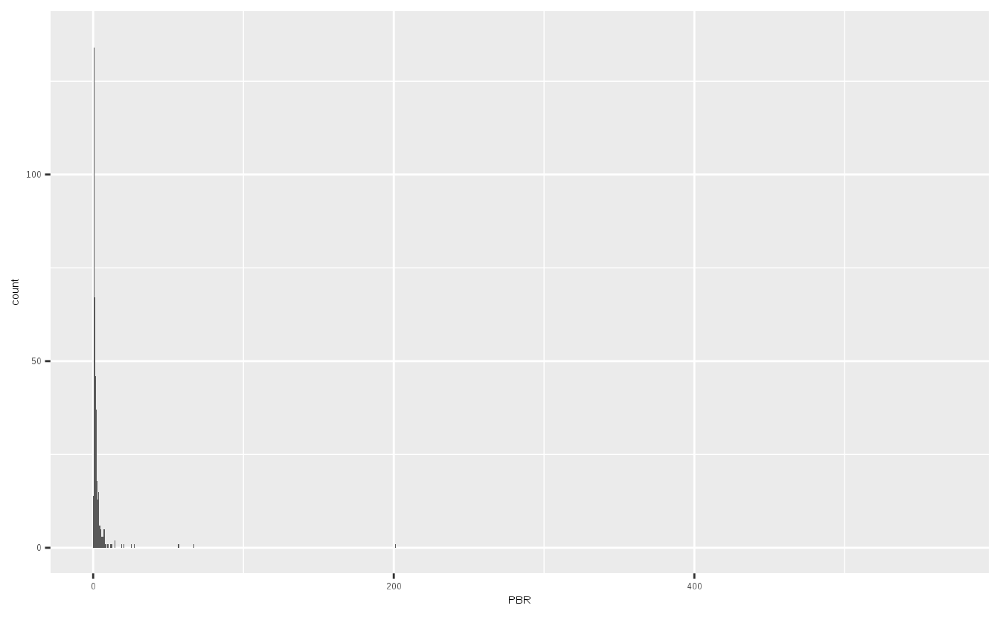

```r
max(KOR_value$PBR, na.rm = TRUE)
```

```
## [1] 137.6451
```

국내 종목들의 PBR을 통해 히스토그램을 그려보면 오른쪽으로 꼬리가 매우 긴 분포를 보이고 있습니다. 이는 PBR이 무려 137.65인 이상치 데이터가 존재하기 때문입니다. 이처럼 모든 팩터 지표에는 극단치 데이터가 존재하기 마련이며, 이를 처리하는 방법에 대해 알아보도록 하겠습니다.

### 트림(Trim): 이상치 데이터 삭제

트림은 이상치 데이터를 삭제하는 방법입니다. 위의 예제에서 이상치에 해당하는 상하위 1% 데이터를 삭제해주도록 하겠습니다.


```r
library(dplyr)

value_trim = KOR_value %>%
  select(PBR) %>%
  mutate(PBR = ifelse(percent_rank(PBR) > 0.99, NA, PBR),
         PBR = ifelse(percent_rank(PBR) < 0.01, NA, PBR))

value_trim %>%
  ggplot(aes(x = PBR)) +
  geom_histogram(binwidth = 0.1)
```

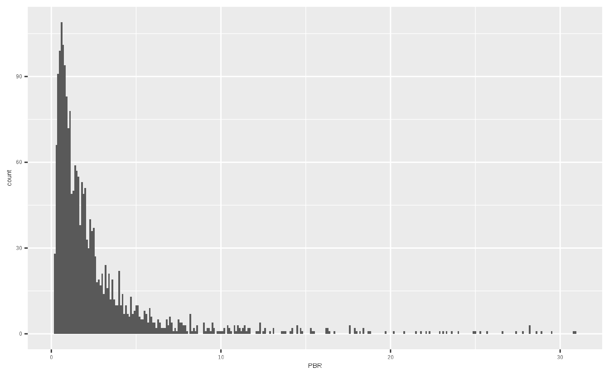

`percent_rank()` 함수를 통해 백분위를 구한 후 상하위 1%에 해당하는 데이터들은 NA로 변경하였습니다. 결과적으로 지나치게 PBR이 낮은 종목과 높은 종목은 제거가 되어 x축의 스케일이 많이 줄어든 모습입니다.

평균이나 분산과 같이 통계값을 구하는 과정에서는 이상치 데이터를 제거하는 것이 바람직 할 수 있습니다. 그러나 팩터를 이용해 포트폴리오를 구하는 과정에서 해당 방법은 잘 사용되지 않습니다. 데이터의 손실이 발생하게 되며, 제거된 종목 중 정말로 좋은 종목이 존재할 수도 있기 때문입니다.


### 윈저라이징(Winsorizing): 이상치 데이터 대체

포트폴리오 구성에서는 일반적으로 이상치 데이터를 다른 데이터로 대체하는 윈저라이징 방법이 사용됩니다. 예를 들어, 상위 99%를 초과하는 데이터는 99% 값으로 대체하며, 하위 1% 미만의 데이터는 1% 데이터로 대체합니다. 즉, 좌우로 울타리를 쳐놓고 해당 범위를 넘어가는 값을 강제로 울타리에 맞춰줍니다.


```r
value_winsor = KOR_value %>%
  select(PBR) %>%
  mutate(PBR = ifelse(percent_rank(PBR) > 0.99,
                      quantile(., 0.99, na.rm = TRUE), PBR),
         PBR = ifelse(percent_rank(PBR) < 0.01,
                      quantile(., 0.01, na.rm = TRUE), PBR))

value_winsor %>%
  ggplot(aes(x = PBR)) +
  geom_histogram(binwidth = 0.1)
```


역시나 `percent_rank()` 함수를 통해 백분위를 구한 후, 해당 범위를 초과할 경우 각각 상하위 1% 데이터로 변형을 해주도록 합니다. 그림을 살펴보면 x축 양 끝 부분의 막대가 길어진 것을 확인할 수 있습니다.

### 팩터의 결합 방법

우리는 이전에 밸류 지표의 결합, 퀄리티 지표의 결합, 그리고 마법공식 포트폴리오를 구성할 때 단순히 랭킹을 더하는 방법을 사용하였습니다. 물론 투자 종목수가 얼마 되지 않거나, 개인투자자의 입장에서는 이러한 방법이 가장 심플하면서도 효과적일수 있습니다.

그러나 전문투자자 혹은 팩터를 분석하는 업무를 할 경우, 이처럼 단순히 랭킹을 더하는 방법은 여러가지 문제를 지니고 있습니다.


```r
library(tidyr)
  
KOR_value %>%
  mutate_all(list(~min_rank(.))) %>%
  gather() %>%
  ggplot(aes(x = value)) +
  geom_histogram() +
  facet_wrap(. ~ key)  
```

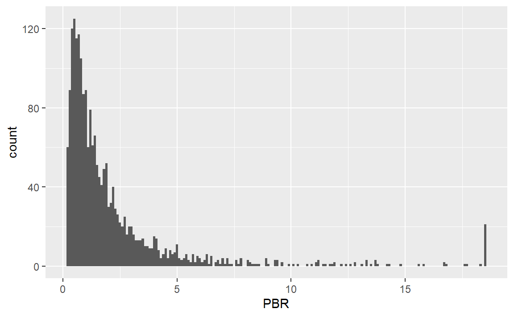

위 그림은 각 밸류 지표의 랭킹을 구한 후 히스토그램으로 나타낸 것입니다. 랭킹을 구하는 것의 가장 큰 장점은 극단치로 인한 효과가 사라진다는 점과, 균등한 분포를 가진다는 점입니다.

그러나 각 지표의 x축을 보면 최대값이 서로 다릅니다. 이는 지표별 결측치로 인해 유효 데이터의 갯수가 달라 나타나는 현상이며, 서로 다른 범위의 분포를 단순히 합치는 것은 좋은 방법이 아닙니다.

예를 들어 A, B, C, D 팩터에 각각 비중을 40%, 30%, 20%, 10% 부여하여 포트폴리오를 구성하고자 할 경우를 생각해 봅시다. 각 랭킹은 분포의 범위가 다르므로, 랭킹과 비중의 가중평균을 통해 포트폴리오를 구성하는 방법은 왜곡된 결과를 발생시킵니다.

이러한 문제를 해결하는 가장 좋은 방법은 랭킹을 구한 후, 이를 Z-Score로 정규화하는 방법입니다.


```r
KOR_value %>%
  mutate_all(list(~min_rank(.))) %>%
  mutate_all(list(~scale(.))) %>%
  gather() %>%
  ggplot(aes(x = value)) +
  geom_histogram() +
  facet_wrap(. ~ key)  
```

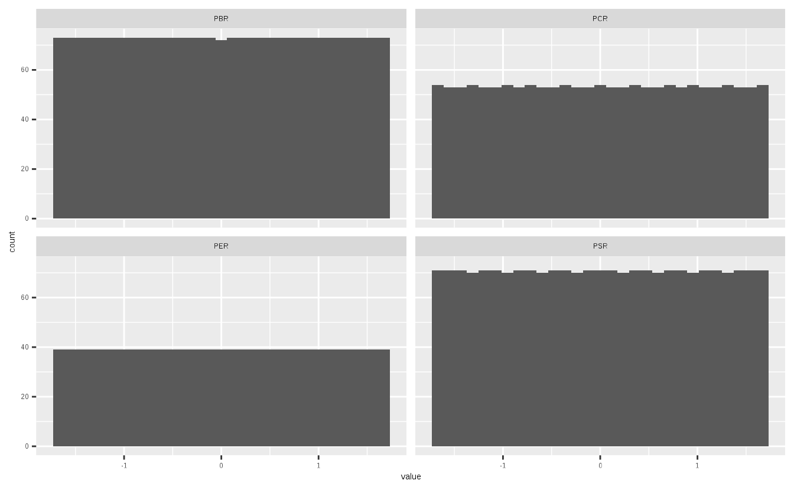

`min_rank()`를 통해 랭킹을 구한 후, `scale()`을 통해 정규화를 해주었습니다. 기본적으로 랭킹의 분포가 가진 극단치 효과가 사라지는 점과 균등 분포의 장점을 유지하고 있으며, 분포의 범위 역시 거의 동일하게 바뀌었습니다.

이처럼 여러 팩터를 결합하여 포트폴리오를 구성하고자 하는 경우, 먼저 각 팩터(지표) 별 랭킹을 구한 후 정규화를 한 뒤 더하는 것이, 왜곡 효과가 제거된 안정적인 방법입니다. 

$$Z－Score(Rank(Factor\,A)) + Z－Score(Rank(Factor\,B)) +\,\dots\,+ Z－Score(Rank(Factor\,N))$$

## 멀티팩터 포트폴리오

앞에서 배웠던 팩터 이론들과 결합 방법들을 응용하여 멀티팩터 포트폴리오를 구성해보도록 하겠습니다. 각 팩터에 사용되는 지표는 다음과 같습니다.

- 퀄리티: 자기자본이익률, 매출총이익, 영업활동현금흐름
- 밸류: PER, PBR, PSR, PCR
- 모멘텀: 3개월 수익률, 6개월 수익률, 12개월 수익률


```r
library(xts)
library(stringr)

KOR_fs = readRDS('data/KOR_fs.Rds')
KOR_value = read.csv('data/KOR_value.csv', row.names = 1, stringsAsFactors = FALSE)
KOR_price = read.csv('data/KOR_price.csv', row.names = 1, stringsAsFactors = FALSE) %>% as.xts()

KOR_ticker = read.csv('data/KOR_ticker.csv', row.names = 1, stringsAsFactors = FALSE) 
KOR_ticker$'종목코드' = str_pad(KOR_ticker$'종목코드', 6, 'left', 0)
```

먼저 재무제표, 가치지표, 주가 데이터를 불러오도록 합니다.


```r
num_col = ncol(KOR_fs[[1]])
quality_roe = (KOR_fs$'지배주주순이익' / KOR_fs$'자본')[num_col]
quality_gpa = (KOR_fs$'매출총이익' / KOR_fs$'자산')[num_col]
quality_cfo = (KOR_fs$'영업활동으로인한현금흐름' / KOR_fs$'자산')[num_col]
quality_profit = cbind(quality_roe, quality_gpa, quality_cfo) %>%
  setNames(., c('ROE', 'GPA', 'CFO'))

factor_quality = quality_profit %>%
  mutate_all(list(~min_rank(desc(.)))) %>%
  mutate_all(list(~scale(.))) %>%
  rowSums()

factor_quality %>% 
  data.frame() %>%
  ggplot(aes(x = `.`)) +
  geom_histogram()
```

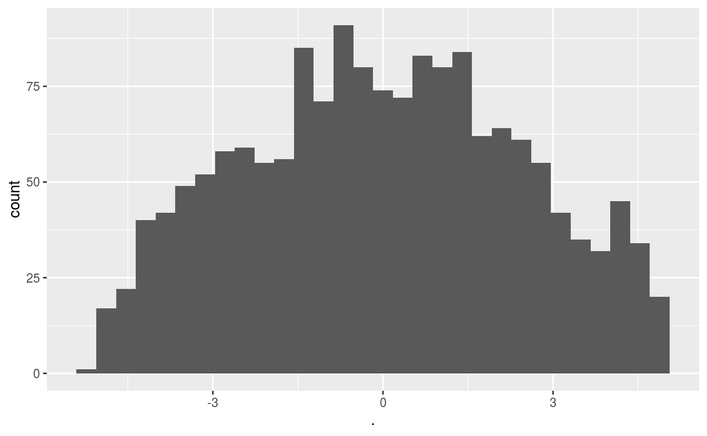

첫번째로 퀄리티 지표를 계산해줍니다. 코드는 앞장에서 살펴본 것과 거의 비슷하며, 자기자본이익률, 매출총이익, 영업활동현금흐름을 계산해줍니다. 그 후 `mutate_all()` 함수를 통해 랭킹을 구한 후 다시 표준화를 해주도록 하며, 내림차순으로 정리하기 위해 랭킹 부분에 `desc()`를 붙여줍니다. 

그 후 `rowSums()` 함수를 통해 계산된 Z-Score를 종목별로 합쳐주도록 합니다. Z-Score의 히스토그램을 살펴보면 이상치가 없이 중앙에 데이터가 많이 분포되어 있습니다.


```r
factor_value = KOR_value %>%
  mutate_all(list(~min_rank(.))) %>%
  mutate_all(list(~scale(.))) %>%
  rowSums()

factor_value %>% 
  data.frame() %>%
  ggplot(aes(x = `.`)) +
  geom_histogram()
```

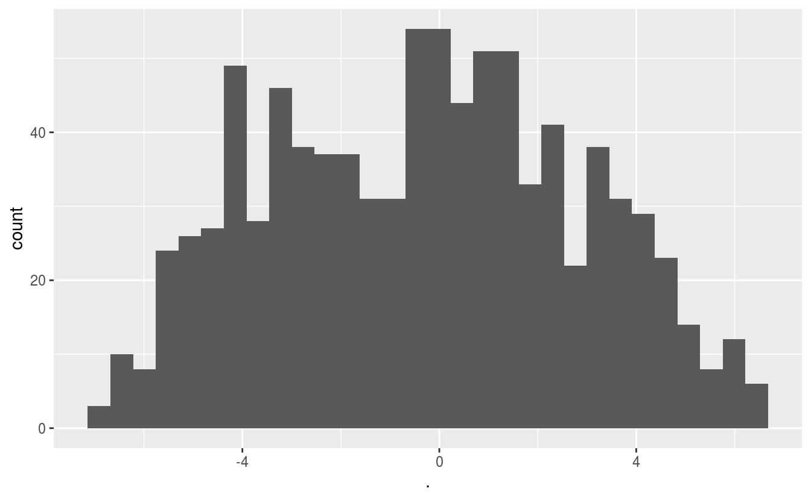

두번째로 밸류 지표를 계산해줍니다. 밸류 지표의 경우 이미 테이블 형태로 들어와 있으며, 랭킹과 표준화를 거쳐 합을 구해주도록 합니다. 역시나 이상치가 없이 중앙에 데이터가 많이 분포되어 있습니다.


```r
library(PerformanceAnalytics)
library(dplyr)

ret_3m = Return.calculate(KOR_price) %>% xts::last(60) %>%
  sapply(., function(x) {prod(1+x) - 1})
ret_6m = Return.calculate(KOR_price) %>% xts::last(120) %>%
  sapply(., function(x) {prod(1+x) - 1})
ret_12m = Return.calculate(KOR_price) %>% xts::last(252) %>%
  sapply(., function(x) {prod(1+x) - 1})
ret_bind = cbind(ret_3m, ret_6m, ret_12m) %>% data.frame()

factor_mom = ret_bind %>%
  mutate_all(list(~min_rank(desc(.)))) %>%
  mutate_all(list(~scale(.))) %>%
  rowSums()

factor_mom %>% 
  data.frame() %>%
  ggplot(aes(x = `.`)) +
  geom_histogram()
```

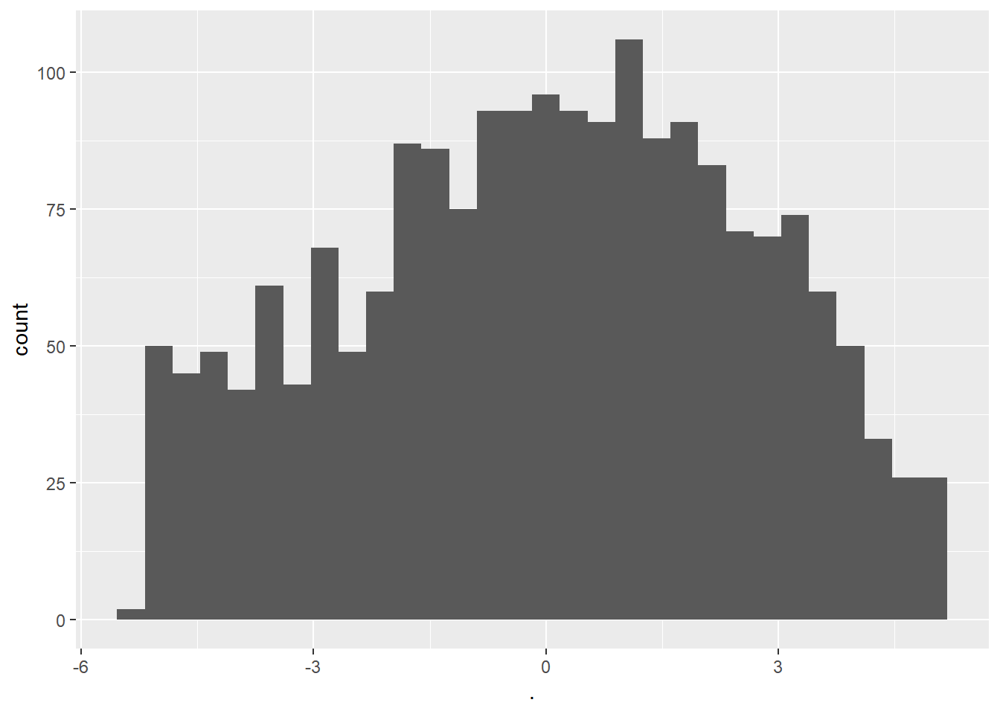

마지막으로 모멘텀 지표를 계산해줍니다. 최근 60일, 120일, 252일 주가를 통해 3개월, 6개월, 12개월 수익률을 구해준 후 `cbind()`를 통해 열로 묶어주도록 합니다. 그 후 내림차순 기준 랭킹과 표준화를 거쳐 합을 구해주도록 합니다.


```r
library(corrplot)

cbind(factor_quality, factor_value, factor_mom) %>%
  data.frame() %>%
  setNames(c('Quality', 'Value', 'Momentum')) %>%
  cor(use = 'complete.obs') %>%
  round(., 2) %>%
  corrplot(method = 'color', type = 'upper',
           addCoef.col = 'black', number.cex = 1,
           tl.cex = 0.6, tl.srt = 45, tl.col = 'black',
           col = colorRampPalette(c('blue', 'white', 'red'))(200),
           mar=c(0,0,0.5,0))
```

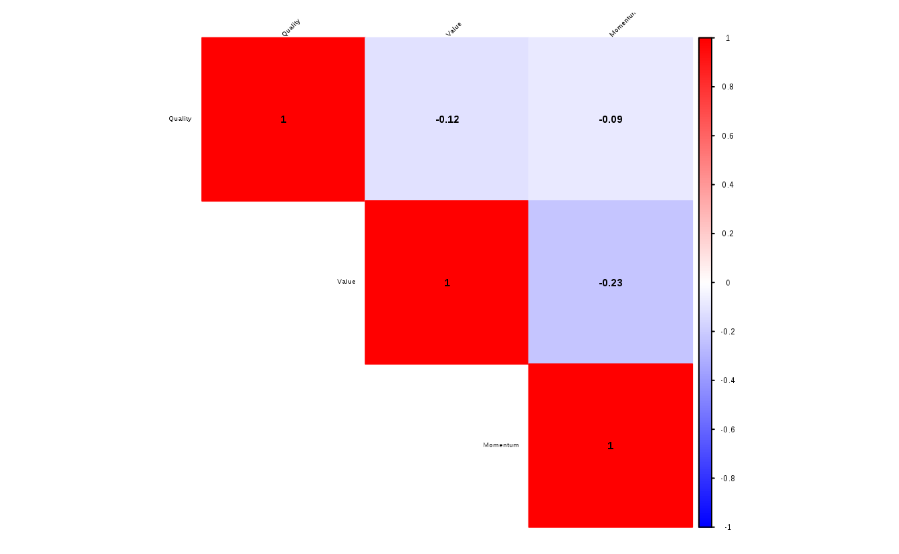

퀄리티, 밸류, 모멘텀 팩터 간의 랭크의 서로 간 상관관계가 매우 낮으며, 여러 팩터를 동시에 고려함으로써 분산효과를 기대할 수 있습니다.


```r
library(tidyr)

factor_qvm = cbind(factor_quality, factor_value, factor_mom) %>%
  data.frame() %>%
  mutate_all(list(~scale(.))) %>%
  mutate(factor_quality = factor_quality * 0.33,
         factor_value = factor_value * 0.33,
         factor_mom = factor_mom * 0.33) %>%
  rowSums()

invest_qvm = rank(factor_qvm) <= 30
```

계산된 팩터들을 토대로 최종 포트폴리오를 구성해주도록 합니다. 각 팩터의 분포가 역시나 다르기 때문에 다시 한번 `scale()`을 통해 정규화를 해주도록 하며, 각 팩터에 동일한 비중인 0.33을 곱해준 후 이를 더해주도록 합니다.

물론 팩터 별 비중을 [0.2, 0.4, 0.4]와 같이 다르게 줄 수도 있으며, 이는 어떠한 팩터를 더욱 중요하게 생각하는지 혹은 더욱 좋게 보는지에 따라 조정이 가능합니다.

최종적으로 해당 값의 랭킹 기준 상위 30 종목을 선택해 줍니다.


```r
quality_profit[invest_qvm, ] %>%
  gather() %>%
  ggplot(aes(x = value)) +
  geom_histogram() +
  facet_wrap(. ~ key, scale = 'free', ncol = 1) +
  xlab(NULL)
```

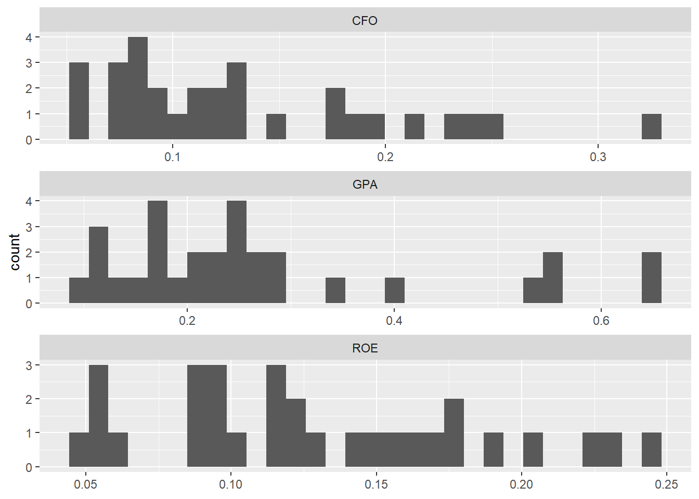

먼저 선택된 종목의 퀄리티 지표별 분포를 살펴보도록 하겠습니다. 대부분 종목의 수익성이 높음이 확인됩니다.


```r
KOR_value[invest_qvm, ] %>%
  gather() %>%
  ggplot(aes(x = value)) +
  geom_histogram() +
  facet_wrap(. ~ key, scale = 'free', ncol = 1) +
  xlab(NULL)
```

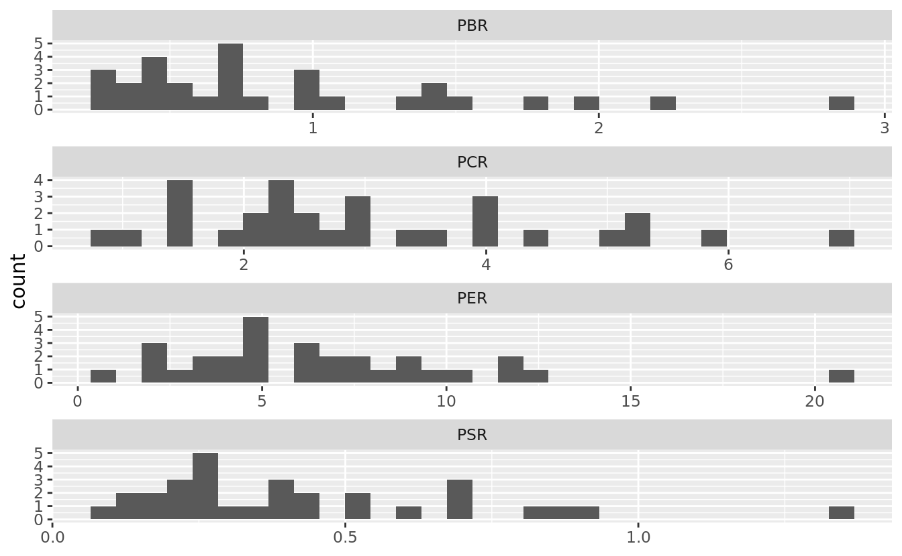

이번에는 선택된 종목의 가치 지표별 분포입니다. 대부분 종목의 값이 낮아, 밸류 종목임이 확인됩니다.


```r
ret_bind[invest_qvm, ] %>%
  gather() %>%
  ggplot(aes(x = value)) +
  geom_histogram() +
  facet_wrap(. ~ key, scale = 'free', ncol = 1) +
  xlab(NULL)
```


마지막으로 각 종목들의 기간 별 수익률 분포입니다. 역시나 대부분의 종목들이 높은 수익률을 보입니다.


```r
KOR_ticker[invest_qvm, ] %>%
  select('종목코드', '종목명') %>%
  cbind(round(quality_roe[invest_qvm, ], 2)) %>%
  cbind(round(KOR_value$PBR[invest_qvm], 2)) %>%
  cbind(round(ret_12m[invest_qvm], 2)) %>%
  setNames(c('종목코드', '종목명', 'ROE', 'PBR', '12M'))
```

```
##      종목코드         종목명  ROE  PBR   12M
## 170    010780   아이에스동서 0.22 1.06  0.34
## 229    034310           NICE 0.06 0.78  0.11
## 357    122990         와이솔 0.17 1.87  0.46
## 359    097520       엠씨넥스 0.23 3.62  1.15
## 378    215200 메가스터디교육 0.19 1.97  0.23
## 464    002310     아세아제지 0.15 0.65  0.07
## 486    016590     신대양제지 0.16 0.65  0.01
## 487    067990   도이치모터스 0.17 1.63  0.82
## 604    013580       계룡건설 0.20 0.54 -0.08
## 636    035890       서희건설 0.12 0.79  0.21
## 717    002170       삼양통상 0.09 0.72  0.67
## 733    005990     매일홀딩스 0.05 0.37 -0.13
## 755    023600       삼보판지 0.16 0.53  0.30
## 785    036810     에프에스티 0.18 1.78  0.29
## 803    101330       모베이스 0.09 0.75  0.42
## 808    065130   탑엔지니어링 0.06 0.60  0.68
## 860    038390     레드캡투어 0.09 1.01  0.09
## 874    039340     한국경제TV 0.13 1.35  0.52
## 899    069510         에스텍 0.14 1.05  0.26
## 947    005710       대원산업 0.10 0.48 -0.03
## 990    007540           샘표 0.06 0.57  0.34
## 1071   006580       대양제지 0.25 0.95  0.28
## 1256   031310     아이즈비전 0.10 0.84  0.42
## 1279   016740           두올 0.09 0.57 -0.19
## 1513   037330   인지디스플레 0.06 0.40  0.13
## 1514   092780     동양피스톤 0.12 0.72  0.33
## 1527   019180     티에이치엔 0.12 1.92  0.24
## 1584   004140           동방 0.12 0.48 -0.01
## 1645   002710        TCC스틸 0.09 0.51  0.27
## 1649   091340      S&K폴리텍 0.11 0.82  0.32
```

포트폴리오 내 종목들을 대상으로 팩터 별 대표적인 지표인 ROE, PBR, 12개월 수익률을 나타내었습니다. 전반적으로 ROE는 높고 PBR은 낮으며, 12개월 수익률이 높은 모습을 보입니다. 물론 특정 팩터의 강도가 약하더라도 나머지 팩터의 강도가 충분히 강하다면, 포트폴리오에 편입되는 모습을 보이기도 합니다.


```r
cbind(quality_profit, KOR_value, ret_bind)[invest_qvm, ] %>% 
  apply(., 2, mean) %>% round(3) %>% t()
```

```
##        ROE   GPA   CFO   PER PBR   PCR   PSR ret_3m ret_6m ret_12m
## [1,] 0.129 0.274 0.133 7.967   1 3.885 0.496  0.219  0.459   0.284
```

마지막으로 포트폴리오 내 종목들의 지표 별 평균을 계산한 값입니다.
