# R 기초 배우기 {-}

이번 장에서는 본 책의 핵심이 되는 언어인 R과 R 스튜디오의 설치, R 스튜디오의 화면 구성과 간단한 사용법에 대해서 배우도록 하겠습니다. 본 장은 R의 기초 중에서도 핵심만을 추린 것으로써, 기초에 대해 세세하게 다루지는 않습니다. 좀 더 탄탄한 기본기를 배우고 싶으신 분은 시중에 나와있는 훌륭한 R 기본 서적을 추가로 보실 것을 추천드립니다.

## R과 R 스튜디오 설치하기

### R 설치하기

먼저 R 프로젝트 공식 사이트인 https://cran.r-project.org/ 에 접속하여 본인의 OS에 맞는 설치 파일을 다운로드 합니다.

```{r fig.cap='CRAN 사이트', echo = FALSE}
knitr::include_graphics('images/rbasic_cran.png')
```

가장 상단의 [base]를 선택합니다.

```{r fig.cap='R 다운로드 화면', echo = FALSE}
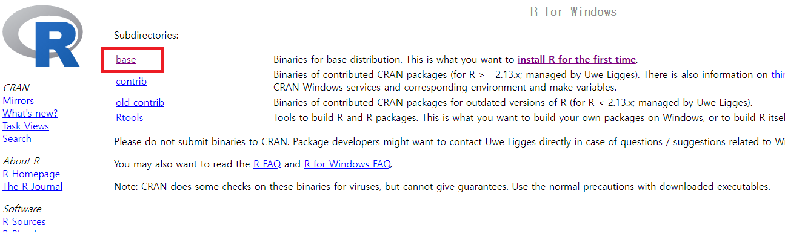
```

[Download R x.x.x for Windows] 항목을 클릭하면 설치 파일이 다운로드 됩니다. 다운로드 받은 파일을 실행해 설치를 하며, 옵션은 수정하지 않아도 됩니다.

```{r fig.cap='R 설치파일 다운로드', echo = FALSE}
knitr::include_graphics('images/rbasic_cran3.png')
```

### R 스튜디오 설치하기

위에서 설치한 R GUI를 그대로 쓰는 사용자는 거의 없습니다. 대부분의 경우 R을 사용하기 편리하게 만들어주는 IDE 소프트웨어인 R 스튜디오를 사용하므로, 해당 프로그램을 설치하도록 합니다. R 스튜디오를 사용하려면 R이 먼저 설치되어 있어야 하며, R과 마찬가지로 무료로 사용할 수 있습니다. 먼저 아래 사이트에 접속합니다.

```
https://www.rstudio.com/products/rstudio/download/
```

하단의 [All Installers] 항목에서 본인의 OS에 해당하는 파일을 다운로드 받아 설치합니다.

```{r fig.cap='R 스튜디오 설치파일 다운로드', echo = FALSE}
knitr::include_graphics('images/rbasic_rstudio.png')
```

::: {.infobox .note data-latex="{note}"}
윈도우 사용자의 경우 간혹 R 스튜디오를 실행하는데 있어 오류가 발생할 수 있습니다.

1. R 스튜디오가 관리자 권한으로 실행되지 않으면 오류가 발생할 수 있으며, 이 경우 아래와 같은 방법으로 해결이 가능합니다. 

- R 스튜디오 바로가기 아이콘을 마우스 우클릭으로 연 후, [속성] → [호환성]을 클릭합니다. 
- [관리자 권한으로 이 프로그램 실행]에 체크한 후 [확인]을 누릅니다.

<br>
2. 윈도우 사용자 계정이 한글인 경우 기존 사용자 계정을 영문으로 변경하거나, 영문으로 된 사용자 계정을 새로 추가합니다.
:::

## R 스튜디오 화면 구성

처음으로 R 스튜디오를 실행하면 다음과 같은 화면으로 구성되어 있습니다. 이 중 소스 창을 열기 위해 네모 2개가 겹쳐 있는 모양()의 버튼을 클릭합니다. 

```{r fig.cap='R 스튜디오 화면구성', echo = FALSE}
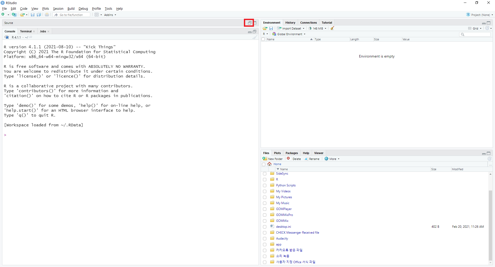
```

소스 창이 활성화되면 총 4개의 창으로 화면이 구성되며, 각 창의 크기는 경계선 부분을 드래그하여 조절할 수 있습니다.

```{r fig.cap='R 스튜디오 화면구성 (2)', echo = FALSE}
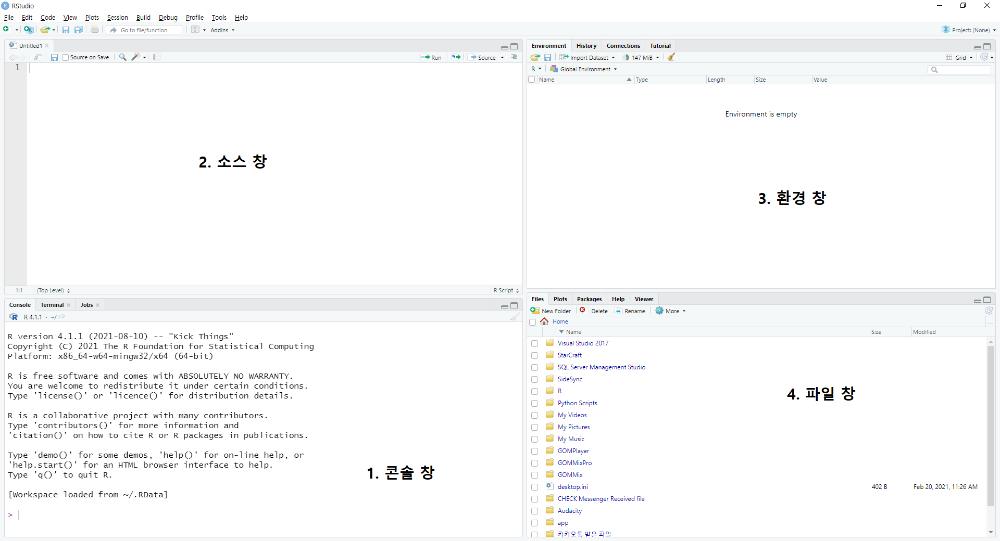
```

**1. 콘솔 창**

좌측 하단에 있는 콘솔 창은 코드를 입력하고 결과물을 출력하는 곳입니다. 

```{r fig.cap='R 스튜디오 콘솔 창', echo = FALSE}
knitr::include_graphics('images/rbasic_rstudio_console.png')
```

콘솔 창의 > 기호 뒤에 **1+1**을 입력하면 그 결과값인 **2**가 출력됩니다. 

이 외에도 [Terminal] 탭에서는 시스템 쉘을 이용해 운영 체제를 조작할 수 있습니다.

**2. 소스 창**

좌측 상단에 있는 소스 창은 코드를 기록할 수 있는 공간이며, 이를 저장한 파일을 스크립트라고 합니다. 콘솔 창과는 다르게 코드를 입력하여도 바로 실행이 되지 않으며, 엔터를 누르면 행이 바뀝니다. 실행하고자 하는 코드가 있는 행을 선택한 후, [Ctrl + Enter]키를 누르면 해당 코드가 실행됩니다.

```{r fig.cap='R 스튜디오 소스 창의 실행', echo = FALSE}
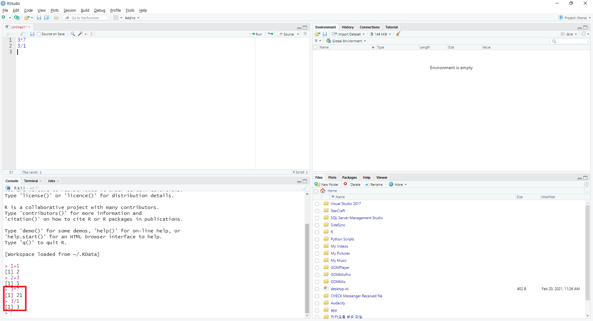
```

3*7이란 코드가 있는 곳에 커서를 둔 후 [Ctrl + Enter]키를 누르면 해당 코드가 콘솔 창에서 실행됩니다. 만일 여러줄의 명령어를 한번에 실행하고 할 경우, 원하는 부분의 코드를 마우스로 드래그하여 선택한 후 [Ctrl + Enter]키를 누르면 코드가 순차적으로 콘솔 창에 입력되면서 실행됩니다.

```{r fig.cap='R 스튜디오 소스 저장하기', echo = FALSE}
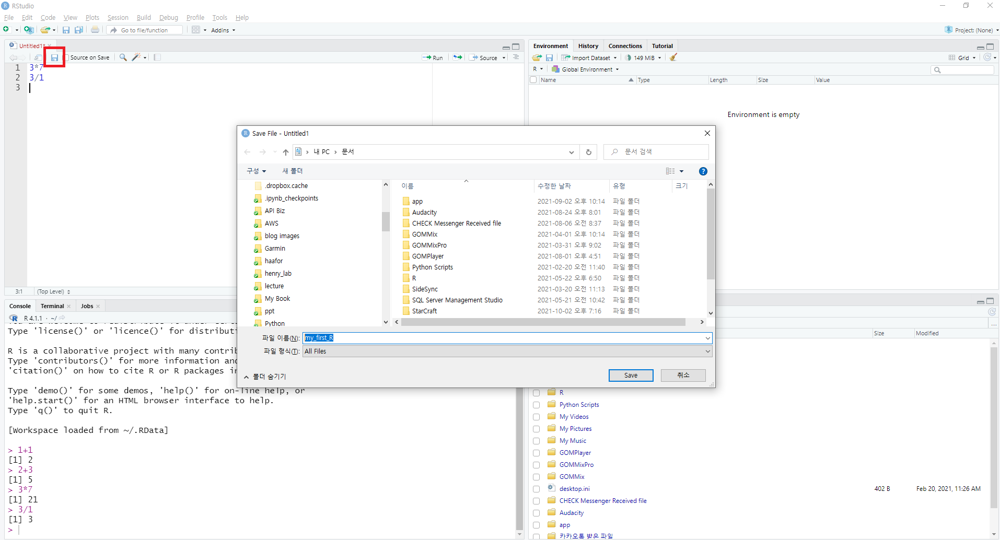
```

위에서 작성한 코드를 저장해보도록 하겠습니다. 저장 버튼()을 클릭한 후 원하는 폴더 및 파일 이름을 입력 한 후 [Save] 버튼을 누릅니다. 

```{r fig.cap='R 스튜디오 소스 저장하기 (2)', echo = FALSE}
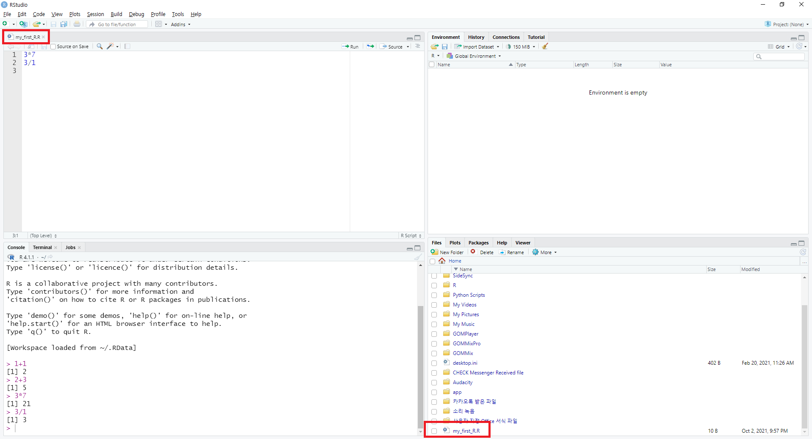
```

Untitled1로 되어 있던 스크립트의 이름이 저장한 이름으로 바뀌며, 스크립트가 저장되어 있는 것이 확인됩니다. 이처럼 코딩을 한 후 스크립트를 저장할 경우, 나중에 해당 내역을 그대로 불러올 수 있습니다.

**3. 환경 창**

우측 상단에 있는 환경 창은 생성된 데이터를 보여주는 화면입니다. 

```{r fig.cap='R 스튜디오 환경 창', echo = FALSE}
knitr::include_graphics('images/rbasic_rstudio_env.png')
```

스크립트 창에서 **a = 1**을 입력하면, 환경 창의 Values 목록에 a가 생기며 그 값은 1로 표시됩니다.

이 외에도 환경 창의 [History] 탭은 이제까지 실행했던 코드의 내역을 볼 수 있으며, [Connections] 탭은 SQL이나 Spark 등 데이터베이스와의 연결을 도와줍니다.

**4. 파일 창**

우측 하단에 있는 파일 창은 윈도우의 파일 탐색기와 비슷한 역할을 하며, 워킹 디렉터리 내의 파일을 보여줍니다. 이 외에도 [Plots] 탭은 그래프를 보여주며 [Packages] 탭은 설치된 패키지의 목록을 보여줍니다. [Help] 탭은 도움말을 보여주며, [Viewer] 탭은 분석 결과를 HTML 등 웹 문서로 출력한 모습을 보여줍니다.

## R 스튜디오 설정하기

R 스튜디오는 기본적으로 흰색 바탕에 검은색 글씨로 설정되어 있습니다. 그러나 흰 화면에서 작업을 하게 되면 눈이 쉽게 피로해지며, 시력에도 좋지 않습니다. 이를 방지하기 위해 어두운 화면으로 설정을 변경해주는 것이 좋습니다.   

```{r fig.cap='R 스튜디오의 테마 선택', echo = FALSE}
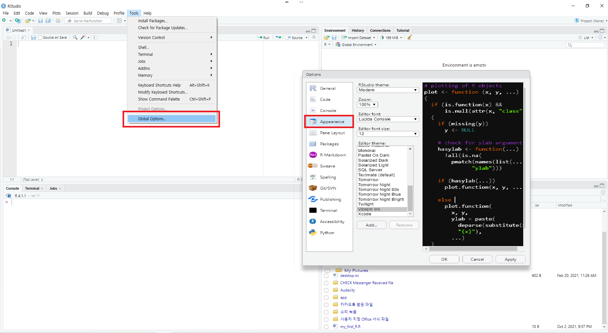
```

상단 탭에서 [Tools] → [Global Options]를 선택한 후, Options의 [Appearance] 탭의 [Editor theme]을 통해 각종 테마를 적용할 수 있습니다. 이 중 본인의 마음에 드는 테마를 선택한 후, [OK] 버튼을 누릅니다.

```{r fig.cap='R 스튜디오의 다크모드 적용', echo = FALSE}
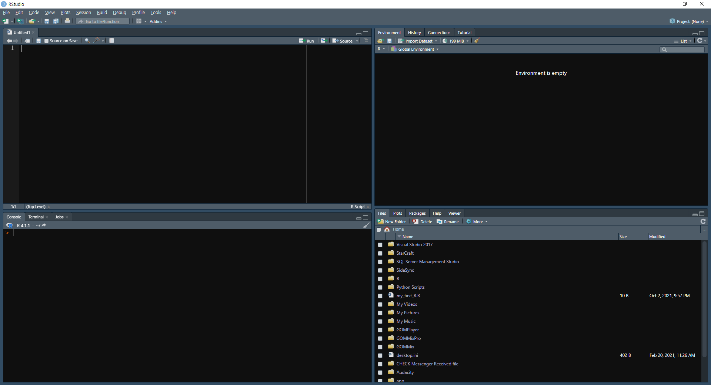
```

화면의 배경이 어두워져 눈이 한결 편해졌습니다.

또한 스크립트 내용 중 한글이 깨지는 것을 방지하기 위해 인코딩 방식을 설정할 필요도 있습니다. 

```{r fig.cap='R 스튜디오의 인코딩 변경', echo = FALSE}
knitr::include_graphics('images/rbasic_rstudio_encoding.png')
```

상단 탭에서 [Tools] → [Global Options]를 선택한 후, Options의 [Code] 탭의 [Default text encoding] 부분의 [Change]를 눌러 **UTF-8**로 변경해줍니다.

:::: {.infobox .note data-latex="{note}"}
인코딩은 컴퓨터가 문자를 표현하는 방식을 의미하며, 이에 대해서는 나중 장에서 다시 자세하게 다루도록 합니다.
::::

해당 방법으로도 스크립트의 인코딩이 깨질 경우 [File → Reopen with Encoding] 메뉴에서 [UTF-8] 항목을 선택하고 [Set as default encoding for source files] 항목을 선택한 후 [OK]를 클릭합니다. UTF-8로 인코딩이 설정된 후 파일을 다시 열리게 됩니다.

```{r fig.cap='인코딩 변경 후 재시작', echo = FALSE}
knitr::include_graphics('images/rbasic_reopen.png')
```

## 프로젝트 만들기

R 스튜디오에서 코딩을 하기 전에 프로젝트(Project)를 만들면 하나의 프로젝트에 사용되는 소스 코드, 이미지, 문서 등의 파일을 폴더별로 관리하여 효율적으로 관리할 수 있습니다.

먼저 R 스튜디오 상단의 육각형 모양 버튼()을 클릭하거나 [File → New Project]를 클릭합니다.

```{r fig.cap='프로젝트 생성', echo = FALSE}
knitr::include_graphics('images/rbasic_project.png')
```

[Create Project] 화면에서 가장 상단의 [New Directory]를 클릭합니다. 참고로 Existing Directory는 기존 폴더에 새로운 프로젝트를 만들때, Version Control은 깃허브 등의 버전 관리 시스템을 이용할 때 사용됩니다.

```{r fig.cap='새 프로젝트 생성', echo = FALSE}
knitr::include_graphics('images/rbasic_newproject.png')
```

[Project Type]에서 가장 상단의 [New Project]를 클릭합니다.

```{r fig.cap='새 프로젝트 생성 (2)', echo = FALSE}
knitr::include_graphics('images/rbasic_newproject2.png')
```

[Create New Project] 창에서 [Directory name] 항목에 새로 만들 프로젝트 이름을 입력합니다. [Create project as subdirectory of] 항목에는 프로젝트 폴더를 만들 위치를 선택하며, [Browse]를 클릭해 원하는 위치를 선택합니다. 그 후 하단의 [Creage Project]를 클릭합니다.

```{r fig.cap='새 프로젝트 생성 (3)', echo = FALSE}
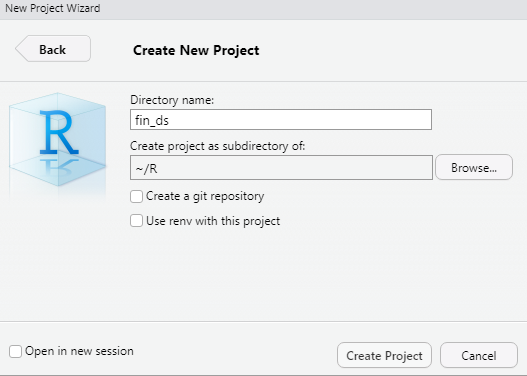
```

R 스튜디오가 재시작되면 우측 상단 부분이 프로젝트 이름으로 바뀌며, 파일 창의 윗부분도 프로젝트 폴더의 위치로 바뀝니다. 또한 폴더 내에 fin_ds.Rpoj 라는 파일이 생성됩니다. 스크립트 및 각종 파일들을 해당 프로젝트 폴더에 저장하여, 효율적으로 각종 작업을 관리할 수 있습니다.

```{r fig.cap='새 프로젝트 생성 (4)', echo = FALSE}
knitr::include_graphics('images/rbasic_newproject4.png')
```

::: {.infobox .note data-latex="{note}"}
프로젝트 이름과 폴더 경로에 한글이 들어가면 오류가 발생할 수 있으니, 영문으로 입력하는 것이 좋습니다.
:::


## 데이터 타입별 다루기

R과 R 스튜디오 설치가 끝났으면 본격적으로 R의 기본적인 사용법에 대해 배워보겠으며, 먼저 데이터의 타입별로 다루는 법부터 시작하겠습니다.

R 뿐만 아니라 각종 프로그래밍에는 여러가지 데이터 타입이 있으며, 이를 다루는 방법은 각각 다릅니다. 예를 들어 같은 '3'도 숫자 3인지 문자 3인지에 따라 다루는 방법이 다릅니다. 따라서 데이터 타입의 종류와 이들을 어떻게 다루어야 하는지를 아는 것이 프로그래밍의 기초라고 할 수 있습니다.

### 숫자 형태

R에서 숫자(Numbers) 형태는 크게 integer와 double로 나눌 수 있습니다. 이 중 integer는 정수를 의미하며, double은 부동소수점 실수를 의미합니다.

```{r}
dbl_var = c(1, 2.5, 4.5)

print(dbl_var)
```

위와 같이 입력하면 double, 즉 소수점 형태의 숫자가 만들어 집니다. 

```{r}
int_var = c(1L, 6L, 5L)

print(int_var)
```

만일 숫자 뒤에 **L**을 붙이면, integer(정수) 형태의 숫자가 만들어 집니다.

double 형태를 integer 형태로 바꾸려면 할 경우, `as.integer()` 함수를 사용해 쉽게 변경할 수 있습니다. 이처럼 R에서는 `as.*()` 함수의 형태로 각 데이터의 형태를 바꿀 수 있습니다.

```{r}
as.integer(dbl_var)
```

[1.0 2.5 4.5] 이던 dbl_var 값이 `as.integer()` 함수를 통해 소수점이 사라지고 정수 형태인 [1 2 4]로 변경되었습니다.

#### 숫자 생성하기

R에서는 콜론(:)과 `c()` 함수를 통해 순서가 있는 숫자 벡터를 생성할 수 있습니다.

```{r}
1:10
```

**시작숫자:끝숫자**의 형태로 입력하여 1에서 10까지 숫자가 생성됩니다.

```{r}
c(1, 5, 10)
```

`c()` 함수 내부에 각각의 숫자를 입력할 경우, 이로 구성된 숫자 벡터가 생성됩니다.

`seq()` 함수를 이용할 경우 더욱 다양하게 숫자 벡터를 생성할 수 있습니다. seq는 Sequence 즉 '순서'의 약어입니다. 이처럼 R이나 여타 프로그래밍에서는 함수의 이름을 통해 대략적인 기능을 추론할 수 있습니다.

```{r}
seq(from = 1, to = 21, by = 2)
```

`seq()` 함수 내부에 from에는 시작 숫자, to에는 종료 숫자, by에는 간격을 입력합니다. 즉 1에서 21까지 2 단위로 숫자가 생성됩니다.

```{r}
seq(0, 21, length.out = 15)
```

만일 입력값에 **by** 대신 **length.out**을 쓸 경우 from에서 to 까지 동일한 증가폭으로 length.out 만큼의 숫자를 생성하며, 해당 예제에서는 총 15개의 숫자가 만들어집니다.

`rep()` 함수 역시 숫자를 생성해주는 함수입니다.

```{r}
rep(1:4, times = 2)
```

rep는 Replicate 즉 '복제하다'의 약어 입니다. 해당 함수 내에 **times**라는 입력값을 추가해줄 경우, 해당 숫자만큼 반복되어 벡터가 생성됩니다.

```{r}
rep(1:4, each = 2)
```

만일 **each**라는 입력값을 추가할 경우, 각각의 숫자를 n번 반복하여 벡터가 생성됩니다.

#### 올림, 내림, 반올림

함수를 통해 간단하게 숫자의 올림, 내림, 반올림을 할 수도 있습니다. 먼저 다음과 같이 숫자를 입력합니다.

```{r}
x = c(1, 1.35, 1.7, 2.053, 2.4, 2.758, 3.1, 3.45,
      3.8, 4.15, 4.5, 4.855, 5.2, 5.55, 5.9)
```


```{r}
round(x)
```

`round()` 함수는 가장 가까운 정수로 반올림을 합니다.

```{r}
round(x, digits = 2)
```

함수 내부에 **digits** 입력값을 추가해 줄 경우, 해당 자리수 만큼 반올림을 합니다. 위 예제에서는 소수 둘째자리 만큼 반올림을 하였습니다.

```{r}
ceiling(x)

floor(x)
```

`ceiling()` 함수는 올림을, `floor()` 함수는 내림을 실행합니다.

### 문자열 형태

일반적인 글자 혹은 텍스트를 문자열(Character Strings)이라고 합니다.

```{r}
a = 'learning to create'
b = 'character strings'

paste(a, b)
```

먼저 a와 b 변수에 각각의 문자를 입력한 후, R의 기본함수인 `paste()` 함수를 이용해 두 문자를 붙일 수 있습니다.

```{r}
print(pi)

paste('pi is', pi)
```

원주율을 의미하는 pi는 원래 3.14159 라는 숫자가 입력되어 있습니다. 그러나 `paste()` 함수를 통해 문자열과 숫자를 합칠 경우, 그 결과값은 문자열이 됩니다.

```{r}
paste('I', 'love', 'R', sep = ',')
```

`paste()` 함수 내부에 sep 인자를 추가할 경우, 각 단어를 구분하는 문자를 입력할 수 있습니다. 기존에는 각 문자가 공백을 기준으로 합쳐졌다면, 이번에는 콤마(,)를 기준으로 합쳐졌습니다.

```{r}
paste0('I', 'love', 'R')
```

`paste0()` 함수는 구분 문자가 없이 결합됩니다.

#### `stringr` 패키지를 이용한 문자열 다루기

R의 기본함수를 이용하여도 문자열을 다룰 수 있지만, `stringr` 패키지를 이용할 경우 더욱 다양한 작업을 수행할 수 있습니다.

```{r}
library(stringr)

str_c('Learning', 'to', 'use', 'the', 'stringr', 'package', sep = ' ')
```

`str_c()` 함수는 `paste()` 함수와 기능이 동일하며, sep 인자를 통해 구분자를 추가할 수 있습니다.

```{r}
text = c('Learning', 'to', NA, 'use', 'the', NA, 'stringr', 'package')

str_length(text)
```

`str_length()` 함수는 문자열 각각의 텍스트 갯수를 세줍니다. 

```{r}
x = 'Learning to use the stringr package'

str_sub(x, start = 1, end = 15)

str_sub(x, start = -7, end = -1)
```

`str_sub()` 함수는 start부터 end까지의 문자를 출력합니다. 만일 start 혹은 end에 음수를 입력하면, 문장의 뒤에서부터 start/end 지점이 계산됩니다. 즉, start와 end에 각각 -7와 -1을 입력하면 끝에서부터 일곱번째와 첫번째 지점이 시작점과 끝점이 됩니다.

텍스트 데이터를 다룰때는 빈 공백이 따라오는 경우가 많으며, 이는 대부분 제거해주어야 할 대상입니다.

```{r}
text = c('Text ', ' with', ' whitespace ', ' on', 'both ', 'sides ')

print(text)
```

각 단어를 자세히 살펴보면 좌/우 혹은 양쪽에 공백이 있습니다. 이를 제거하도록 하겠습니다.

```{r}
str_trim(text, side = 'left')

str_trim(text, side = 'right')

str_trim(text, side = 'both')
```

`str_trim()` 함수는 공백을 제거해주는 기능을 합니다. side 인자에 **left**를 입력할 경우 각 텍스트 왼쪽의 공백을, **right**를 입력할 경우 오른쪽의 공백을, **both**를 입력할 경우 양쪽의 공백을 제거해줍니다.

마지막으로 원하는 자리수를 채우기 위해 문자열에 공백 혹은 특정 문자를 입력할 수도 있으며, `str_pad()` 함수를 통해 손쉽게 작업을 할 수 있습니다.


```{r}
str_pad('beer', width = 10, side = 'left')
```

width에 해당하는 10자리를 맞추기 위해 side의 입력값인 좌측에 공백이 추가되었습니다. 

```{r}
str_pad('beer', width = 10, side = 'left', pad = '!')
```

pad 인자를 추가할 경우, 공백이 아닌 입력한 문자가 추가됩니다


아래 페이지에는 `stringr` 패키지의 자세한 사용법이 나와 있습니다.

```
https://stringr.tidyverse.org/
```

### 날짜 형태

시계열 작업을 위해서는 날짜(Date), 혹은 시간(Datetime) 형태를 다루어야 합니다.

```{r}
Sys.timezone()

Sys.Date()

Sys.time()
```

`Sys.timezone()` 함수는 현재 타임존을 출력합니다. `Sys.Date()` 함수는 현재 날짜를, `Sys.time()` 함수는 날짜와 시간을 출력합니다.

'2018-12-31'과 같이 사용자가 보기에는 날짜 형태이지만 문자열 형태로 데이터가 들어오는 경우, 이를 날짜 형태로 변경해야 할 경우가 있습니다.

```{r}
x = c('2021-07-01', '2021-08-01', '2021-09-01')
x_date = as.Date(x)

str(x_date)
```

`as.Date()` 함수를 이용하면 문자열을 손쉽게 날짜 형태로 변경할 수 있습니다. `str()` 함수는 데이터의 형태를 확인하는 함수로써, Date 형태임이 확인됩니다.

```{r}
y = c('07/01/2015', '08/01/2015', '09/01/2015')

as.Date(y, format = '%m/%d/%Y')
```

YYYY-MM-DD 형태가 아닌 다른 형태(MM/DD/YYYY)로 입력된 경우, format을 직접 입력하여 Date 형태로 변경할 수 있습니다.

:::: {.infobox .note data-latex="{note}"}
YYYY는 연, MM은 월, DD는 일을 나타냅니다.
::::

#### `lubridate` 패키지를 이용한 날짜 다루기

`lubridate` 패키지를 이용할 경우 날짜 형태와 관련된 다양한 작업을 수행할 수 있습니다.

```{r}
library(lubridate)

x = c('2021-07-01', '2021-08-01', '2021-09-01')
y = c('07/01/2015', '08/01/2015', '09/01/2015')

ymd(x)

mdy(y)
```

`lubridate` 패키지를 이용할 경우 YYYY-MM-DD 형태는 `ymd()`, MM-DD-YYYY 형태는 `mdy()` 함수를 사용해 손쉽게 Date 형태로 변경할 수 있습니다. 이 외에도 `lubridate`에는 Date 형태로 변경하기 위한 다양한 함수가 존재합니다.

```{r, echo = FALSE}
library(kableExtra)
data.frame(
  '순서' = c('연, 월, 일',
           '연, 일, 월',
           '월, 일, 연',
           '일, 월, 연',
           '시, 분',
           '시, 분, 초',
           '연, 월, 일, 시, 분, 초'),
  '함수' = c('ymd()', 'ydm()', 'mdy()', 'dmy()', 'hm()', 'hms()', 'ymd_hms()')
) %>% kable(booktabs = TRUE,
            align = "c",
            caption = 'lubridate 패키지의 Date 형태 변경 함수') %>%
  kableExtra::kable_styling(bootstrap_options  = c("striped", "hover"))
```

`lubridate` 패키지에는 날짜 관련 정보를 추출할 수 있는 다양한 함수가 존재합니다.

```{r, echo = FALSE}
library(kableExtra)
data.frame(
  '정보' = c('연', '월', '주', '연도 내 일수', '월 내 일수',
           '주 내 일수', '시', '분', '초', '타임존'),
  '함수' = c('year()', 'month()', 'week()', 'yday()', 'mday()',
           'wday()', 'hour()', 'minute()', 'second()', 'tz()')
) %>% kable(booktabs = TRUE,
            align = "c",
            caption = 'lubridate 패키지의 날짜 관련 정보 추출 함수') %>%
  kableExtra::kable_styling(bootstrap_options  = c("striped", "hover"))
```

```{r}
x = c('2021-07-01', '2021-08-01', '2021-09-01')

year(x)

month(x)

week(x)
```

`year()`, `month()`, `week()` 함수를 통해 년도, 월, 주 정보를 확인할 수 있습니다. 

```{r}
z = '2021-09-15'

yday(z)

mday(z)

wday(z)
```

`yday()`, `mday()`, `wday()` 함수는 각각 해당 년도에서 몇번째 일인지, 해당 월에서 몇번째 일인지, 해당 주에서 몇번째 일인지를 계산합니다.

```{r}
x = ymd('2021-07-01', '2021-08-01', '2021-09-01') 

x + years(1) - days(c(2, 9, 21))
```

날짜에서 연과 월, 일자를 더하거나 빼는 계산 역시 가능합니다. 먼저 `year()` 함수를 통해 1년씩을 더 하였으며, `days()` 함수를 통해 각각의 일자 만큼을 뺍니다.

#### 날짜 순서 생성하기

숫자와 마찬가지로 `seq()` 함수를 이용할 경우 날짜 벡터를 생성할 수 있습니다.

```{r}
seq(ymd('2015-01-01'), ymd('2021-01-01'), by ='years')
```

2015년 1월 1일부터 2021년 1월 1일까지 1년을 기준으로 벡터가 생성됩니다.

```{r}
seq(ymd('2021-09-01'), ymd('2021-09-30'), by ='2 days')
```

지정한 일수인 2일 단위로 날짜 벡터를 생성할 수도 있습니다. 이 외에도 by 인자를 통해 원하는 기간 단위의 벡터를 생성할 수 있습니다.

아래 페이지에는 lubridate 패키지의 자세한 사용법이 나와 있습니다.

```
https://lubridate.tidyverse.org/
```

## 데이터 구조 다루기

R에서 자주 사용되는 데이터구조는 벡터(Vector), 리스트(List), 데이터프레임(Dataframe) 입니다.

### 벡터 다루기

벡터는 R의 가장 기본적인 데이터 구조로써 integer, double, logical, character로 이루어져 있습니다. 벡터를 만드는 방법에 대해서는 앞서 다루었습니다.

```{r}
vec_integer = 8:17

vec_integer
```

```{r}
vec_double = c(0.5, 0.6, 0.2)

vec_double
```

```{r}
vec_char = c('a', 'b', 'c')

vec_char
```

integer의 경우 start:end 형태를 통해서, 그 외에는 `c()` 함수를 통해 벡터를 만들 수 있습니다.

```{r}
c('a', 'b', 'c', 1, 2, 3)
```

숫자와 문자가 같이 벡터로 묶일 경우, 숫자는 모두 문자 형태로 변경됩니다.

```{r}
c(1, 2, 3, TRUE, FALSE)
```

TRUE와 FALSE는 참 혹은 거짓을 나타내는 논리값(logical) 입니다. 숫자와 논리값이 같이 묶일 경우 TRUE는 1, FALSE는 0으로 치환된 후 숫자 형태로 변경됩니다.

```{r}
c('a', 'b', 'c', TRUE, FALSE)
```

문자와 논리값이 같이 묶일 경우 모두 문자 형태로 변경됩니다. 이처럼 문자와 다른 형태가 묶일 경우엔 모든 데이터가 문자로 변경됩니다.

이번에는 기존의 벡터에 새로운 값을 추가해보겠습니다.

```{r}
v1 = 8:17
c(v1, 18:22)
```

기존 8부터 17까지의 숫자로 이루어진 v1 벡터에, `c()` 함수를 이용하여 새로운 값을 추가할 수 있습니다. 

만약 벡터에서 원하는 부분의 데이터를 추출하려면 대괄호([])를 이용하면 됩니다.

```{r}
v1[2]

v1[2:4]

v1[c(2, 4, 6)]
```

대괄호 안에 숫자를 입력하면, 벡터에서 해당 순서의 데이터가 추출됩니다. **c(2,4,6)**과 같이 특정 위치를 지정하여 데이터를 추출할 수도 있습니다.

```{r}
v1[-1]

v1[-c(2, 4, 6, 8)]
```

마이너스 기호를 입력하면, 해당 순서를 제외한 데이터가 추출됩니다.

```{r}
v1 < 12

v1[v1 < 12]

v1[v1 < 12 | v1 > 15]
```

먼저 **v1 < 12**를 입력하면 해당 조건에 해당하는 부분은 TRUE, 그렇지 않은 부분은 FALSE를 반환합니다. 그 후 대괄호 안에 다시 결과를 입력하면 TRUE에 해당하는 순서의 데이터만 반환합니다. 이처럼 대괄호 내부에 조건을 설정하여 원하는 데이터를 추출할 수도 있습니다.

### 리스트 다루기

먼저 리스트를 생성합니다.

```{r}
l = list(1:3, 'a', c(TRUE, FALSE, TRUE), c(2.5, 4.2))

str(l)
```

첫번째 원소는 정수(int), 두번째 원소는 문자(chr), 세번째 원소는 논리값(logi), 네번째 원소는 숫자(num)로 이루어져 있습니다. 이처럼 리스트는 각 원소간 타입이나 길이가 달라도 데이터가 결합할 수 특징이 있습니다.

```{r}
l2 = list(1:3, list(letters[1:5], c(TRUE, FALSE, TRUE)))

str(l2)
```

위 예제에서 두번째 원소는 리스트로 구성되어 있습니다. 이처럼 리스트 내에 또 다른 리스트를 생성하는 것 역시 가능합니다.

이번에는 기존 리스트에 새로운 원소를 추가하도록 하겠습니다.

```{r}
l3 = list(1:3, 'a', c(TRUE, FALSE, TRUE))
l4 = append(l3, list(c(2.5, 4.2)))

print(l4)
```

`append()` 함수를 이용하면 기존 리스트에 추가로 원소를 붙일 수 있습니다.

```{r}
l4$item5 = 'new list item'

print(l4)
```

또한 기존 리스트에 달러 사인($)을 입력할 경우, 원소에 이름이 생성되며 데이터가 추가됩니다.

리스트에서 원하는 데이터를 추출할 때는, 벡터와 동일하게 대괄호를 이용하면 됩니다.

```{r}
l4[1]

l4[c(1,3)]
```

원소에 이름이 있을 경우, 이를 이용해 추출도 가능합니다.

```{r}
l4['item5']
```

원소의 이름인 **item5**를 입력하면 해당 원소만 반환합니다.

```{r}
l4[[1]]

l4$item5
```

대괄호를 두번, 혹은 달러 사인($)을 이용해 데이터를 추출할 경우 원소 내의 형태가 반환되며, 위의 예제들과는 다르게 벡터 형태가 반환되었습니다.

```{r}
l4[[1]]

l4[[1]][3]
```

특정 원소의 항목을 추출하기 위해서는 [[와 [를 함께 사용합니다. 위 예제는 l4 리스트의 첫번째 원소에서 3번째 항목을 추출하게 됩니다.


### 데이터프레임 다루기

데이터프레임은 R에서 가장 널리 사용되는 형식으로써, 각 컬럼이 다른 형태를 가질 수 있습니다.

```{r}
df = data.frame (col1 = 1:3,
                 col2 = c ("this", "is", "text"),
                 col3 = c (TRUE, FALSE, TRUE),
                 col4 = c (2.5, 4.2, pi))

str(df)
```

col1은 숫자(int), col2는 문자(chr), col3는 논리연산자(logi), col4는 숫자(num)로 구성되어 있습니다. 또한 벡터 혹은 리스트를 이용해 데이터프레임을 생성할 수도 있습니다.

```{r}
v1 = 1:3
v2 = c ("this", "is", "text")
v3 = c (TRUE, FALSE, TRUE)

data.frame(col1 = v1, col2 = v2, col3 = v3)
```

v1, v2, v3는 각각 숫자, 문자, 논리연산로 구성된 벡터입니다. 이를 `data.frame()` 함수 내에 입력할 경우 col1, col2, col3 열 이름에 해당 데이터들이 입력됩니다. 주의해야 할 점은 각 벡터의 길이가 동일해야 데이터프레임 형태를 만들 수 있습니다.

```{r}
l = list (item1 = 1:3,
          item2 = c ("this", "is", "text"),
          item3 = c (2.5, 4.2, 5.1))

l

data.frame(l)
```

리스트 역시 `data.frame()` 함수를 이용할 경우, 각 원소명을 열이름으로 한 데이터프레임이 생성됩니다. 이 경우 역시 각 원소의 데이터 길이가 동일해야 합니다.

기존 데이터프레임에 행방향 혹은 열방향으로 데이터를 추가할 수 있습니다.

```{r}
df

v4 = c ("A", "B", "C")
cbind(df, v4)
```

`cbind()` 함수는 'column bind'의 약어로써, 기존 데이터프레임에 새로운 열을 추가합니다.

```{r}
v5 = c (4, "R", F, 1.1)
rbind(df, v5)
```

`rbind()` 함수는 'row bind'의 약어로써, 기존 데이터프레임에 새로운 행을 추가합니다. 주의할 점은 각 행의 데이터 형태가 기존 데이터의 형태와 일치해야 합니다.

데이터프레임 역시 대괄호를 이용해 데이터를 추출할 수 있으며, 공백으로 두면 모든 행(열)을 선택하게 됩니다.

```{r}
df

df[2:3, ]
```

데이터프레임중 2:3, 즉 두번째부터 세번째까지의 행과 모든 열을 선택하게 됩니다.

```{r}
df[ , c('col2', 'col4')]
```

행이름 혹은 열이름 직접 입력하여 해당값을 추출할 수도 있습니다. 위 예제에서는 열이름이 col2와 col4인 열을 추출합니다. 

```{r}
df[, 2]

df[, 2, drop = FALSE]
```

만일 하나의 열만 선택시 결과가 벡터 형태로 추출되며, drop = FALSE 인자를 추가해주면 데이터프레임의 형태가 유지되어 추출됩니다.

### 결측치 처리하기

결측치란 누락된 데이터를 의미하며, 데이터 분석에서 결측치를 처리하는 것은 매우 중요합니다. R에서 결측치는 `NA`로 표시되며, `is.na()` 함수를 통해 결측치 여부를 확인할 수 있습니다.

```{r}
x = c(1:4, NA, 6:7, NA)
x

is.na(x)
```

데이터가 NA인 경우에는 TRUE, 그렇지 않을 경우 FALSE를 반환합니다. 데이터프레임에도 해당 함수를 적용할 수 있습니다.

```{r}
df = data.frame (col1 = c (1:3, NA),
                 col2 = c ("this", NA,"is", "text"),
                 col3 = c (TRUE, FALSE, TRUE, TRUE),
                 col4 = c (2.5, 4.2, 3.2, NA),
                 stringsAsFactors = FALSE)

df

is.na(df)
```

데이터에 결측치가 있는 경우 계산이 불가능하다는 문제가 발생합니다.

```{r}
y = c(1, 3, NA, 4)

mean(y)
```

데이터의 중간에 결측치인 NA가 존재하여 평균을 계산할 수 없으며, 이 외에도 모든 연산이 불가능하게 됩니다. 

```{r}
mean(y, na.rm = TRUE)
```

na.rm에서 rm은 'remove'의 약어입니다. 즉 해당 인자를 TRUE로 설정할 경우 NA를 제외하고 연산을 수행합니다. 따라서 1,3,4의 평균인 $\frac{1+3+4}{3} = 2.6667$이 계산됩니다.

일반적으로 결측치가 있는 경우 해당 데이터는 문제가 있다고 판단하여 제거하거나, 다른 데이터로 대체하여 채워넣기도 합니다. 먼저 결측치가 있는 데이터를 제거하는 법을 알아보겠습니다.

```{r}
df = data.frame (col1 = c (1:4),
                 col2 = c ("this", NA,"is", "text"),
                 col3 = c (TRUE, FALSE, TRUE, TRUE),
                 col4 = c (2.5, 4.2, 3.2, 5.0)
)

df
```
두번째 행 col2 열에 결측치가 있으므로, 해당 부분을 제거해주도록 합니다.

```{r}
na.omit(df)
```

`na.omit()` 함수를 이용하면 NA가 위치한 부분의 데이터가 제거됩니다. 

```{r}
x = c(1:4, NA, 6:7, NA)
x
```

이번에는 위와 같이 결측치가 있는 경우, 다른 데이터로 대체하도록 하겠습니다.

```{r}
x[is.na(x)] = mean(x, na.rm = TRUE)

x
```

`mean()` 함수 내부를 통해 값들의 평균을 구한 후, `is.na()` 함수를 통해 결측치가 위치한 부분의 데이터를 평균값인 3.833 으로 대체하였습니다. 이 외에도 결측치를 대체하는데는 다양한 방법이 존재합니다.

## 데이터 불러오기 및 내보내기

일반적으로 사람들은 csv 혹은 엑셀 파일로 저장된 데이터를 주고 받으며 데이터 분석을 하는 경우가 많습니다. 해당 형식의 파일을 R로 불러오는 법 그리고 저장하는 법에 대해 알아보겠습니다. 

csv와 엑셀 샘플 파일의 주소는 다음과 같습니다.

```
https://github.com/hyunyulhenry/fin_ds/blob/master/data/kospi.csv
https://github.com/hyunyulhenry/fin_ds/blob/master/data/kospi.xlsx
```

아래의 코드를 실행하면 해당 파일을 PC에 다운로드 받을 수 있습니다.

```{r eval = FALSE}
download.file('https://raw.githubusercontent.com/hyunyulhenry/fin_ds/master/data/kospi.csv', 'kospi.csv')
download.file('https://github.com/hyunyulhenry/fin_ds/raw/master/data/kospi.xlsx', 'kospi.xlsx', mode = 'wb')
```

### 워킹 디렉터리

데이터를 불러오거나 내보낼 때 초보자들이 가장 많이 하는 실수가 워킹 디렉터리를 제대로 설정하지 않는 것입니다. 워킹 디렉터리(Working Directory)란 현재 사용중인 폴더를 의미하며, 현재 워킹 디렉터리는 콘솔창 상단 `getwd()` 함수를 통해 확인할 수 있습니다.

```{r eval = FALSE}
getwd()
# [1] "C:/Users/henry/Documents/R/fin_ds"
```

파일들이 A 폴더에 있는데 워킹 디렉터리가 B 폴더인 상태에서는 파일을 불러올 수 없으므로, 해당 파일들이 현재 워킹 디렉터리에 있어야 합니다.

워킹 디렉터리를 변경할때는 `setwd()` 함수를 통해 위치를 직접 지정해주어도 되지만, R 스튜디오의 파일 창을 이용하면 손쉽게 변경할 수 있습니다. 먼저 파일 창 상단의 [...] 부분을 클릭합니다.

```{r fig.cap='워킹 디렉터리 변경', echo = FALSE}
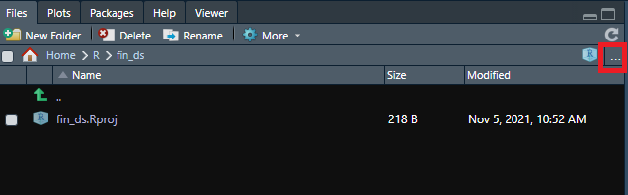
```
탐색기 화면에서 원하는 폴더를 선택한 후 하단의 [Open]을 클릭합니다.

```{r fig.cap='워킹 디렉터리 변경 (2)', echo = FALSE}
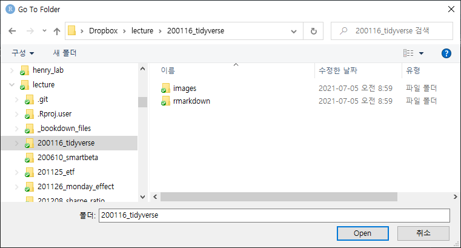
```

탐색기 화면에 선택한 폴더의 파일들이 보입니다. 이제 [Move → Set As Working Directory]를 클릭하면 콘솔창에 해당 폴더를 워킹 디렉터리로 변경하는 코드가 입력되면서, 워킹 디렉터리 위치가 해당 폴더로 변경됩니다.

```{r fig.cap='워킹 디렉터리 변경 (3)', echo = FALSE}
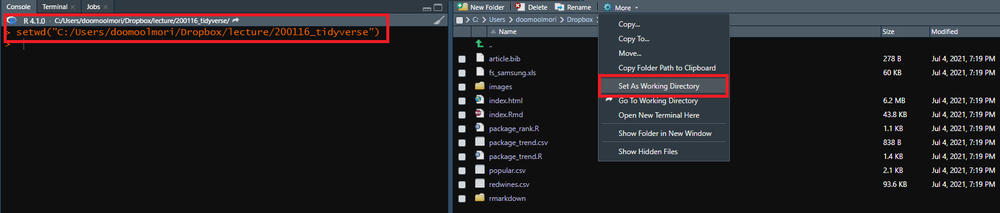
```

### csv 파일 불러오기 및 저장하기

먼저 R의 기본함수인 `read.csv()` 함수를 이용하면 매우 손쉽게 csv 파일을 불러올 수 있습니다.

```{r}
kospi = read.csv('kospi.csv')

head(kospi)
```

`readr` 패키지의 `read._csv()` 함수를 이용하면 기본 함수 대비 10배 정도 빠르게 데이터를 불러올 수 있으며, 훨씬 다양한 조건을 입력할 수도 있습니다.

```{r}
library(readr)

kospi2 = read_csv('kospi.csv')

head(kospi2)
```

R의 데이터를 csv로 저장하는 법은 기본함수의 `write.csv()` 혹은 `readr` 패키지의 `write_csv()` 함수를 이용하면 됩니다. 

```{r eval = FALSE}
# using write.csv
write.csv(kospi, 'kospi2.csv', row.names = FALSE)

# using write_csv
write_csv(kospi2, 'kospi2.csv')
```

기본함수인 `write.csv()` 의 경우 행이름이 자동으로 새로운 열로 추가되어 저장되므로, 이를 원하지 않을 경우 row.names = FALSE 를 추가로 입력해주어야 합니다.

### 엑셀 파일 불러오기 및 저장하기

R의 기본함수 중에는 엑셀 파일을 불러오는 함수가 없지만, 해당 작업을 수행하는 다양한 패키지가 존재합니다. 그 중에서 `readr` 패키지와 쌍둥이 격인 `readxl` 패키지를 이용해보겠습니다.

먼저 해당 패키지의 `read_excel()` 함수를 이용해 엑셀 파일을 불러올 수 있습니다.

```{r}
library(readxl)

kospi_excel = read_excel('kospi.xlsx', sheet = 'kospi')

head(kospi_excel)
```
엑셀은 여러 시트로 구성된 경우가 많으며, sheet에 특정 시트명을 입력하면 해당 시트의 내용을 불러오게 됩니다. 만일 아무값도 입력하지 않을 경우 가장 첫번째 시트의 데이터를 불러옵니다.

반대로 R의 데이터를 엑셀로 저장하는 방법은 `writexl` 패키지의 `write_xlsx()` 함수를 이용하면 됩니다.

```{r eval = FALSE}
library(writexl)

write_xlsx(kospi_excel, 'kospi_excel.xlsx')
```


## 효율성과 가독성 높이기

이번에는 프로그래밍의 효율성을 높이기 위해 자주 사용되는 함수와 루프 구문, 그리고 가독성을 높이기 위한 파이프 오퍼레이터에 대해 알아보겠습니다.

### 함수

동일하거나 비슷한 작업을 반복해야 하는 경우 매번 실행하거나 복사-붙여넣기 하기 보다는 경우 함수를 작성하여 사용하면 매우 효율적으로 작업이 가능합니다. 

함수는 크게 세가지 요소로 구성됩니다.

- `body()`: 함수 내부의 코드
- `formals()`: 인자(argument) 내역
- `environment()`: 함수의 변수에 대한 위치

예를 들어 금융 자산의 현재 가치는 다음과 같이 계산됩니다.

$$PV = FV / (1+r)^n$$

- PV: 현재 가치
- FV: 미래 가치
- r: 할인률
- n: 기간

즉, 1년 뒤에 110만원을 받는 돈의 현재가치는 $110만원/(1+0.1)^1 = 100만원$ 이라 볼 수 있습니다. 이러한 값을 구하기 위해 매번 계산기를 사용하기 보다는 함수를 이용하면, 훨씬 효율적인 작업이 가능합니다. 위의 수식을 함수로 나타내면 다음과 같습니다.

```{r}
PV = function(FV, r, n) {
  PV = FV / (1+r)^n
  return(round(PV, 2))
}
```

R에서는 `함수명 = function(인자) {함수 내용}`의 형태로 함수를 만들수 있으며, 반환하고자 하는 결과를 `return()` 내부에 작성합니다. 함수의 구성요소 세가지를 한번 확인해보도록 하겠습니다.

```{r}
body(PV)
```

먼저 body는 함수 내부의 코드를 의미합니다.

```{r}
formals(PV)
```

formals에는 함수의 인자인 FV, r, n이 있습니다.

```{r}
environment(PV)
```

함수는 GlobalEnv에 위치하고 있습니다.

이제 해당함수를 이용해 현재가치를 계산해보도록 하겠습니다.

```{r}
PV(FV = 1000, r = 0.08, n = 5)
```

$1000 / (1.08)^5$의 값인 680.58이 간단하게 계산됩니다. 

```{r}
PV(1000, 0.08, 5)
```

만약 인자의 리스트를 생략하면, 입력한 순서대로 값이 입력됩니다.

```{r}
PV(r = 0.08, FV = 1000, n = 5)
```

인자의 내역을 정확하게 지정해준다면, 순서대로 입력하지 않아도 됩니다.

```{r error=TRUE}
PV(1000, 0.08)
```

`PV()` 함수에 필요한 인자는 3개인 반면, 2개만 입력하였으므로 에러가 발생합니다.

```{r}
PV = function(FV = 1000, r = .08, n = 5) {
  PV = FV / (1 + r)^n
  return(round(PV, 2))
}

PV(1000, 0.08)
```

만일 함수의 인자에 디폴트 값이 입력되어 있다면, 함수 실행시 이를 생략하여도 디폴트 값이 입력됩니다. 위 예제에서는 n 디폴트 값으로 5가 들어가있으며, `PV()` 함수 내에 입력값이 3개만 입력될 경우 마지막 인자는 디폴트 값인 5를 적용합니다.

### 루프 구문

루프 및 각종 구문을 이용하여 휴율적인 작업을 하는것도 가능합니다. 

#### `if` 구문

먼저 `if` 구문은 다음과 같이 구성됩니다.

```{r eval = FALSE}
if (test_expression) {
  statement
}
```

괄호 안의 **test_expression**이 TRUE일 경우에만 statement 코드가 실행됩니다. 간단한 예제를 살펴보겠습니다.

```{r}
x = c(8, 3, -2, 5)

if (any(x < 0)) {
  print('x contains negative number')
}
```

`any()` 함수는 적어도 하나의 값이 참이면 참으로 출력하는 함수입니다. 즉, 위의 코드는 x중 하나라도 0보다 작은 값이 있으면 **x contains negative number**라는 문장을 출력하며, -2가 0보다 작으므로 해당 문장을 출력합니다.

```{r}
y = c (8, 3, 2, 5)

if (any (y < 0)) {
  print ("y contains negative numbers")
}
```

이번에는 y에 0보다 작은 값이 없으므로, 구문이 실행되지 않아 문장을 출력하지 않습니다. 이처럼 `if` 구문만 존재할 시 이를 만족하지 않는 경우 아무런 구문도 실행되지 않습니다. 만일 조건을 충족하지 않을 때 동작을 추가하고 싶을 경우 `if else` 구문을 사용하며, 이는 if의 조건을 만족하지 않을 경우 else에 해당하는 구문이 실행됩니다.

```{r eval = FALSE}
if (test_expression) {
  statement 1
} else {
  statement 2
}
```

만일 test_expression 구문이 TRUE이면 statement 1이 실행되며, 그렇지 않을 경우 statement 2가 실행됩니다. 실제 예제를 살펴봅시다.

```{r}
y = c (8, 3, 2, 5)

if (any (y < 0)) {
  print ("y contains negative numbers")
} else {
  print ("y contains all positive numbers")
}
```

y에 음수가 존재하는 `if` 구문이 FALSE 이므로, else에 해당하는 메세지가 출력됩니다. `ifelse` 구문은 `ifelse()` 함수로 간단히 나타낼 수도 있습니다.

```{r}
x = c (8, 3, 2, 5)

ifelse(any(x < 0), "x contains negative numbers", "x contains all positive numbers")
```

해당 함수는 `ifelse(test, yes, no)` 형태로 입력되며, test를 충족하면 yes가 그렇지 않으면 no가 실행됩니다. 위의 예에서는 x에 0보다 작은 값이 없으므로, no에 해당하는 내용이 실행됩니다.

또한 `if`와 `else` 사이에 `else if` 조건을 통해, 여러 조건을 추가할 수도 있습니다.

```{r}
x = 7

if (x >= 10) {
  print ("x exceeds acceptable tolerance levels")
} else if(x >= 0 & x < 10) {
  print ("x is within acceptable tolerance levels")
} else {
  print ("x is negative")
}
```

위 조건은 다음과 같습니다.

1. x가 10 이상일 경우 **x exceeds acceptable tolerance levels**을 출력합니다.
2. 만일 x가 10 이상, 10 미만일경우 **x is within acceptable tolerance levels**을 출력합니다.
3. 그렇지 않을 경우 **x is negative**을 출력합니다.

x는 7 이므로 else에 해당하는 내용이 출력됩니다.

#### `for loop` 구문

`for loop` 구문은 특정한 부분의 코드가 반복적으로 수행될 수 있도록 하며, 다음과 같이 구성됩니다.

```{r eval = FALSE}
for (i in 1:100) {
  <code: do stuff here with i>
}
```

먼저 i에 1이 들어간 뒤 code에 해당하는 부분이 실행됩니다. 그 후, i에 2가 들어간 뒤 다시 code가 실행되며 이 작업이 100까지 반복됩니다. 실제 예제를 살펴보도록 하겠습니다.

```{r}
for (i in 2016:2020) {
  output = paste("The year is", i)
  print(output)
}
```

i에 2010부터 2016 까지 대입되며, **The year is**라는 문자와 결합해 결과가 출력됩니다.

#### `apply` 계열 함수

`apply` 계열의 함수는 loop 구문과 비슷한 역할을 하며, 코드를 훨씬 간결하게 표현할 수 있습니다. 먼저 가장 기본이 되는 `apply()` 함수는 데이터프레임의 행 혹은 열단위 계산에 자주 사용됩니다. 해당 함수는 다음과 같이 구성됩니다.

```{r eval = FALSE}
apply(x, MARGIN, FUN, ...)
```

- x: 매트릭스, 데이터프레임, 혹은 어레이
- MARGIN: 함수가 적용될 벡. 1은 행을, 2는 열을, c(1, 2)는 행과 열을 의미
- FUN: 적용될 함수
- ...: 기타

실제 사용 예제를 살펴보도록 하겠습니다.

```{r}
head(mtcars)
```

먼저 위 데이터에서 각 열의 평균을 구하도록 합니다.

```{r}
apply(mtcars, 2, mean)
```

mtcars에서 2 즉 열의 방향으로 평균(mean)을 구합니다. 

`lapply()` 함수는 리스트에 적용되며, 결과 또한 리스트로 반환됩니다. 해당 함수는 다음과 같이 구성됩니다.

```{r eval = FALSE}
lapply(x, FUN, ...)
```

- x: 리스트
- FUN: 적용될 함수
- ...: 기타

실제 사용 예제를 살펴보도록 하겠습니다.

```{r}
data = list(item1 = 1:4,
            item2 = rnorm(10),
            item3 = rnorm(20, 1),
            item4 = rnorm(100, 5))

data
```

4개의 원소로 구성된 리스트에서 각 원소의 평균을 구하고자 할 경우, 리스트에 적용되는 apply인 `lapply()` 함수를 사용해야 합니다.

```{r}
lapply(data, mean)
```

`lapply()` 함수를 통해 각 항목의 평균을 구할 수 있으며, 결과 또한 리스트 형태로 반환됩니다. 해당 함수는 좀더 복잡한 형태로 응용도 가능합니다.

```{r}
beaver_data = list(beaver1 = beaver1, beaver2 = beaver2)

lapply(beaver_data, head)
```

위 데이터의 각 항목에서 열 별 평균을 구하고자 할 경우 `lapply()` 함수 만으로는 계산이 불가능합니다. 이러한 경우 해당 함수 내부에 새로운 함수인 `function()`을 정의하여 복잡한 계산을 수행할 수 있습니다.

```{r}
lapply(beaver_data, function(x) {
  round(apply(x, 2, mean), 2)
})
```

function(x)를 통해 각 항목에 적용될 함수를 직접 정의할 수 있습니다. 우리가 정의한 함수는 `apply()` 함수를 통해 열의 방향으로 평균을 구한 뒤 소수 둘째 자리까지 반올림을 하는 것이며, 해당 함수가 리스트의 모든 원소에 적용됩니다. 

마지막으로 살펴볼 `sapply()` 함수는 `lapply()` 함수와 거의 동일하며, 결과가 리스트가 아닌 벡터 혹은 매트릭스로 출력된다는 점만 차이가 있습니다.

```{r}
lapply(beaver_data, function(x) {
  round(apply(x, 2, mean), 2)
})

sapply(beaver_data, function(x) {
  round(apply(x, 2, mean), 2)
})
```

`sapply()` 함수는 각 원소에 적용된 값을 벡터로 하는 매트릭스 형태로 결과값이 출력됩니다. 

#### 기타 함수

열과 행이 합계나 평균처럼 일반적으로 많이 사용되는 계산에는 `apply()` 함수보다 간단하게 표현할 수 있는 함수들이 있습니다.

```{r}
rowSums(mtcars)

colSums(mtcars)
```

`rowSums()` 함수는 행의 합계를, `colSums()` 함수는 열의 합계는 구하며 이는 `apply(mtcars, 1 or 2, sum)` 과 동일합니다.

```{r}
rowMeans(mtcars)

colMeans(mtcars)
```

`rowMeans()` 함수와 `colMeans()` 함수 역시 각각 행과 열의 평균을 구합니다.

### 파이프 오퍼레이터

파이프 오퍼레이터는 R에서 동일한 데이터를 대상으로 연속으로 작업하게 해주는 오퍼레이터(연산자)입니다. 

흔히 프로그래밍에서 x라는 데이터를 `F()`라는 함수에 넣어 결괏값을 확인하고 싶으면 `F(x)`의 방법을 사용합니다. 예를 들어 3과 5라는 데이터 중 큰 값을 찾으려면 `max(3,5)`를 통해 확인합니다. 이를 통해 나온 결괏값을 또 다시 `G()`라는 함수에 넣어 결괏값을 확인하려면 비슷한 과정을 거칩니다. `max(3,5)`를 통해 나온 값의 제곱근을 구하려면 `result = max(3,5)`를 통해 첫 번째 결괏값을 저장하고, `sqrt(result)`를 통해 두 번째 결괏값을 계산합니다. 물론 `sqrt(max(3,5))`와 같은 표현법으로 한 번에 표현할 수 있습니다.

이러한 표현의 단점은 계산하는 함수가 많아질수록 저장하는 변수가 늘어나거나 괄호가 지나치게 길어진다는 것입니다. 그러나 파이프 오퍼레이터인 `%>%`를 사용하면 함수 간의 관계를 매우 직관적으로 표현하고 이해할 수 있습니다. 이를 정리하면 아래 표와 같습니다.

```{r echo = FALSE}
library(magrittr)
knitr::kable(
  tibble::tibble(
  '내용' = c('F(x)', 'G(F(x))'),
  '표현 방법' = c('x %>% F', 'x %>% F %>% G')
  ),
  booktabs = TRUE,
  align = "c",
  caption = '파이프 오퍼레이터의 표현과 내용 비교'
) %>%
  kableExtra::kable_styling(latex_options = c("striped", "hold_position"))
```

간단한 예제를 통해 파이프 오퍼레이터의 사용법을 살펴보겠습니다. 먼저 다음과 같은 10개의 숫자가 있다고 가정합니다.

```{r}
x = c(0.3078, 0.2577, 0.5523, 0.0564, 0.4685,
      0.4838, 0.8124, 0.3703, 0.5466, 0.1703)
```


우리가 원하는 과정은 다음과 같습니다.

1. 각 값들의 로그값을 구할 것
2. 로그값들의 계차를 구할 것
3. 구해진 계차의 지수값을 구할 것
4. 소수 둘째 자리까지 반올림할 것

입니다. 즉 `log()`, `diff()`, `exp()`, `round()`에 대한 값을 순차적으로 구하고자 합니다.

```{r}
x1 = log(x)
x2 = diff(x1)
x3 = exp(x2)

round(x3, 2)
```

첫 번째 방법은 단계별 함수의 결괏값을 변수에 저장하고 저장된 변수를 다시 불러와 함수에 넣고 계산하는 방법입니다. 전반적인 계산 과정을 확인하기에는 좋지만 매번 변수에 저장하고 불러오는 과정이 매우 비효율적이며 코드도 불필요하게 길어집니다.

```{r}
round(exp(diff(log(x))), 2)
```

두 번째는 괄호를 통해 감싸는 방법입니다. 앞선 방법에 비해 코드는 짧아졌지만, 계산 과정을 알아보기에는 매우 불편한 방법으로 코드가 짜여 있습니다.

```{r}
library(magrittr)

x %>% log() %>% diff() %>% exp() %>% round(., 2)
```

마지막으로 파이프 오퍼레이터를 사용하는 방법입니다. 코드도 짧으며 계산 과정을 한눈에 파악하기도 좋습니다. 맨 왼쪽에는 원하는 변수를 입력하며, %>% 뒤에는 차례대로 계산하고자 하는 함수를 입력합니다. 변수의 입력값을 ()로 비워둘 경우, 오퍼레이터의 왼쪽에 있는 값이 입력 변수가 됩니다. 반면 `round()`와 같이 입력값이 두 개 이상 필요하면 마침표(.)가 오퍼레이터의 왼쪽 값으로 입력됩니다.

파이프 오퍼레이터는 크롤링뿐만 아니라 모든 코드에 사용할 수 있습니다. 이를 통해 훨씬 깔끔하면서도 데이터 처리 과정을 직관적으로 이해할 수 있습니다.

## 데이터 구조 변형하기

기본적인 R 사용법을 익혔다면 데이터의 모양을 바꾸고 가공하여 내가 원하는 결과물을 출력해야 합니다. 해당 작업은 `tidyr` 패키지와 `dplyr` 패키지를 이용해 매우 효율적으로 수행할 수 있으며, dplyr 패키지의 함수 중 일부는 SQL 구문과 매우 유사합니다.

### `tidyr` 패키지를 이용한 데이터 모양 바꾸기

깔끔한 데이터(tidy data)는 다음과 같이 구성되어 있습니다.

- 각 변수(variable)는 열로 구성됩니다.
- 각 관측값(observation)은 행으로 구성됩니다.
- 각 타입의 관측치는 테이블을 구성합니다.

```{r fig.cap='tidy 데이터 요건', echo = FALSE}
knitr::include_graphics('images/rbasic_tidy.png')
```

`tidyr` 패키지에는 이러한 깔끔한 데이터를 만드는데 필요한 여러 함수가 있습니다.

#### `pivot_longer()`: 세로로 긴 데이터 만들기

먼저 가로로 긴(Wide) 데이터를 세로로 길게 만드는데는 `pivot_longer()` 함수가 사용됩니다. 이 함수는 여러 열을 key-value 페어로 변형해줍니다.

```{r}
library(tidyr)

table4a
```

위 예제에는 세 국가의 1999, 2000년 데이터가 있습니다. 이 중 country를 제외한 연도별 데이터를 세로로 길게 만들도록 하겠습니다.

```{r}
long = table4a %>% pivot_longer(names_to = 'years', values_to = 'cases', -country)

print(long)
```

열 이름에 해당하던 1999, 2000 데이터가 names_to에 입력한 years 열에 입력되었습니다. 또한 각 관측값이 values_to에 입력한 cases 열에 입력되었습니다. country 앞에는 마이너스(-) 기호를 붙여 해당 열은 그대로 유지됩니다.

```{r echo = FALSE}
library(knitr)
library(kableExtra)
list(table4a, long) %>% kable() %>% kable_styling("striped")
```

#### `pivot_wider()`: 가로로 긴 데이터 만들기

`pivot_longer()` 함수와 반대로, `pivot_wider()` 함수를 이용할 경우 세로로 긴 데이터를 가로로 길게 만들 수 있습니다. 위의 데이터에 year 열에 있는 항목들을 열 이름으로, cases 열에 있는 항목들을 가로로 길게 되돌려 보겠습니다.

```{r}
back2wide = long %>% pivot_wider(names_from = 'years', values_from = 'cases')

print(back2wide)
```

names_from와 values_from에 각각 열이름 및 관측값에 해당하는 값을 입력하면, 원래대로 가로로 긴 테이블 형태가 되었습니다. 

#### `separate()`: 하나의 열을 여러 열로 나누기

```{r}
table3
```

rate 열에는 데이터가 ###/#### 형태로 들어가 있습니다. / 기호를 기준으로 앞과 뒤로 각각 나누어보도록 하겠습니다.

```{r}
table3 %>% 
  separate(rate, into = c("cases", "population"))
```

`separate()` 함수를 사용할 경우 rate 열이 "/"를 기준으로 into에 입력한 cases와 population 열로 분리됩니다.

```{r}
table3 %>% 
  separate(rate, into = c("cases", "population"), remove = FALSE)
```
remove = FALSE 인자를 추가해주면 원래의 열이 사라지지 않고 유지됩니다.

#### `unite()`: 여러 열을 하나로 합치기

`separate()` 함수와는 반대로, `unite()` 함수를 이용시 여러 열을 하나로 합칠 수 있습니다.

```{r}
table5
```
이번에는 century와 year 열을 합친 후 새로운 열을 만들어보도록 하겠습니다.

```{r}
table5 %>% 
  unite(new, century, year, sep = "_")
```

century 열과 year열이 합쳐진 후 new 열에 입력되었으며, sep 인자를 통해 구분자는 "_"로 설정하였습니다.

#### `tidyr` 패키지의 기타 함수

먼저 `fill()` 함수는 결측치를 채워주는 역할을 합니다.

```{r}
score = tribble(
  ~ person, ~ Math, ~ Computer,
  "Henry",  1,         7,
  NA,       2,         10,
  NA,       NA,        9,
  "David",  1,         4
)

score
```

score의 2번째와 3번째 행에 NA 데이터가 있어 이를 채워줄 필요가 있습니다.

```{r}
score %>% 
  fill(person, Math)
```

`fill()` 함수는 결측치가 있을 경우, 각 열의 이전 데이터를 이용해 채워줍니다. 반면에 NA 데이터를 특정 값으로 변경할 수도 있습니다.

```{r}
score %>% replace_na(replace = list(person = "unknown", Math = 0))
```

`replace_na()` 함수를 이용해 person 열의 NA 데이터를 **unknown**으로, Math열의 NA 데이터를 0으로 변경하였습니다.

### `dplyr` 패키지를 이용한 데이터 변형하기

데이터를 필터링 하거나, 요약하거나, 정렬하거나, 새로운 변수를 만드는 등 데이터 분석을 위해서는 데이터 변형하고 가공해야 하는 경우가 많습니다. R의 기본 함수도 이러한 기능을 제공하지만, `dplyr` 패키지를 이용할 경우 훨씬 빠르고 효율적으로 업무를 처리할 수 있습니다.

nycflights13 패키지의 flights 데이터셋을 예제로 사용하도록 하겠습니다.

```{r}
library(dplyr)
library(nycflights13)

flights
```
#### `select()`: 원하는 열 선택하기

`select()` 함수를 이용해 특정 열만을 선택할 수 있습니다.

```{r}
flights %>% select(year, month, day) %>% head()
```
`select()` 함수 내에 선택하고자 하는 열을 입력하여 year, month, day 열을 선택했습니다.

```{r}
flights %>% select(year:day) %>% head()
```
콜론(:)을 이용해 year부터 day 까지의 열을 한번에 선택할 수도 있습니다.

```{r}
flights %>% select(-(year:day)) %>% head()
```

마이너스(-)를 이용할 경우 해당 열을 제외한 모든 열이 선택됩니다.

```{r}
flights %>% select(starts_with("dep")) %>% head()
```

`select()` 함수 내에 `starts_with()` 함수를 이용할 경우, 해당 문자로 시작하는 열을 모두 선택할 수 있습니다. 이 외에도 `ends_with()` 함수는 해당 문자로 끝나는 열울, `contains()` 함수는 해당 문자가 포함되는 열을 선택합니다.

#### `rename()`: 열이름 바꾸기

```{r}
flights %>% rename(tail_num = tailnum) %>% select(tail_num) %>% head()
```
`rename()` 함수를 이용해 **tailnum** 이던 열 이름을 **tail_num** 으로 변경하였습니다. 해당 함수는 `rename(변경하고자 하는 이름 = 변경전 이름)` 형태로 입력해야 합니다.

#### `filter()`: 필터링

특정 열에 원하는 데이터가 있는 부분만 필터링을 해야하는 경우가 많으며, `filter()` 함수를 사용해 손쉽게 해결할 수 있습니다.

```{r}
flights %>% filter(month == 3, day == 1) %>% head()
```

`filter()` 함수 내에 필터링 하고자 하는 조건, 즉 month가 3이고 day가 1인 조건을 입력하면 해당 조건에 부합하는 행만 선택됩니다.

#### `summarize()`: 요약값 계산하기

요약 통계값은 `summarize()` 함수를 통해 쉽게 계산할 수 있습니다.

```{r}
flights %>% summarize(max_dep = max(dep_time, na.rm = TRUE),
                      min_dep = min(dep_time, na.rm = TRUE))
```

`summarize()` 함수를 통해 max_dep에는 dep_time의 최대값을, min_dep에는 dep_time의 최소값을 구해줍니다. **na.rm** 인자를 TRUE로 설정하여 NA 데이터는 제거해 줍니다.

#### `group_by()`: 원하는 조건으로 그룹화

각 그룹별 통계량을 계산할 때는 `group_by()` 함수를 통해 그룹을 묶고, 계산하는 것이 편합니다.

```{r}
by_day = flights %>% group_by(year, month, day)

by_day %>% head()
```
year, month, day를 기준으로 그룹을 묶었습니다. 아직 계산을 하지 않았으므로 출력되는 데이터프레임 자체는 원래와 동일하며, **Groups**를 통해 어떠한 조건으로 그룹이 묶여있는지 확인됩니다.

```{r}
by_day %>%
  summarise(delay = mean(dep_delay, na.rm = TRUE)) %>%
  head()
```

해당 데이터는 그룹별로 묶여 있으므로, `summarise()` 함수를 적용하면 각 그룹(year, month, day) 별로 dep_delay의 평균을 구합니다.


```{r}
flights %>% group_by(dest) %>%
  summarize(
    count = n(),
    dist = mean(distance, na.rm = TRUE),
    delay = mean(arr_delay, na.rm = TRUE)
)
```

한 번에 여러 통계량을 계산할 수도 있으며, `n()`은 데이터의 갯수를 의미합니다.

#### `arrange()`: 데이터 정렬하기

`arrange()` 함수를 통해 원하는 열을 기준으로 데이터를 순서대로 정렬할 수 있으며, 오름차순을 기본으로 합니다.

```{r}
flights %>% arrange(year, month, day) %>% head()
```
`arrange()` 함수 내에 입력한 [year -> month -> day] 순으로 오름차순 정렬이 됩니다.


```{r}
flights %>% arrange(desc(dep_delay)) %>% head()
```

정렬하고자 하는 열에 `desc()` 함수를 추가할 경우, 오름차순이 아닌 내림차순으로 정렬됩니다.

#### `*_join()`: 데이터 합치기

여러 테이블을 하나로 합치기 위해 `*_join()` 함수를 이용합니다. 합치는 방법은 그림 \@ref(fig:joinimg2)과 표 \@ref(tab:joindesc2) 같이 크게 네가지 종류가 있습니다.

```{r joinimg2, fig.cap='*_ join() 함수의 종류', echo = FALSE}
knitr::include_graphics('images/rbasic_join.png')
```

```{r joindesc2, echo = FALSE}
knitr::kable(
  data.frame(
    '함수' = c('inner_join()', 'full_join()', 'left_join()', 'right_join()'),
    '내용' = c('교집합', '합집합', '좌측 기준', '우측 기준')),
  booktabs = TRUE,
  align = "c",
  caption = 'join 함수의 종류'
) %>%
  kableExtra::kable_styling(latex_options = c("striped", "hold_position")) %>%
  kableExtra::column_spec(1, width = "4cm") %>%
  kableExtra::column_spec(2, width = "4cm")
```

다음 두개의 데이터 테이블을 이용하도록 합니다.

```{r}
flights2 = flights %>% 
  select(year:day, hour, tailnum, carrier)

flights2 %>% head()

airlines %>% head()
```

flights2 데이터에는 항공사 명의 약자인 carrier가 있으며, airlines 데이터는 해당 약자의 풀 네임이 적혀있습니다. `left_join()` 함수를 이용해 왼쪽 데이터프레임을 기준으로 데이터를 합치도록 하며, 두 데이터 모두 carrier 열이 있으므로 이를 기준으로 데이터가 합치도록 하겠습니다.

```{r}
flights2 %>%
  left_join(airlines, by = "carrier") %>%
  head()
```

flights2에서 모든 데이터를 가져오며, airlines의 name 열이 기존 테이블에 추가됩니다. join 구문에 대한 더욱 상세한 예제 및 애니메이션은 다음 주소를 참조하시기 바랍니다.

```
https://github.com/gadenbuie/tidyexplain
```

#### `mutate()`: 새로운 열 생성하기

`mutate()` 함수를 사용해 기존 열끼리 계산을 하여 새로운 열을 생성할 수 있습니다.

```{r}
flights_sml = flights %>%
  select(
    year:day, 
    ends_with("delay"), 
    distance, 
    air_time
    )

flights_sml %>%
  mutate(
    gain = dep_delay - arr_delay,
    speed = distance / air_time * 60
    ) %>%
  head()
```

먼저 flights에서 일부 열을 선택하여 flights_sml에 저장합니다.그 후, `mutate()` 함수를 이용해 새로운 열을 만들어 줍니다. gain 열에는 dep_delay와 arr_delay의 차이가, speed 열에는 distance와 air_time 비에 60을 곱한 값이 새롭게 생성됩니다.

```{r}
flights_sml %>%
  mutate(
    across(c('dep_delay', 'arr_delay'), ~ .x * 60)
    ) %>%
  head()
```
동일한 함수를 한번에 여러행에 적용해야 할 때는 `mutate()` 함수 내에 `across()` 함수를 입력합니다. 위 예제에서는 dep_delay과 arr_delay열의 데이터에 60을 곱해주었습니다. `across()` 함수의 자세한 사용법은 다소 생소하고 어려울 수 있으므로 아래 페이지의 내용을 따라가며 익히시는게 좋습니다.

```
https://dplyr.tidyverse.org/reference/across.html
```